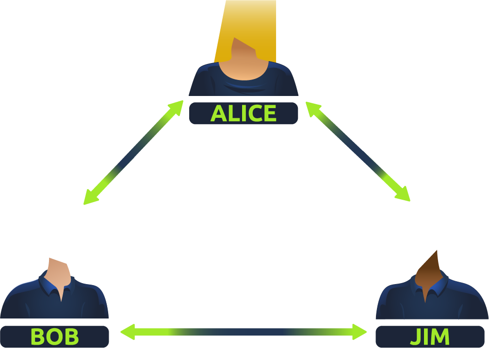
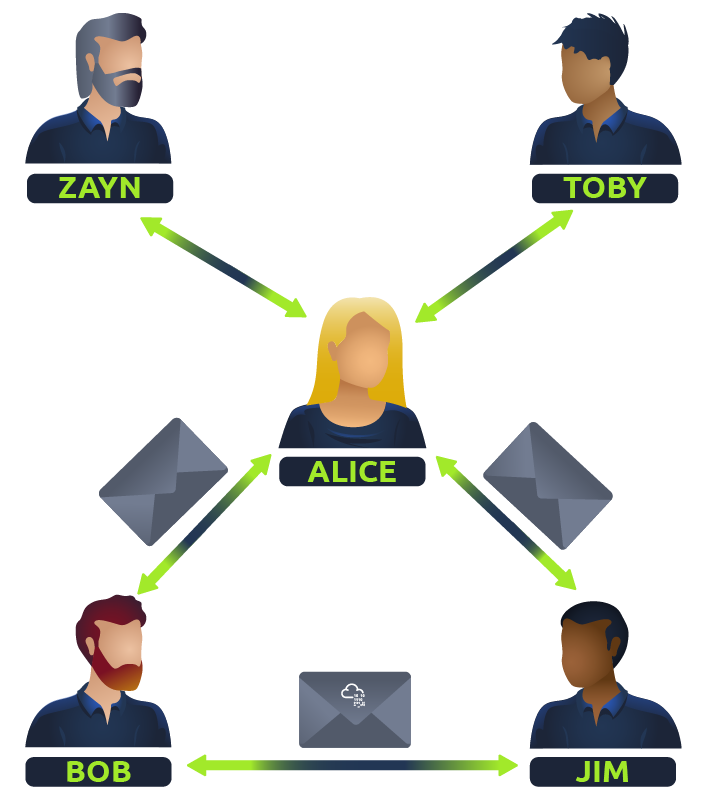
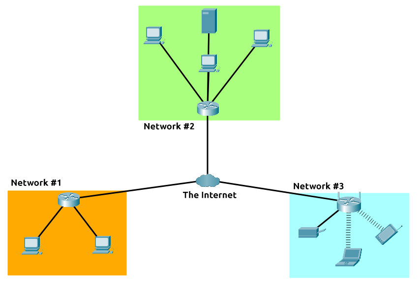
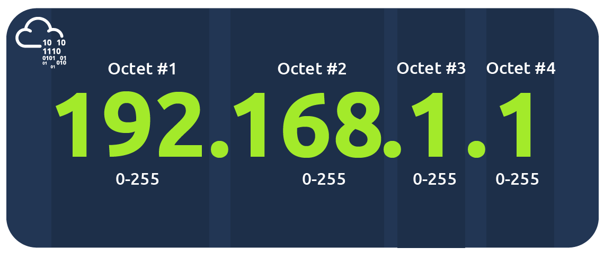
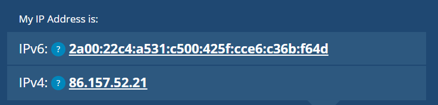
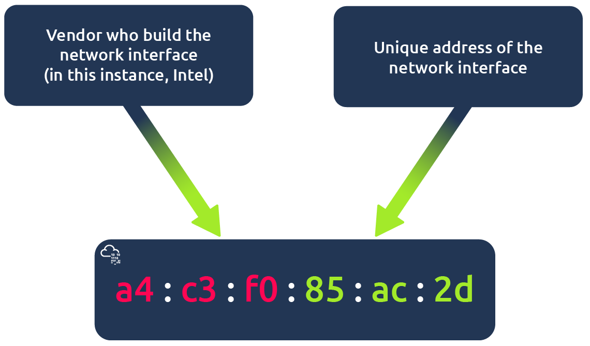

# What is Networking?

## Task 1: What is Networking?

Networks are simply things connected. For example, your friendship circle: you are all connected because of similar interests, hobbies, skills and sorts.

Networks can be found in all walks of life:

- A city's public transportation system
- Infrastructure such as the national power grid for electricity
- Meeting and greeting your neighbours
- Postal systems for sending letters and parcels

But more specifically, in computing, networking is the same idea, just dispersed to technological devices. Take your phone as an example; the reason that you have it is to access things. We'll cover how these devices communicate with each other and the rules that follow.

In computing, a network can be formed by anywhere from 2 devices to billions. These devices include everything from your laptop and phone to security cameras, traffic lights and even farming!

Networks are integrated into our everyday life. Be it gathering data for the weather, delivering electricity to homes or even determining who has the right of way at a road. Because networks are so embedded in the modern-day, networking is an essential concept to grasp in cybersecurity.

Take the diagram below as an example, Alice, Bob and Jim have formed their network! We'll come onto this a bit later on.

Networks come in all shapes and sizes, which is something that we will also come on to discuss throughout this module.

***Answer the questions below***

What is the key term for devices that are connected together?

***Correct answer: Network***

## Task 2: What is the Internet?

Now that we've learnt what a network is and how one is defined in computing (just devices connected), let's explore the Internet.

The Internet is one giant network that consists of many, many small networks within itself. Using our example from the previous task, let's now imagine that Alice made some new friends named Zayn and Toby that she wants to introduce to Bob and Jim. The problem is that Alice is the only person who speaks the same language as Zayn and Toby. So Alice will have to be the messenger!

Because Alice can speak both languages, they can communicate to one another through Alice — forming a new network.

The first iteration of the Internet was within the ARPANET project in the late 1960s. This project was funded by the United States Defence Department and was the first documented network in action. However, it wasn't until 1989 when the Internet as we know it was invented by Tim Berners-Lee by the creation of the World Wide Web (WWW). It wasn't until this point that the Internet started to be used as a repository for storing and sharing information, just like it is today.

Let's relate Alice's network of friends to computing devices. The Internet looks like a much larger version of this sort of diagram:

As previously stated, the Internet is made up of many small networks all joined together.  These small networks are called private networks, where networks connecting these small networks are called public networks -- or the Internet! So, to recap, a network can be one of two types:

- A private network
- A public network

Devices will use a set of labels to identify themselves on a network, which we will come onto in the task below.

***Answer the questions below***

Who invented the World Wide Web?

***Correct answer: Tim Berners-Lee***

## Task 3: Identifying devices on a network

To communicate and maintain order, devices must be both identifying and identifiable on a network. What use is it if you don't know whom you're talking to at the end of the day?

Devices on a network are very similar to humans in the fact that we have two ways of being identified:

- Our Name
- Our Fingerprints

Now we can change our name through deed poll, but we can't, however, change our fingerprints. Every human has an individual set of fingerprints which means that even if they change their name, there is still an identity behind it. Devices have the same thing: two means of identification, with one being permeable. These are:

- An IP Address
- A Media Access Control (MAC) Address -- think of this as being similar to a serial number.

### IP Addresses

Briefly, an IP address (or Internet Protocol) address can be used as a way of identifying a host on a network for a period of time, where that IP address can then be associated with another device without the IP address changing. First, let's split up precisely what an IP address is in the diagram below:

An IP address is a set of numbers that are divided into four octets. The value of each octet will summarise to be the IP address of the device on the network. This number is calculated through a technique known as IP addressing & subnetting, but that is for another day. What's important to understand here is that IP addresses can change from device to device but cannot be active simultaneously more than once within the same network.

IP Addresses follow a set of standards known as protocols. These protocols are the backbone of networking and force many devices to communicate in the same language, which is something that we'll come onto another time. However, we should recall that devices can be on both a private and public network. Depending on where they are will determine what type of IP address they have: a public or private IP address.

A public address is used to identify the device on the Internet, whereas a private address is used to identify a device amongst other devices. Take the table & screenshot below as an example. Here we have two devices on a private network:

| Device Name      | IP Address   | IP Address Type |
| :--------------: | :----------: | :-------------: |
| DESKTOP-KJE57FD  | 192.168.1.77 | Private         |
| DESKTOP-KJE57FD  | 86.157.52.21 | Public          |
| CMNatic-PC       | 192.168.1.74 | Private         |
| CMNatic-PC       | 86.157.52.21 | Public          |

These two devices will be able to use their private IP addresses to communicate with each other. However, any data sent to the Internet from either of these devices will be identified by the same public IP address. Public IP addresses are given by your Internet Service Provider (or ISP) at a monthly fee (your bill!)

As more and more devices become connected, it is becoming increasingly harder to get a public address that isn't already in use. For example, Cisco, an industry giant in the world of networking, estimated that there would be approximately 50 billion devices connected on the Internet by the end of 2021. [(Cisco., 2021)](https://www.cisco.com/c/dam/en_us/about/ac79/docs/innov/IoT_IBSG_0411FINAL.pdf). Enter IP address versions. So far, we have only discussed one version of the Internet Protocol addressing scheme known as IPv4, which uses a numbering system of 2^32 IP addresses (4.29 billion) -- so you can see why there is such a shortage!

IPv6 is a new iteration of the Internet Protocol addressing scheme to help tackle this issue. Although it is seemingly more daunting, it boasts a few benefits:

- Supports up to 2^128 of IP addresses (340 trillion-plus), resolving the issues faced with IPv4
- More efficient due to new methodologies

The screenshot below compares both an IPv6 and IPv4 address.

### MAC Addresses

Devices on a network will all have a physical network interface, which is a microchip board found on the device's motherboard. This network interface is assigned a unique address at the factory it was built at, called a MAC (Media Access Control ) address. The MAC address is a twelve-character hexadecimal number (a base sixteen numbering system used in computing to represent numbers) split into two's and separated by a colon. These colons are considered separators. For example, a4:c3:f0:85:ac:2d. The first six characters represent the company that made the network interface, and the last six is a unique number.

However, an interesting thing with MAC addresses is that they can be faked or "spoofed" in a process known as spoofing. This spoofing occurs when a networked device pretends to identify as another using its MAC address. When this occurs, it can often break poorly implemented security designs that assume that devices talking on a network are trustworthy. Take the following scenario: A firewall is configured to allow any communication going to and from the MAC address of the administrator. If a device were to pretend or "spoof" this MAC address, the firewall would now think that it is receiving communication from the administrator when it isn't.

Places such as cafes, coffee shops, and hotels alike often use MAC address control when using their "Guest "or "Public" Wi-Fi. This configuration could offer better services, i.e. a faster connection for a price if you are willing to pay the fee per device.  The interactive lab attached to this task has been made to replicate this scenario!

### Practical

The interactive labs simulate a hotel Wi-Fi network where you have to pay for the service. You'll note that the router is not allowing Bob's packets ( blue) to the TryHackMe website and is placing them in the bin, but Alice's packets (green) are going through fine because she has paid for Wi-Fi. Try changing Bob's MAC address to the same as Alice's to see what happens.

Deploy the interactive lab and proceed to answer the following questions below.

***Answer the questions below***

What does the term "IP" stand for?

***Correct answer: Internet Protocol***

What is each section of an IP address called?

***Correct answer: octet***

How many sections (in digits) does an IP address have?

***Correct answer: 4***

What does the term "MAC" stand for?

***Correct answer: Media Access Control***

Deploy the interactive lab using the "View Site" button and spoof your MAC address to access the site.  What is the flag?

*Solution:* Copy Alice's MAC address, paste into Bob, then click "Request Site".

***Correct answer: THM{YOU_GOT_ON_TRYHACKME}***

## Task 4: Ping (ICMP)

Ping is one of the most fundamental network tools available to us. Ping uses ICMP (Internet Control Message Protocol) packets to determine the performance of a connection between devices, for example, if the connection exists or is reliable.

The time taken for ICMP packets travelling between devices is measured by ping, such as in the screenshot below. This measuring is done using ICMP's echo packet and then ICMP's echo reply from the target device.

Pings can be performed against devices on a network, such as your home network or resources like websites. This tool can be easily used and comes installed on Operating Systems (OSs) such as Linux and Windows. The syntax to do a simple ping is ping IP address or website URL. Let's see this in action in the screenshot below.

Here we are pinging a device that has the private address of 192.168.1.254. Ping informs us that we have sent six ICMP packets, all of which were received with an average time of 4.16 milliseconds.

Now you are going to do the same thing to ping the address of "8.8.8.8" on the deployable website in this task. Pinging the correct address will reveal a flag to answer the following question below.

***Answer the questions below***

What protocol does ping use?

***Correct answer: ICMP***

What is the syntax to ping 10.10.10.10?

***Correct answer: ping 10.10.10.10***

What flag do you get when you ping 8.8.8.8?

***Correct answer:***

## Task 5: Continue your learning: Intro to LAN

Continue your learning by joining the ["Intro to LAN" room](https://tryhackme.com/room/introtolan).

***Answer the questions below***

Join the ["Intro to LAN" room](https://tryhackme.com/room/introtolan).

***Correct answer: No answer needed***
