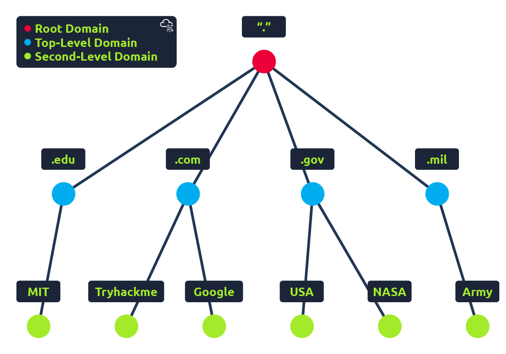

# DNS in Detail

## Task 1: What is DNS?

DNS (Domain Name System) provides a simple way for us to communicate with devices on the internet without remembering complex numbers. Much like every house has a unique address for sending mail directly to it, every computer on the internet has its own unique address to communicate with it called an IP address. An IP address looks like the following 104.26.10.229, 4 sets of digits ranging from 0 - 255 separated by a period. When you want to visit a website, it's not exactly convenient to remember this complicated set of numbers, and that's where DNS can help. So instead of remembering 104.26.10.229, you can remember tryhackme.com instead.

***Answer the questions below***

What does DNS stand for?

***Correct answer: Domain Name System***

## Task 2: Domain Hierarchy

### TLD (Top-Level Domain)

A TLD is the most righthand part of a domain name. So, for example, the tryhackme.com TLD is .com. There are two types of TLD, gTLD (Generic Top Level) and ccTLD (Country Code Top Level Domain). Historically a gTLD was meant to tell the user the domain name's purpose; for example, a .com would be for commercial purposes, .org for an organisation, .edu for education and .gov for government. And a ccTLD was used for geographical purposes, for example, .ca for sites based in Canada, .co.uk for sites based in the United Kingdom and so on. Due to such demand, there is an influx of new gTLDs ranging from .online , .club , .website , .biz and so many more. For a full list of over 2000 TLDs click here.

### Second-Level Domain

Taking tryhackme.com as an example, the .com part is the TLD, and tryhackme is the Second Level Domain. When registering a domain name, the second-level domain is limited to 63 characters + the TLD and can only use a-z 0-9 and hyphens (cannot start or end with hyphens or have consecutive hyphens).

### Subdomain

A subdomain sits on the left-hand side of the Second-Level Domain using a period to separate it; for example, in the name admin.tryhackme.com the admin part is the subdomain. A subdomain name has the same creation restrictions as a Second-Level Domain, being limited to 63 characters and can only use a-z 0-9 and hyphens (cannot start or end with hyphens or have consecutive hyphens). You can use multiple subdomains split with periods to create longer names, such as jupiter.servers.tryhackme.com. But the length must be kept to 253 characters or less. There is no limit to the number of subdomains you can create for your domain name.

***Answer the questions below***

What is the maximum length of a subdomain?

***Correct answer: 63***

Which of the following characters cannot be used in a subdomain `( 3 b _ - )`?

***Correct answer: _***

What is the maximum length of a domain name?

***Correct answer: 253***

What type of TLD is `.co.uk`?

***Correct answer: ccTLD***

## Task 3: Record Types

### DNS Record Types

DNS isn't just for websites though, and multiple types of DNS record exist. We'll go over some of the most common ones that you're likely to come across.

#### A Record

These records resolve to IPv4 addresses, for example 104.26.10.229

#### AAAA Record

These records resolve to IPv6 addresses, for example 2606:4700:20::681a:be5

#### CNAME Record

These records resolve to another domain name, for example, TryHackMe's online shop has the subdomain name store.tryhackme.com which returns a CNAME record shops.shopify.com. Another DNS request would then be made to shops.shopify.com to work out the IP address.

#### MX Record

These records resolve to the address of the servers that handle the email for the domain you are querying, for example an MX record response for tryhackme.com would look something like alt1.aspmx.l.google.com. These records also come with a priority flag. This tells the client in which order to try the servers, this is perfect for if the main server goes down and email needs to be sent to a backup server.

#### TXT Record

TXT records are free text fields where any text-based data can be stored. TXT records have multiple uses, but some common ones can be to list servers that have the authority to send an email on behalf of the domain (this can help in the battle against spam and spoofed email). They can also be used to verify ownership of the domain name when signing up for third party services.

***Answer the questions below***

What type of record would be used to advise where to send email?

***Correct answer: MX***

What type of record handles IPv6 addresses?

***Correct answer:***

## Task 4

***Answer the questions below***

***Correct answer:***
