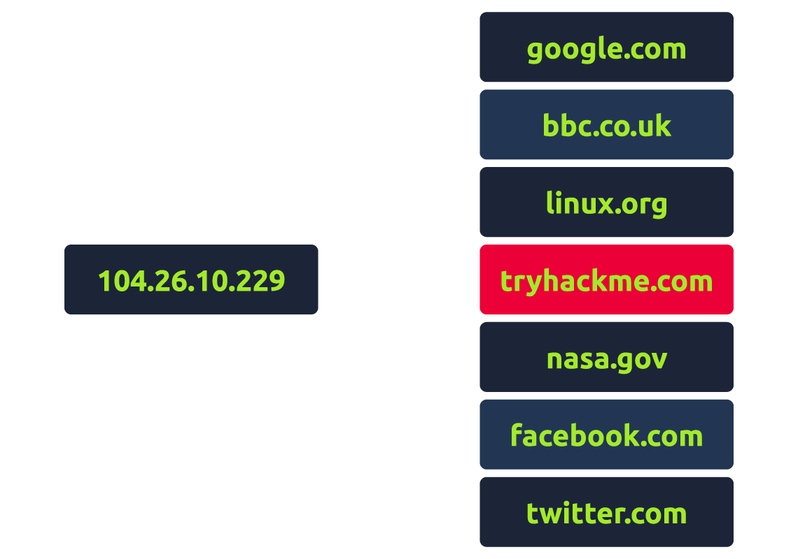

# DNS in Detail

## Task 1: What is DNS?

DNS (Domain Name System) provides a simple way for us to communicate with devices on the internet without remembering complex numbers. Much like every house has a unique address for sending mail directly to it, every computer on the internet has its own unique address to communicate with it called an IP address. An IP address looks like the following 104.26.10.229, 4 sets of digits ranging from 0 - 255 separated by a period. When you want to visit a website, it's not exactly convenient to remember this complicated set of numbers, and that's where DNS can help. So instead of remembering 104.26.10.229, you can remember tryhackme.com instead.

***Answer the questions below***

What does DNS stand for?

***Correct answer: Domain Name System***

## Task 2

***Answer the questions below***

***Correct answer:***

## Task 3

***Answer the questions below***

***Correct answer:***
