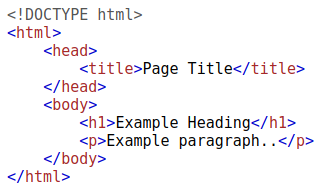

# How Websites Work

## Task 1: How websites work

Websites are primarily created using:

- HTML, to build websites and define their structure
- CSS, to make websites look pretty by adding styling options
- JavaScript, implement complex features on pages using interactivity

HyperText Markup Language (HTML) is the language websites are written in.
Elements (also known as tags) are the building blocks of HTML pages and
tells the browser how to display content. The code snippet below shows a
simple HTML document, the structure of which is the same for every website:

There are two major components that make up a website:

- Front End (Client-Side) - the way your browser renders a website.
- Back End (Server-Side) - a server that processes your request and returns a response.

There are many other processes involved in your browser making a request to a web server,
but for now, you just need to understand that you make a request to a server,
and it responds with data your browser uses to render information to you.

***Answer the questions below***

What term best describes the component of a web application rendered by your browser?

***Correct answer: Front end***

## Task 2: HTML

Websites are primarily created using:

- HTML, to build websites and define their structure
- CSS, to make websites look pretty by adding styling options
- JavaScript, implement complex features on pages using interactivity

HyperText Markup Language (HTML) is the language websites are written in.
Elements (also known as tags) are the building blocks of HTML pages and
tells the browser how to display content. The code snippet below shows a
simple HTML document, the structure of which is the same for every website:

The HTML structure (as shown in the screenshot) has the following components:

- The `<!DOCTYPE html>` defines that the page is a HTML5 document.
This helps with standardisation across different browsers and
tells the browser to use HTML5 to interpret the page.
- The `<html>` element is the root element of the HTML page - all other elements come after this element.
- The `<head>` element contains information about the page (such as the page title)
- The `<body>` element defines the HTML document's body; only content inside of the body is shown in the browser.
- The `<h1>` element defines a large heading
- The `
` element defines a paragraph
- There are many other elements (tags) used for different purposes.
For example, there are tags for buttons (`<button>`),
images (``), lists, and much more.

Tags can contain attributes such as the class attribute which can be used to
style an element (e.g. make the tag a different color)
`
`, or the src attribute which is used on images to
specify the location of an image: ``.An element can
have multiple attributes each with its own unique purpose, e.g.,
`
`.

Elements can also have an id attribute (`
`), which is unique
to the element. Unlike the class attribute, where multiple elements can use
the same class, an element must have different id's to identify them
uniquely. Element id's are used for styling and to identify it by JavaScript.

You can view the HTML of any website by right-clicking and selecting
"View Page Source" (Chrome) / "Show Page Source" (Safari).

***Answer the questions below:***

Let's play with some HTML! First click the "View Site" button inside this task.
On the right-hand side, you should see a box that renders HTML -
If you enter some HTML into the box and click the green "Render HTML Code"
button, it will render your HTML on the page; you should see an image of some cats.

***Correct answer: No answer needed***

One of the images on the cat website is broken - fix it,
and the image will reveal the hidden text answer!

*Solution:* Edit the code `` by adding the file extension:
`` then click "Render Html".

***Correct answer: HTMLHERO***

Add a dog image to the page by adding another img tag (``) on line 11.
The dog image location is `img/dog-1.png`. What is the text in the dog image?

***Correct answer:***

## Task 3: Javascript

***Answer the questions below:***

***Correct answer:***

## Task 4: Sensitive Data Exposure

***Answer the questions below:***

***Correct answer:***

## Task 5: HTML Injection

***Answer the questions below:***

***Correct answer:***
