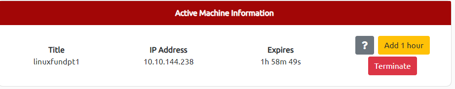

# Linux Fundamentals Part 1

## Task 1: Introduction


Welcome to the first part of the "Linux Fundamentals" room series.
You're most likely using a Windows or Mac machine,
both are different in visual design and how they operate.
Just like Windows, iOS and MacOS, Linux is just another operating system and
one of the most popular in the world powering smart cars, android devices,
supercomputers, home appliances, enterprise servers, and more.

We'll be covering some of the history behind Linux and then eventually starting your
journey of being a Linux-wizard! This room will have you:

- Running your very first commands in an interactive Linux machine in your browser
- Teaching you some essential commands used to interact with the file system
- Demonstrate how you can search for files and introduce shell operators

***Answer the questions below***

Let's get started!

***Correct answer: No answer needed***

## Task 2: A Bit of Background on Linux

### Where is Linux Used?

It's fair to say that Linux is a lot more intimidating to approach than Operating
System's (OSs) such as Windows. Both variants have their own advantages and
disadvantages. For example, Linux is considerably much more lightweight and you'd be
surprised to know that there's a good chance you've used Linux in some form or another
every day! Linux powers things such as:

- Websites that you visit
- Car entertainment/control panels
- Point of Sale (PoS) systems such as checkout tills and registers in shops
- Critical infrastructures such as traffic light controllers or industrial sensors

### Flavours of Linux

The name "Linux" is actually an umbrella term for multiple OS's that are based on UNIX
(another operating system). Thanks to Linux being open-source, variants of Linux come
in all shapes and sizes - suited best for what the system is being used for.

For example, Ubuntu & Debian are some of the more commonplace distributions of Linux
because it is so extensible. I.e. you can run Ubuntu as a server (such as websites &
web applications) or as a fully-fledged desktop.
For this series, we're going to be using Ubuntu.

> Ubuntu Server can run on systems with only 512MB of RAM

Similar to how you have different versions Windows (7, 8 and 10),
there are many different versions/distributions of Linux.

***Answer the questions below***

Research: What year was the first release of a Linux operating system?

***Correct answer: 1991***

## Task 3: Interacting With Your First Linux Machine (In-Browser)

This room has a Ubuntu Linux machine that you can interact with all within your browser
whilst following along with this room's material.

However, to get started, simply press the green Start Machine button below.

Once deployed, a card will appear at the top of the room:



This contains all of the information for the machine deployed in the room including the
IP address and expiry timer - along with buttons to manage the machine. Remember to
"Terminate" a machine once you are done with the room. More information on this can be
found in the tutorial room.

For now, press "Start Machine" where you will be able to interact with your own Linux
machine within your browser whilst following along with this room:


### Subheading

***Answer the questions below***

I've deployed my first Linux machine!

***Correct answer: No answer needed***

## Task 4: Running Your First Few Commands

As we previously discussed, a large selling point of using OSs such as Ubuntu is how
lightweight they can be. This, of course, doesn't come without its disadvantages, where
for example, often there is no GUI (Graphical User Interface) or what is also known as
a desktop environment that we can use to interact with the machine (unless it has been
installed). A large part of interacting with these systems is using the "Terminal".

The "Terminal" is purely text-based and is intimidating at first.
However, if we break down some of the commands, after some time,
you quickly become familiar with using the terminal!

```bash
# This is what a terminal looks like
tryhackme@linux1:~$ enter commands here
```

We need to be able to do basic functions like navigate to files, output their contents
and make files! The commands to do so are self-explanatory
(once you know what they are of course...)

Let's get started with two of the first commands
which I have broken down in the table below:

|Command|Description|
|:-:|:-:|
|`echo`|Output any text that we provide|
|`whoami`|Find out what user we're currently logged in as!|

> See the snippets below for an example of each command being used...

```bash
# Using echo
tryhackme@linux1:~$ echo "Hello Friend!"
```

```bash
# Using whoami to find out the username of who we're logged in as
tryhackme@linux1:~$ whoami
```

Try this on your Linux machine now!

***Answer the questions below***

If we wanted to output the text "TryHackMe", what would our command be?

***Correct answer: echo TryHackMe***

What is the username of who you're logged in as on your deployed Linux machine?

***Correct answer: tryhackme***

## Task 5: Interacting With The Filesystem

So far we've only covered the "echo" and "whoami" commands. Not all that useful when
you consider things that we need to do -
including navigating the filesystem, read and write to it as well.

In this task, we're going to be learning the commands so that we can do just that. Just
like the previous task, I'll display the commands in the table in the next heading &
show examples of these commands being used.

### Interacting With the Filesystem

As I previously stated, being able to navigate the machine that you are logged into
without relying on a desktop environment is pretty important. After all, what's the
point of logging in if we can't go anywhere?

|Command|Full Name|
|:-:|:-:|
|`ls`|listing|
|`cd`|change directory|
|`cat`|concatenate|
|`pwd`|print working directory|

### Listing Files in Our Current Directory (`ls`)

Before we can do anything such as finding out the contents of any files or folders, we
need to know what exists in the first place.
This can be done using the "ls" command (short for listing)

```bash
# Using "ls" to to list the contents of the current directory
tryhackme@linux1:~$ ls
'Important Files' 'My Documents' Notes Pictures
```

In the screenshot above, we can see there are the following directories/folders:

- Important Files
- My Documents
- Notes
- Pictures

Great! You can probably take a guess as to what
to expect a folder to contain given by its name.

> Pro tip: You can list the contents of a directory without having to navigate
> to it by using `ls` and the name of the directory. I.e. `ls Pictures`

### Changing Our Current Directory (`cd`)

Now that we know what folders exist, we need to use the `cd` command (short for
change directory) to change to that directory. Say if I wanted to open the `Pictures`
directory - I'd do `cd Pictures`. Where again, we want to find out the contents of this
`Pictures` directory and to do so, we'd use `ls` again:

```bash
# Listing our new directory after we have used "cd"
tryhackme@linux1:~/Pictures$ ls
dog_picture1.jpg dog_picture2.jpg dog_picture3.jpg dog_picture4.jpg
```

In this case, it looks like there are 4 pictures of dogs!

### Outputting the Contents of a File (`cat`)

Whilst knowing about the existence of files is great —
it's not all that useful unless we're able to view the contents of them.

We will come on to discuss some of the tools available to us that allows us to transfer
files from one machine to another in a later room. But for now, we're going to talk
about simply seeing the contents of text files using a command called `cat`.

`cat` is short for concatenating & is a fantastic way for us to output
the contents of files (not just text files!).

In the screenshot below, you can see how I have combined the use of `ls` to list the
files within a directory called `Documents`:

```bash
# Using "ls" to to list the contents of the current directory
tryhackme@linux1:~/Documents$ ls
todo.txt
tryhackme@linux1:~/Documents$ cat todo.txt
Here's something important for me to do later!
```

We've applied some knowledge from earlier in this task to do the following:

- Used `ls` to let us know what files are available in the `Documents` folder of this
machine. In this case, it is called `todo.txt`.
- We have then used `cat todo.txt` to concatenate/output the contents of this `todo.txt`
file, where the contents are "Here's something important for me to do later!"

> Pro tip: You can use cat to output the contents of a file within directories without
> having to navigate to it by using cat and the name of the directory.
> I.e. `cat /home/ubuntu/Documents/todo.txt`

Sometimes things like usernames, passwords (yes - really...), flags or configuration
settings are stored within files where `cat` can be used to retrieve these.

### Finding out the full Path to our Current Working Directory `pwd`

You'll notice as you progress through navigating your Linux machine, the name of the
directory that you are currently working in will be listed in your terminal.

It's easy to lose track of where we are on the filesystem exactly, which is why I want
to introduce `pwd`. This stands for print working directory.

Using the example machine from before, we are currently in the `Documents` folder —
but where is this exactly on the Linux machine's filesystem?
We can find this out using this `pwd` command like within the screenshot below:

```bash
# Using "pwd" to list the full path of the current directory
tryhackme@linux1:~/Documents$ pwd
/home/ubuntu/Documents
tryhackme@linux1:~/Documents$
```

#### Let's break this down

- We already know we're in `Documents` thanks to our terminal, but at this point in
time, we have no idea where `Documents` is stored so that we can get
back to it easily in the future.
- I have used the `pwd` (print working directory) command to find the full
file path of this `Documents` folder.
- We're helpfully told by Linux that this `Documents` directory is stored at
`/home/ubuntu/Documents` on the machine — great to know!
- Now in the future, if we find ourselves in a different location, we can just use
`cd /home/ubuntu/Documents` to change our working directory to this `Documents`
directory.

***Answer the questions below***

On the Linux machine that you deploy, how many folders are there?

*Solution:* Use `ls` then count the folders.

***Correct answer: 4***

Which directory contains a file?

*Solution:* Use `cd folder1`, `cd folder2` etc. to look inside each folder.

***Correct answer: folder4***

What is the contents of this file?

*Solution:* After `cd folder4`, use `cat note.txt` to see the contents.

***Correct answer: Hello World***

Use the `cd` command to navigate to this file and find out the new current
working directory. What is the path?

*Solution:* After `cd folder4`, use `pwd` to see the path.

***Correct answer: /home/tryhackme/folder4***

## Task 6: Searching For Files

### Subheading

***Answer the questions below***

***Correct answer:***

## Task 7: An Introduction to Shell Operators

### Subheading

***Answer the questions below***

***Correct answer:***

## Task 8: Conclusions & Summaries

### Subheading

***Answer the questions below***

***Correct answer:***

## Task 9: Linux Fundamentals Part 2

### Subheading

***Answer the questions below***

***Correct answer:***
