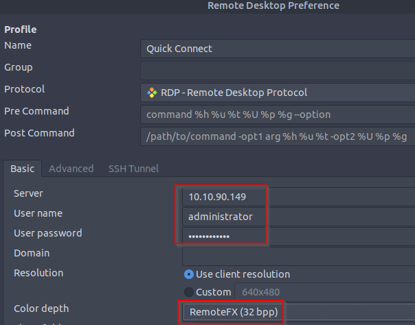

# Windows Fundamentals Part 1

## Task 1: Introduction to Windows

The Windows operating system (OS) is a complex product with many system files,
utilities, settings, features, etc.

This module will attempt to provide a general overview of just a handful of what makes
up the Windows OS, navigate the user interface, make changes to the system, etc. The
content is aimed at those who wish to understand and use the Windows OS on a more
comfortable level.

Press the Start Machine button below to launch the attached virtual machine.

The virtual machine should open within your web browser.

If you want to access the virtual machine via Remote Desktop, use the credentials below.

- **Machine IP:** `MACHINE_IP`

- **User:** `administrator`

- **Password:** `letmein123!`

Accept the Certificate when prompted,
and you should be logged into the remote system now.

**Note:** The virtual machine may take up to 3 minutes to load.

***Answer the questions below***

Read above and start the virtual machine.

***Correct answer: No answer needed***

## Task 2

### Subheading

***Answer the questions below***

***Correct answer:***

## Task 3

### Subheading

***Answer the questions below***

***Correct answer:***

## Task 4

### Subheading

***Answer the questions below***

***Correct answer:***

## Task 5

### Subheading

***Answer the questions below***

***Correct answer:***

## Task 6

### Subheading

***Answer the questions below***

***Correct answer:***

## Task 7

### Subheading

***Answer the questions below***

***Correct answer:***
