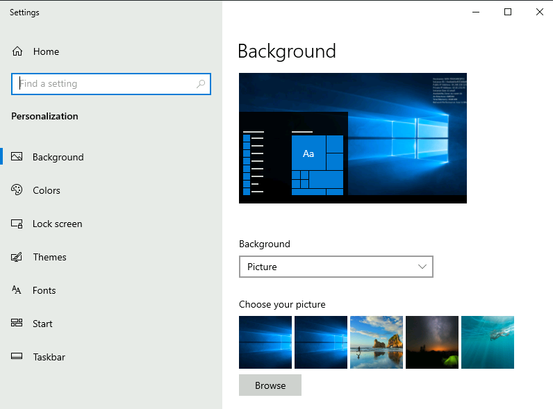
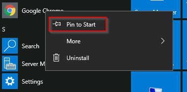
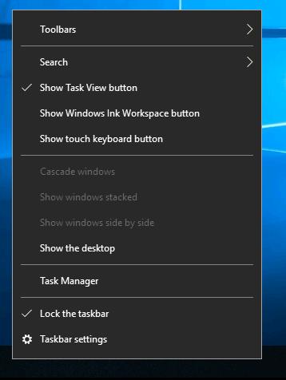

# Windows Fundamentals Part 1

## Task 1: Introduction to Windows

The Windows operating system (OS) is a complex product with many system files,
utilities, settings, features, etc.

This module will attempt to provide a general overview of just a handful of what makes
up the Windows OS, navigate the user interface, make changes to the system, etc. The
content is aimed at those who wish to understand and use the Windows OS on a more
comfortable level.

Press the Start Machine button below to launch the attached virtual machine.

The virtual machine should open within your web browser.

If you want to access the virtual machine via Remote Desktop, use the credentials below.

- **Machine IP:** `MACHINE_IP`

- **User:** `administrator`

- **Password:** `letmein123!`

Accept the Certificate when prompted,
and you should be logged into the remote system now.

**Note:** The virtual machine may take up to 3 minutes to load.

***Answer the questions below***

Read above and start the virtual machine.

***Correct answer: No answer needed***

## Task 2: Windows Editions

The Windows operating system has a long history dating back to 1985, and currently,
it is the dominant operating system in both home use and corporate networks.
Because of this, Windows has always been targeted by hackers & malware writers.

Windows XP was a popular version of Windows and had a long-running.
Microsoft announced Windows Vista, which was a complete overhaul of the
Windows operating system. There were many issues with Windows Vista.
It wasn't received well by Windows users, and it was quickly phased out.

When Microsoft announced the end-of-life date for Windows XP, many customers panicked.
Corporations, hospitals, etc., scrambled and tested the next viable Windows version,
which was Windows 7, against many other hardware and devices.
Vendors had to work against the clock to ensure their products worked with
Windows 7 for their customers.
If they couldn't, their customers had to break their agreement and find another
vendor that upgraded their products to work with Windows 7.
It was a nightmare for many, and Microsoft took note of it.

Windows 7, as quickly as it was released soon after,
was marked with an end of support date.
Windows 8.x came and left and it was short-lived, like Vista.

Then arrived Windows 10,
which is the current Windows operating system version for desktop computers.

Windows 10 comes in 2 flavors, Home and Pro.
You can read the difference between the Home and Pro
[here](https://www.microsoft.com/en-us/windows/compare-windows-10-home-vs-pro).

Even though we didn't talk about servers,
the current version of the Windows operating system for servers is Windows Server 2019.

Many critics like to bash on Microsoft, but they have made long strides
to improve the usability and security with each new version of Windows.

*Note:* The Windows edition for the attached VM is Windows Server 2019 Standard,
as seen in *System Information.*

*Update:* As of June 2021, Microsoft announced the retirement dates for Windows 10
[here](https://learn.microsoft.com/en-us/lifecycle/products/windows-10-home-and-pro).

"Microsoft will continue to support at least one
Windows 10 Semi-Annual Channel until October 14, 2025".

As of October 5th, 2021 - Windows 11 now is the current Windows
operating system for end-users. Read more about Windows 11
[here](https://www.microsoft.com/en-us/windows).

***Answer the questions below***

What encryption can you enable on Pro that you can't enable in Home?

***Correct answer: BitLocker***

## Task 3: The Desktop (GUI)

The Windows Desktop, aka the graphical user interface or GUI in short,
is the screen that welcomes you once you log into a Windows 10 machine.

Traditionally, you need to pass the login screen first.
The login screen is where you need to enter valid account credentials;
usually, a username & password of a preexisting Windows account on that
particular system or in the Active Directory environment
(if it's a domain-joined machine).

The above screenshot is an example of a typical Windows Desktop. Each component that makes up the GUI is explained briefly below.

1. The Desktop
2. Start Menu
3. Search Box (Cortana)
4. Task View
5. Taskbar
6. Toolbars
7. Notification Area

### The Desktop

The desktop is where you will have shortcuts to programs, folders, files, etc.
These icons will either be well organized in folders sorted alphabetically
or scattered randomly with no specific organization on the desktop.
In either case, these items are typically placed on the desktop for quick access.

The look and feel of the desktop can be changed to suit your liking.
By right-clicking anywhere on the desktop, a context menu will appear.
This menu will allow you to change the sizes of the desktop icons,
specify how you want to arrange them, copy/paste items to the desktop,
and create new items, such as a folder, shortcut, or text document.

Under **Display settings**, you can make changes to the screen's resolution
and orientation. In case you have multiple computer screens,
you can make configurations to the multi-screen setup here.

**Note:** In a Remote Desktop session, some of the display settings will be disabled.

You can also change the wallpaper by selecting **Personalize.**

Under Personalize, you can change the background image to the Desktop,
change fonts, themes, color scheme, etc.

### The Start Menu

In previous versions of Windows, the word Start was visible at the bottom left
corner of the desktop GUI. In modern versions of Windows, such as Windows 10,
the word 'Start' doesn't appear anymore, but rather a Windows Logo is shown instead.
Even though the look of the Start Menu has changed, its overall purpose is the same.

The Start Menu provides access to all the apps/programs,
files, utility tools, etc., that are most useful.

Clicking on the Windows logo, the Start Menu will open.
The Start Menu is broken up into sections. See below.

1. This section of the Start Menu provides quick shortcuts to actions that
you can perform with your account or login session, such as making changes to
your user account, lock your screen, or signing out of your account.
Other shortcuts specific to your account are your Documents (document icon)
folder and Pictures folder (pictures icon).
Lastly, the gear/cog icon will take you to the Settings screen,
and the power icon will allow you to Disconnect from a Remote Desktop session,
shut down the computer, or restart the computer.

In the below image, you can see what each of the icons represents.
To expand this section, click on the icon that resembles a hamburger at the top.

2. This section will show all Recently added apps/programs at the top and
all the installed apps/programs (that are configured to appear in the Start Menu).
In this section, you'll also see the apps/programs will be listed in alphabetical order.
Each letter will have its own section. See below.

In the above image, the first box is where the recently added apps/programs will appear.
The second box is where all the installed apps/programs will appear.

**Note:** In your VM, Google Chrome will not show up as a Recently Added program anymore.

If you have a LONG list of installed apps/programs,
you can jump to a particular section in the list by clicking on
the letter headings to launch an alphabet grid. See below.

**Note:** The white letters match the letter headings.

3. The right side of the Start Menu is where you will find icons for specific
apps/programs or utilities. These icons are known as tiles.
Some tiles are added to this section by default.
If you right-click any of the tiles, you guessed it;
a menu will appear to allow you to perform more actions on the selected tile;
such as resizing the tile, unpinning from Start Menu,
view its Properties, etc. See below.

Apps/programs can be added to this Start Menu section by right-clicking
the app/program and selecting Pin to Start. See below.

### The Taskbar

Some of the components are enabled and visible by default. The Toolbar (6),
for example, was enabled for demonstration purposes.

If you're like me and want to disable some of these components, you can right-click
on Taskbar to bring up a context menu that will allow you to make changes.

Any apps/programs, folders, files, etc., that you open/start will appear in the taskbar.

Hovering over the icon will provide a preview thumbnail, along with a tooltip.
This tooltip is handy if you have many apps/programs open, such as Google Chrome,
and you wish to find which instance of Google Chrome is
the one you need to bring in to focus.

When you close any of these items, they will disappear from the taskbar
(unless you explicitly pinned it to the taskbar).

### The Notification Area

The Notification Area, which is typically located at the bottom right of the
Windows screen, is where the date and time are displayed.
Other icons possibly visible in this area is the volume icon,
network/wireless icon, to name a few.
Icons can be either added or removed from the Notification Area in Taskbar settings.

From there, scroll down to the Notification Area section to make changes.

Here are Microsoft's brief documents for the
[Start Menu](https://support.microsoft.com/en-us/windows/see-what-s-on-the-start-menu-a8ccb400-ad49-962b-d2b1-93f453785a13)
and [Notification Area](https://support.microsoft.com/en-us/windows/customize-the-taskbar-notification-area-e159e8d2-9ac5-b2bd-61c5-bb63c1d437c3).

**Tip:** You can right-click any folder, file, app/program,
or icon to view more information or perform other actions on the clicked item.

***Answer the questions below***

Which selection will hide/disable the Search box?

***Correct answer:***

Which selection will hide/disable the Task View button?

***Correct answer:***

Besides Clock and Network, what other icon is visible in the Notification Area?

***Correct answer:***

## Task 4: The File System

### Subheading

***Answer the questions below***

***Correct answer:***

## Task 5: The Windows\system32 Folders

### Subheading

***Answer the questions below***

***Correct answer:***

## Task 6: User Accounts, Profiles and Permissions

### Subheading

***Answer the questions below***

***Correct answer:***

## Task 7: User Account Control

### Subheading

***Answer the questions below***

***Correct answer:***

## Task 8: Settings and the Control Panel

### Subheading

***Answer the questions below***

***Correct answer:***

## Task 9: Task Manager

### Subheading

***Answer the questions below***

***Correct answer:***

## Task 10: Conclusion

### Subheading

***Answer the questions below***

***Correct answer:***
