# Windows Fundamentals Part 1

## Task 1: Introduction to Windows

The Windows operating system (OS) is a complex product with many system files,
utilities, settings, features, etc.

This module will attempt to provide a general overview of just a handful of what makes
up the Windows OS, navigate the user interface, make changes to the system, etc. The
content is aimed at those who wish to understand and use the Windows OS on a more
comfortable level.

Press the Start Machine button below to launch the attached virtual machine.

The virtual machine should open within your web browser.

If you want to access the virtual machine via Remote Desktop, use the credentials below.

- **Machine IP:** `MACHINE_IP`

- **User:** `administrator`

- **Password:** `letmein123!`

Accept the Certificate when prompted,
and you should be logged into the remote system now.

**Note:** The virtual machine may take up to 3 minutes to load.

***Answer the questions below***

Read above and start the virtual machine.

***Correct answer: No answer needed***

## Task 2: Windows Editions

The Windows operating system has a long history dating back to 1985, and currently,
it is the dominant operating system in both home use and corporate networks.
Because of this, Windows has always been targeted by hackers & malware writers.

Windows XP was a popular version of Windows and had a long-running.
Microsoft announced Windows Vista, which was a complete overhaul of the
Windows operating system. There were many issues with Windows Vista.
It wasn't received well by Windows users, and it was quickly phased out.

When Microsoft announced the end-of-life date for Windows XP, many customers panicked.
Corporations, hospitals, etc., scrambled and tested the next viable Windows version,
which was Windows 7, against many other hardware and devices.
Vendors had to work against the clock to ensure their products worked with
Windows 7 for their customers.
If they couldn't, their customers had to break their agreement and find another
vendor that upgraded their products to work with Windows 7.
It was a nightmare for many, and Microsoft took note of it.

Windows 7, as quickly as it was released soon after,
was marked with an end of support date.
Windows 8.x came and left and it was short-lived, like Vista.

Then arrived Windows 10,
which is the current Windows operating system version for desktop computers.

Windows 10 comes in 2 flavors, Home and Pro.
You can read the difference between the Home and Pro
[here](https://www.microsoft.com/en-us/windows/compare-windows-10-home-vs-pro).

Even though we didn't talk about servers,
the current version of the Windows operating system for servers is Windows Server 2019.

Many critics like to bash on Microsoft, but they have made long strides
to improve the usability and security with each new version of Windows.

*Note:* The Windows edition for the attached VM is Windows Server 2019 Standard,
as seen in *System Information.*

*Update:* As of June 2021, Microsoft announced the retirement dates for Windows 10
[here](https://learn.microsoft.com/en-us/lifecycle/products/windows-10-home-and-pro).

"Microsoft will continue to support at least one
Windows 10 Semi-Annual Channel until October 14, 2025".

As of October 5th, 2021 - Windows 11 now is the current Windows
operating system for end-users. Read more about Windows 11
[here](https://www.microsoft.com/en-us/windows).

***Answer the questions below***

What encryption can you enable on Pro that you can't enable in Home?

***Correct answer: BitLocker***

## Task 3: The Desktop (GUI)

The Windows Desktop, aka the graphical user interface or GUI in short,
is the screen that welcomes you once you log into a Windows 10 machine.

Traditionally, you need to pass the login screen first.
The login screen is where you need to enter valid account credentials;
usually, a username & password of a preexisting Windows account on that
particular system or in the Active Directory environment
(if it's a domain-joined machine).

The above screenshot is an example of a typical Windows Desktop.
Each component that makes up the GUI is explained briefly below.

1. The Desktop
2. Start Menu
3. Search Box (Cortana)
4. Task View
5. Taskbar
6. Toolbars
7. Notification Area

### The Desktop

The desktop is where you will have shortcuts to programs, folders, files, etc.
These icons will either be well organized in folders sorted alphabetically
or scattered randomly with no specific organization on the desktop.
In either case, these items are typically placed on the desktop for quick access.

The look and feel of the desktop can be changed to suit your liking.
By right-clicking anywhere on the desktop, a context menu will appear.
This menu will allow you to change the sizes of the desktop icons,
specify how you want to arrange them, copy/paste items to the desktop,
and create new items, such as a folder, shortcut, or text document.

Under **Display settings**, you can make changes to the screen's resolution
and orientation. In case you have multiple computer screens,
you can make configurations to the multi-screen setup here.

**Note:** In a Remote Desktop session, some of the display settings will be disabled.

You can also change the wallpaper by selecting **Personalize.**

Under Personalize, you can change the background image to the Desktop,
change fonts, themes, color scheme, etc.

### The Start Menu

In previous versions of Windows, the word Start was visible at the bottom left
corner of the desktop GUI. In modern versions of Windows, such as Windows 10,
the word 'Start' doesn't appear anymore, but rather a Windows Logo is shown instead.
Even though the look of the Start Menu has changed, its overall purpose is the same.

The Start Menu provides access to all the apps/programs,
files, utility tools, etc., that are most useful.

Clicking on the Windows logo, the Start Menu will open.
The Start Menu is broken up into sections. See below.

This section of the Start Menu provides quick shortcuts to actions that
you can perform with your account or login session, such as making changes to
your user account, lock your screen, or signing out of your account.
Other shortcuts specific to your account are your Documents (document icon)
folder and Pictures folder (pictures icon).
Lastly, the gear/cog icon will take you to the Settings screen,
and the power icon will allow you to Disconnect from a Remote Desktop session,
shut down the computer, or restart the computer.

In the below image, you can see what each of the icons represents.
To expand this section, click on the icon that resembles a hamburger at the top.

This section will show all Recently added apps/programs at the top and
all the installed apps/programs (that are configured to appear in the Start Menu).
In this section, you'll also see the apps/programs will be listed in alphabetical order.
Each letter will have its own section. See below.

In the above image, the first box is where the recently added apps/programs will appear.
The second box is where all the installed apps/programs will appear.

**Note:** In your VM, Google Chrome will not show up as a Recently Added program anymore.

If you have a LONG list of installed apps/programs,
you can jump to a particular section in the list by clicking on
the letter headings to launch an alphabet grid. See below.

**Note:** The white letters match the letter headings.

The right side of the Start Menu is where you will find icons for specific
apps/programs or utilities. These icons are known as tiles.
Some tiles are added to this section by default.
If you right-click any of the tiles, you guessed it;
a menu will appear to allow you to perform more actions on the selected tile;
such as resizing the tile, unpinning from Start Menu,
view its Properties, etc. See below.

Apps/programs can be added to this Start Menu section by right-clicking
the app/program and selecting Pin to Start. See below.

### The Taskbar

Some of the components are enabled and visible by default. The Toolbar (6),
for example, was enabled for demonstration purposes.

If you're like me and want to disable some of these components, you can right-click
on Taskbar to bring up a context menu that will allow you to make changes.

Any apps/programs, folders, files, etc., that you open/start will appear in the taskbar.

Hovering over the icon will provide a preview thumbnail, along with a tooltip.
This tooltip is handy if you have many apps/programs open, such as Google Chrome,
and you wish to find which instance of Google Chrome is
the one you need to bring in to focus.

When you close any of these items, they will disappear from the taskbar
(unless you explicitly pinned it to the taskbar).

### The Notification Area

The Notification Area, which is typically located at the bottom right of the
Windows screen, is where the date and time are displayed.
Other icons possibly visible in this area is the volume icon,
network/wireless icon, to name a few.
Icons can be either added or removed from the Notification Area in Taskbar settings.

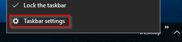

From there, scroll down to the Notification Area section to make changes.

Here are Microsoft's brief documents for the
[Start Menu](https://support.microsoft.com/en-us/windows/see-what-s-on-the-start-menu-a8ccb400-ad49-962b-d2b1-93f453785a13)
and [Notification Area](https://support.microsoft.com/en-us/windows/customize-the-taskbar-notification-area-e159e8d2-9ac5-b2bd-61c5-bb63c1d437c3).

**Tip:** You can right-click any folder, file, app/program,
or icon to view more information or perform other actions on the clicked item.

***Answer the questions below***

Which selection will hide/disable the Search box?

***Correct answer: Hidden***

Which selection will hide/disable the Task View button?

***Correct answer: Show Task View button***

Besides Clock and Network, what other icon is visible in the Notification Area?

***Correct answer: Action Center***

## Task 4: The File System

The file system used in modern versions of Windows is the
New Technology File System or simply NTFS.

Before NTFS, there was FAT16/FAT32 (File Allocation Table) and
HPFS (High Performance File System).

You still see FAT partitions in use today.
For example, you typically see FAT partitions in USB devices,
MicroSD cards, etc. but traditionally not on personal Windows
computers/laptops or Windows servers.

NTFS is known as a journaling file system.
In case of a failure, the file system can automatically repair
the folders/files on disk using information stored in a log file.
This function is not possible with FAT.

NTFS addresses many of the limitations of the previous file systems; such as:

- Supports files larger than 4GB
- Set specific permissions on folders and files
- Folder and file compression
- Encryption
([Encryption File System](https://learn.microsoft.com/en-us/windows/win32/fileio/file-encryption)
or EFS)

If you're running Windows, what is the file system your Windows installation is using?
You can check the Properties (right-click) of the drive your operating system
is installed on, typically the C drive (`C:\`).

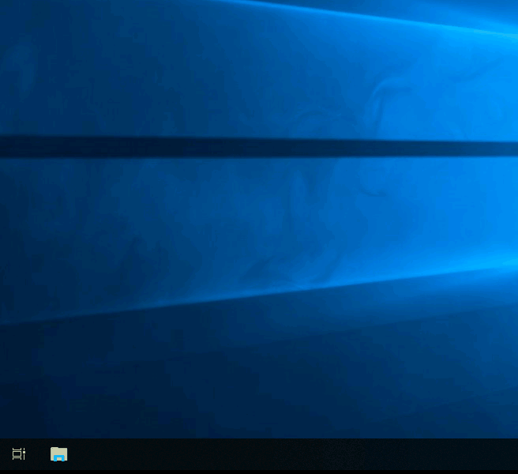

You can read Microsoft's official documentation on FAT, HPFS, and NTFS
[here](https://learn.microsoft.com/en-us/troubleshoot/windows-client/backup-and-storage/fat-hpfs-and-ntfs-file-systems).

Let's speak briefly on some features that are specific to NTFS.

On NTFS volumes, you can set permissions that grant or deny access to files and folders.

The permissions are:

- Full control
- Modify
- Read & Execute
- List folder contents
- Read
- Write

The below image lists the meaning of each permission
on how it applies to a file and a folder. (credit Microsoft)

How can you view the permissions for a file or folder?

- Right-click the file or folder you want to check for permissions.
- From the context menu, select `Properties`.
- Within `Properties`, click on the `Security` tab.
- In the `Group or user names` list, select the user, computer,
or group whose permissions you want to view.

In the below image, you can see the permissions for the
`Users` group for the Windows folder.

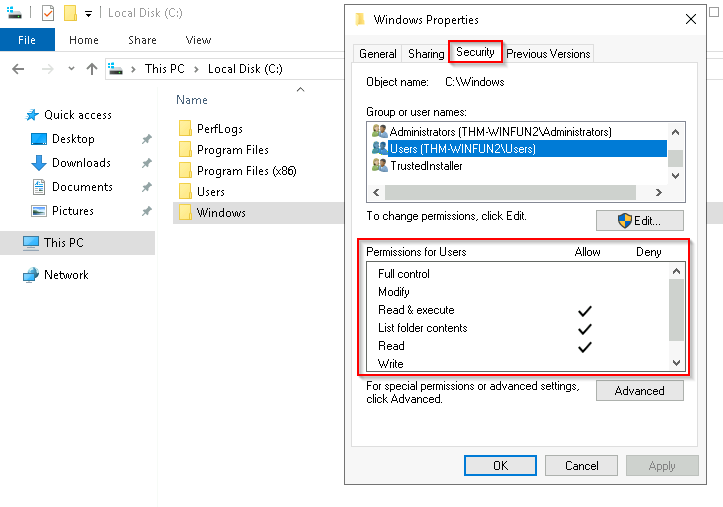

Refer to the Microsoft documentation to get a better understanding
of the NTFS permissions for Special Permissions.

Another feature of NTFS is **Alternate Data Streams** (ADS).

**Alternate Data Streams** (ADS) is a file attribute specific to
Windows NTFS (New Technology File System).

Every file has at least one data stream (`$DATA`),
and ADS allows files to contain more than one stream of data.
Natively Window Explorer doesn't display ADS to the user.
There are 3rd party executables that can be used to view this data,
but Powershell gives you the ability to view ADS for files.

From a security perspective, malware writers have used ADS to hide data.

Not all its uses are malicious.
For example, when you download a file from the Internet,
there are identifiers written to ADS to identify that
the file was downloaded from the Internet.

To learn more about ADS, refer to the following link from MalwareBytes here.

**Bonus:** If you wish to interact hands-on with ADS,
I suggest exploring Day 21 of Advent of Cyber 2.

***Answer the questions below***

What is the meaning of NTFS?

***Correct answer: New Technology File System***

## Task 5: The Windows\system32 Folders

The Windows folder (`C:\Windows`) is traditionally known as the folder
which contains the Windows operating system.

The folder doesn't have to reside in the `C` drive necessarily.
It can reside in any other drive and technically can reside in a different folder.

This is where environment variables, more specifically system environment variables,
come into play. Even though not discussed yet, the system
environment variable for the Windows directory is `%windir%`.

Per [Microsoft](https://learn.microsoft.com/en-us/powershell/module/microsoft.powershell.core/about/about_environment_variables?view=powershell-7.4&viewFallbackFrom=powershell-7.1),
"Environment variables store information about the operating system environment.
This information includes details such as the operating system path,
the number of processors used by the operating system,
and the location of temporary folders".

There are many folders within the 'Windows' folder. See below.

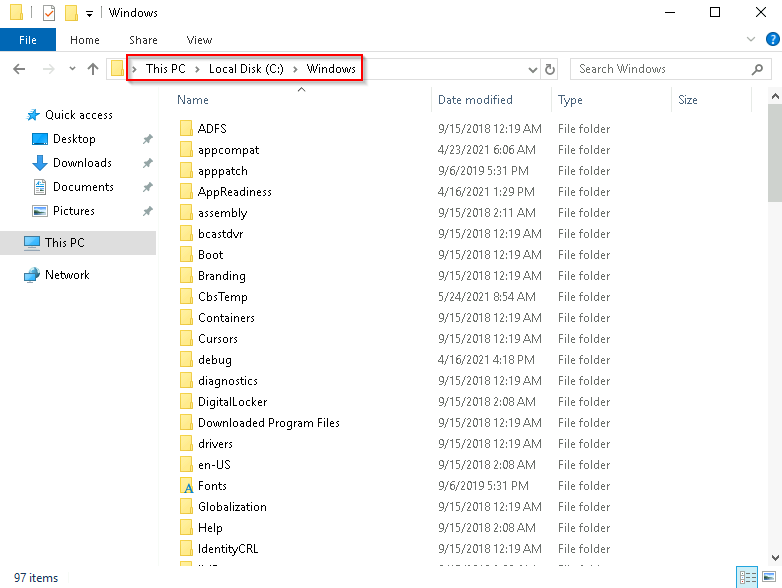

One of the many folders is `System32`.

The `System32` folder holds the important files that are
critical for the operating system.

You should proceed with extreme caution when interacting with this folder.
Accidentally deleting any files or folders within `System32`
can render the Windows OS inoperational. Read more about this action
[here](https://www.howtogeek.com/346997/what-is-the-system32-directory-and-why-you-shouldnt-delete-it/).

**Note:** Many of the tools that will be covered in the Windows Fundamentals
series reside within the `System32` folder.

***Answer the questions below***

What is the system variable for the Windows folder?

***Correct answer: `%windir%`***

## Task 6: User Accounts, Profiles and Permissions

User accounts can be one of two types on a typical local Windows system:
**Administrator** & **Standard User**.

The user account type will determine what actions the user can
perform on that specific Windows system.

- An Administrator can make changes to the system:
add users, delete users, modify groups, modify settings on the system, etc.
- A Standard User can only make changes to folders/files attributed to the user
& can't perform system-level changes, such as install programs.

You are currently logged in as an Administrator.
There are several ways to determine which user accounts exist on the system.

One way is to click the `Start Menu` and type `Other User`.
A shortcut to `System Settings > Other users` should appear.

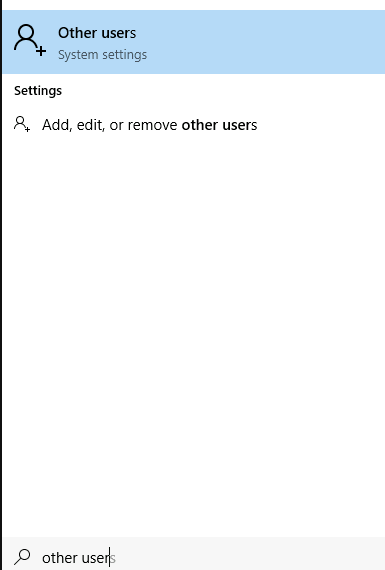

If you click on it, a Settings window should now appear. See below.

Since you're the Administrator, you see an option to Add someone else to this PC.

Note: A Standard User will not see this option.

Click on the local user account. More options should appear:
Change account type and Remove.

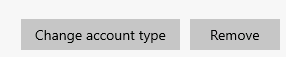

Click on Change account type. The value in the drop-down box
(or the highlighted value if you click the drop-down) is the current account type.

When a user account is created, a profile is created for the user.
The location for each user profile folder will fall under is `C:\Users`.

For example, the user profile folder for the user account Max will be `C:\Users\Max`.

The creation of the user's profile is done upon initial login.
When a new user account logs in to a local system for the first time,
they'll see several messages on the login screen.
One of the messages, User Profile Service, sits on the login screen for a while,
which is at work creating the user profile. See below.

Once logged in, the user will see a dialog box similar to the one below (again),
indicating that the profile is in creation.

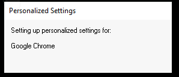

Each user profile will have the same folders; a few of them are:

- Desktop
- Documents
- Downloads
- Music
- Pictures

Another way to access this information, and then some,
is using Local User and Group Management.

Right-click on the Start Menu and click Run. Type `lusrmgr.msc`. See below

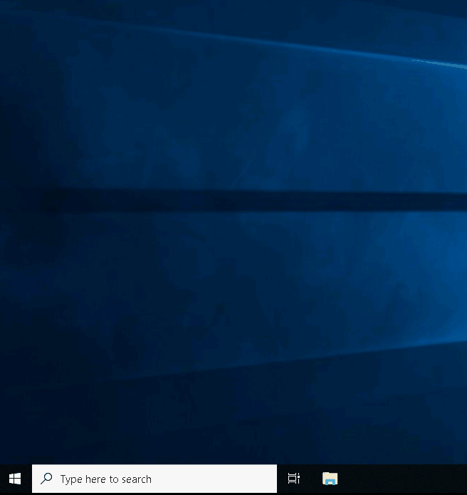

**Note:** The Run Dialog Box allows us to open items quickly.

Back to `lusrmgr`, you should see two folders: Users and Groups.

If you click on Groups, you see all the names of the local groups
along with a brief description for each group.

Each group has permissions set to it,
and users are assigned/added to groups by the Administrator.
When a user is assigned to a group,
the user inherits the permissions of that group.
A user can be assigned to multiple groups.

**Note:** If you click on Add someone else to this PC from Other users,
it will open Local Users and Management.

***Answer the questions below***

What is the name of the other user account?

***Correct answer: tryhackmebilly***

What groups is this user a member of?

***Correct answer: Remote Desktop Users,Users***

What built-in account is for guest access to the computer?

***Correct answer: Guest***

What is the account description?

***Correct answer: Account is disabled***

## Task 7: User Account Control

The large majority of home users are logged into their Windows systems
as local administrators. Remember from the previous task that any user
with administrator as the account type can make changes to the system.

A user doesn't need to run with high (elevated) privileges on the system
to run tasks that don't require such privileges, such as surfing the Internet,
working on a Word document, etc. This elevated privilege increases
the risk of system compromise because it makes it easier for malware
to infect the system. Consequently, since the user account can make
changes to the system, the malware would run in the context of the logged-in user.

To protect the local user with such privileges,
Microsoft introduced User Account Control (UAC).
This concept was first introduced with the short-lived Windows Vista
and continued with versions of Windows that followed.

**Note:** UAC (by default) doesn't apply for the built-in local administrator account.

How does UAC work? When a user with an account type of administrator logs into a system,
the current session doesn't run with elevated permissions.
When an operation requiring higher-level privileges needs to execute,
the user will be prompted to confirm if they permit the operation to run.

Let's look at the program on the account you're currently logged into,
the built-in administrator account—Right-click to view its Properties.

In the Security tab, we can see the users/groups and their permissions to this file.
Notice that the standard user is not listed.

Log in as the standard user and try to install this program.
To do this, you can remote desktop into the machine as the standard user account.

Note: You have the username and password for the standard user.
It's visible in `lusrmgr.msc`.

Before installing the program, notice the icon.
Do you see the difference? When you're logged in as the standard user,
the shield icon is on the program's default icon. See below.

This shield icon is an indicator that UAC will prompt to allow
higher-level privileges to install the program.

Double-click the program, and you'll see the UAC prompt.
Notice that the built-in administrator account is already
set as the user name and prompts the account's password. See below.

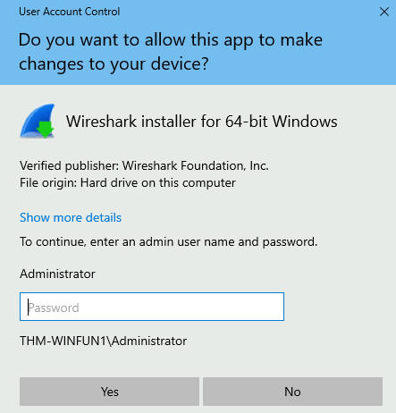

After some time, if a password is not entered, the UAC prompt disappears,
and the program does not install.

This feature reduces the likelihood of malware successfully compromising your system.
You can read more about UAC
[here](https://learn.microsoft.com/en-us/windows/security/application-security/application-control/user-account-control/how-it-works).

***Answer the questions below***

What does UAC mean?

***Correct answer: User Account Control***

## Task 8: Settings and the Control Panel

On a Windows system, the primary locations to make changes
are the Settings menu and the Control Panel.

For a long time, the Control Panel has been the go-to location
to make system changes, such as adding a printer, uninstall a program, etc.

The Settings menu was introduced in Windows 8,
the first Windows operating system catered to touch screen tablets,
and is still available in Windows 10. As a matter of fact,
the Settings menu is now the primary location a user goes to if
they are looking to change the system.

There are similarities and differences between the two menus.
Below are screenshots of each.

**Settings:**

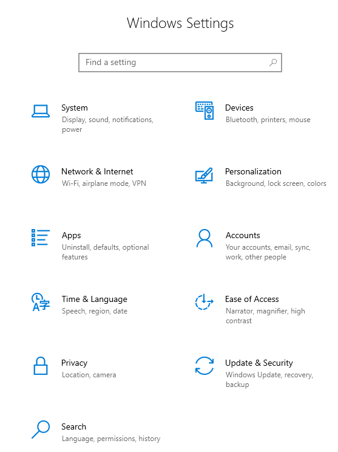

**Control Panel:**

**Note:** The icons for Settings might be different in the
version of Windows on your personal device.

Both can be accessed from the Start Menu. See below.

Control Panel is the menu where you will access more complex settings
and perform more complex actions.
In some cases, you can start in Settings and end up in the Control Panel.

For example, in Settings, click on Network & Internet.
From here, click on Change adapter options.

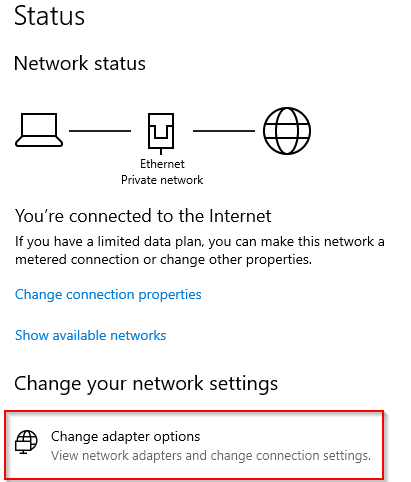

Notice that the next window that pops up is from the Control Panel.

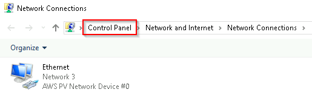

If you're unclear which to open if you wish to change a setting,
use the Start menu and search for it.

In the example below, the search was 'wallpaper.'
Notice that few results were returned.

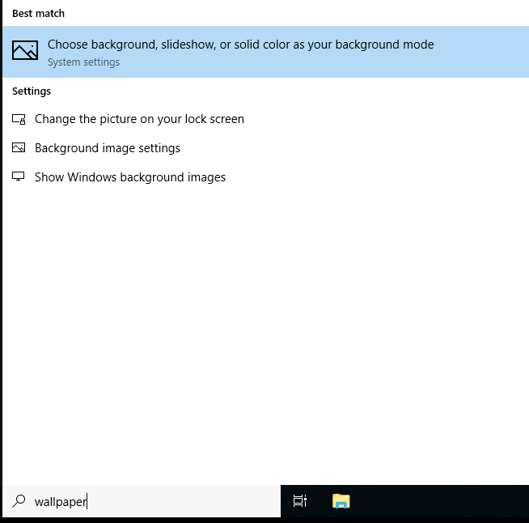

If we click on the Best match, a window to the Settings
menu appears to make changes to the wallpaper.

***Answer the questions below***

In the Control Panel, change the view to Small icons.
What is the last setting in the Control Panel view?

***Correct answer: Windows Defender Firewall***

## Task 9: Task Manager

The last subject that will be touched on in this module is the Task Manager.

The Task Manager provides information about the applications and
processes currently running on the system.
Other information is also available, such as how much
CPU and RAM are being utilized, which falls under Performance.

You can access the Task Manager by right-clicking the taskbar.

Task Manager will open in Simple View and won't show much information.

Click on More details, and the view changes.

You can refer to [this blog post](https://www.howtogeek.com/405806/windows-task-manager-the-complete-guide/)
for more detailed information about the Task Manager.

If you wish to learn more about the core Windows processes and what
each process is responsible for, visit the
[Core Windows Processes room](https://tryhackme.com/jr/btwindowsinternals).

***Answer the questions below***

What is the keyboard shortcut to open Task Manager?

***Correct answer: Ctrl+Shift+Esc***

## Task 10: Conclusion

Again, this was a generic overview of the Windows OS.

There are intermediate and advanced topics for each topic (task)
that was covered in this room.

Hence, Task 9 ended with a detailed blog post explaining the
Task Manager in great detail.

In future modules, we'll cover topics like the Windows folder, the management console,
security tools (Windows Defender, Windows Firewall, etc.), to name a few.

***Answer the questions below***

Read above and terminate the Windows machine you deployed in this room.

***Correct answer: No answer needed***
