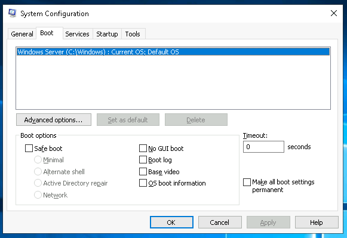
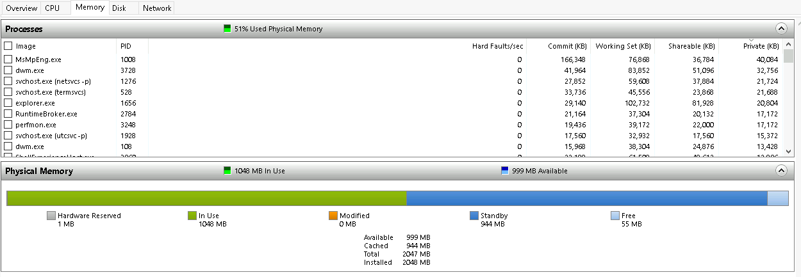
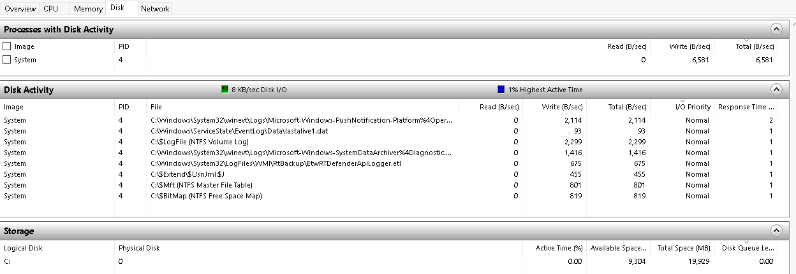
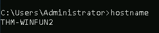
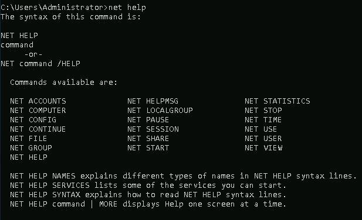

# Windows Fundamentals 2

In part 2 of the Windows Fundamentals module, discover more about
System Configuration,
UAC Settings,
Resource Monitoring,
the Windows Registry and more.

## Task 1: Introduction

We will continue our journey exploring the Windows operating system.

In Windows Fundamentals 1, we covered the desktop, the file system, user account
control, the control panel, settings, and the task manager.

This module will attempt to provide an overview of some other utilities available
within the Windows operating system and different methods to access these utilities.

Press the Start Machine button below to launch the attached virtual machine.

If you wish to access the virtual machine via Remote Desktop, use the credentials below.

**Machine IP:** `MACHINE_IP`

**User:** `administrator`

**Password:** `letmein123!`

Accept the Certificate when prompted, and you should be logged into the remote system now.

**Note:** The virtual machine may take up to 3 minutes to load.

***Answer the questions below***

Read above and start the virtual machine.

***Correct answer: No answer needed***

## Task 2: System Configuration

The **System Configuration** utility (`MSConfig`) is for advanced troubleshooting,
and its main purpose is to help diagnose startup issues.

Reference the following document here for more information on the
System Configuration utility.

There are several methods to launch System Configuration.
One method is from the Start Menu.

**Note:** You need local administrator rights to open this utility.

The utility has five tabs across the top.
Below are the names for each tab.
We will briefly cover each tab in this task.

1. General
2. Boot
3. Services
4. Startup
5. Tools

In the General tab, we can select what devices and services for
Windows to load upon boot. The options are: Normal, Diagnostic, or Selective.

In the Boot tab, we can define various boot options for the Operating System.

The Services tab lists all services configured for the system regardless
of their state (running or stopped).
A service is a special type of application that runs in the background.

In the Startup tab, you won't see anything interesting in the attached VM.
Below is a screenshot of the Startup tab for MSConfig from my local machine.

As you can see, Microsoft advises using Task Manager (taskmgr)
to manage (enable/disable) startup items.
The System Configuration utility is NOT a startup management program.

Note: If you open Task Manager for the attached VM,
you will notice that Task Manager doesn't show a Startup tab.

There is a list of various utilities (tools) in the Tools tab
that we can run to configure the operating system further.
There is a brief description of each tool to provide some insight
into what the tool is for.

Notice the Selected command section.
The information in this textbox will change per tool.

To run a tool, we can use the command to launch the tool via the run prompt,
command prompt, or by clicking the Launch button.

***Answer the questions below***

*Solutions:* We can look up all of these in the System Configuration app.

What is the name of the service that lists Systems Internals as the manufacturer?

***Correct answer: PsShutdown***

Whom is the Windows license registered to?

***Correct answer: Windows User***

What is the command for Windows Troubleshooting?

***Correct answer: `C:\Windows\System32\control.exe /name Microsoft.Troubleshooting`***

What command will open the Control Panel?
(The answer is the name of `.exe`, not the full path)

***Correct answer: `control.exe`***

## Task 3: Change UAC Settings

We're continuing with Tools that are available through the System Configuration panel.

User Account Control (UAC) was covered in great detail in
[Windows Fundamentals 1](https://tryhackme.com/room/windowsfundamentals1xbx).

The UAC settings can be changed or even turned off entirely (not recommended).

You can move the slider to see how the setting will change
the UAC settings and Microsoft's stance on the setting.

***Answer the questions below***

What is the command to open User Account Control Settings?
(The answer is the name of the `.exe` file, not the full path)

*Solution:* We can look up this in the System Configuration app.

***Correct answer: `UserAccountControlSettings.exe`***

## Task 4: Computer Management

We're continuing with Tools that are available through the System Configuration panel.

The Computer Management (`compmgmt`) utility has three primary sections:
System Tools, Storage, and Services and Applications.

### System Tools

Let's start with Task Scheduler. Per Microsoft, with Task Scheduler,
we can create and manage common tasks that our computer will carry out
automatically at the times we specify.

A task can run an application, a script, etc.,
and tasks can be configured to run at any point.
A task can run at log in or at log off.
Tasks can also be configured to run on a specific schedule,
for example, every five mins.

To create a basic task, click on Create Basic Task under Actions (right pane).

Next is Event Viewer.

Event Viewer allows us to view events that have occurred on the computer.
These records of events can be seen as an audit trail that can be
used to understand the activity of the computer system.
This information is often used to diagnose problems and investigate
actions executed on the system.

Event Viewer has three panes.

1. The pane on the left provides a hierarchical tree listing
of the event log providers. (as shown in the image above)
2. The pane in the middle will display a general overview and
summary of the events specific to a selected provider.
3. The pane on the right is the actions pane.

There are five types of events that can be logged.
Below is a table from [docs.microsoft.com](https://docs.microsoft.com)
providing a brief description for each.

For more information about Event Viewer and Event Logs, please refer to the
[Windows Event Log room](https://tryhackme.com/room/windowseventlogs).

Shared Folders is where you will see a complete list of
shares and folders shared that others can connect to.

In the above image, under Shares, are the default share of Windows, `C$`,
and default remote administration shares created by Windows, such as `ADMIN$`.

As with any object in Windows, you can right-click on a folder to view
its properties, such as Permissions (who can access the shared resource).

Under Sessions, you will see a list of users who are currently connected
to the shares. In this VM, you won't see anybody connected to the shares.

All the folders and/or files that the connected users access will list under Open Files.

The Local Users and Groups section you should be familiar with from
Windows Fundamentals 1 because it's lusrmgr.msc.

In Performance, you'll see a utility called Performance Monitor (`perfmon`).

Perfmon is used to view performance data either in real-time or from a log file.
This utility is useful for troubleshooting performance issues on a computer system,
whether local or remote.

Device Manager allows us to view and configure the hardware,
such as disabling any hardware attached to the computer.

### Storage

Under Storage is Windows Server Backup and Disk Management.
We'll only look at Disk Management in this room.

Note: Since the virtual machine is a Windows Server operating system,
there are utilities available that you will typically not see in Windows 10.

Disk Management is a system utility in Windows that enables
you to perform advanced storage tasks.  Some tasks are:

- Set up a new drive
- Extend a partition
- Shrink a partition
- Assign or change a drive letter (ex. E:)

### Services and Applications

Recall from the previous task; a service is a special type of application
that runs in the background. Here you can do more than enable and
disable a service, such as view the Properties for the service.

WMI Control configures and controls the Windows Management Instrumentation (WMI) service.

Per Wikipedia, "WMI allows scripting languages (such as VBScript or Windows PowerShell)
to manage Microsoft Windows personal computers and servers, both locally and remotely.
Microsoft also provides a command-line interface to WMI called
Windows Management Instrumentation Command-line (WMIC)."

Note: The WMIC tool is deprecated in Windows 10, version 21H1.
Windows PowerShell supersedes this tool for WMI.

***Answer the questions below***

What is the command to open Computer Management?
(The answer is the name of the `.msc` file, not the full path)

*Solution:* We can look up this in the System Configuration app.

***Correct answer: compmgmt.msc***

At what time every day is the GoogleUpdateTaskMachineUA task configured to run?

*Solution:* We can look up this in the Computer Management app,
under the Task Scheduler section.

***Correct answer: 6:15 AM***

What is the name of the hidden folder that is shared?

*Solution:* We can look up this in the Computer Management app,
under the Shared Folders section.

***Correct answer: sh4r3dF0Ld3r***

## Task 5: System Information

We're continuing with Tools that are available through the System Configuration panel.

What is the System Information (`msinfo32`) tool?

Per Microsoft, "Windows includes a tool called Microsoft System Information
(`Msinfo32.exe`).  This tool gathers information about your computer
and displays a comprehensive view of your hardware, system components,
and software environment, which you can use to diagnose computer issues."

The  information in System Summary is divided into three sections:

- Hardware Resources
- Components
- Software Environment

System Summary will display general technical specifications for the computer,
such as processor brand and model.

The information displayed in Hardware Resources is not for the average computer user.
If you want to learn more about this section, refer to the official Microsoft
[page](https://learn.microsoft.com/en-us/windows-hardware/drivers/kernel/hardware-resources).

Under Components, you can see specific information about the
hardware devices installed on the computer. Some sections don't
show any information, but some sections do, such as Display and Input.

In the Software Environment section, you can see information about software
baked into the operating system and software you have installed.
Other details are visible in this section as well, such as the
Environment Variables and Network Connections.

Recall from the Windows Fundamentals 1 room (The Windows\System32 Folder task)
where Environment Variables was briefly touched on.

Per Microsoft, "Environment variables store information about the
operating system environment. This information includes details
such as the operating system path, the number of processors used
by the operating system, and the location of temporary folders.

The environment variables store data that is used by the operating system
and other programs. For example, the WINDIR environment variable
contains the location of the Windows installation directory.
Programs can query the value of this variable to determine where
Windows operating system files are located".

Click on Environment Variables to see the assigned values for the virtual machine.

Another method to view environment variables is

`Control Panel > System and Security > System >
Advanced system settings > Environment Variables`

OR

`Settings > System > About > system info >
Advanced system settings > Environment Variables`.

The detour is over.
Let's redirect our attention back to `msinfo32` and pick up where we left off.

Towards the very bottom of this utility, there is a search bar.
Please give it a go. Select Components and search for IP address.

***Answer the questions below***

What is the command to open System Information?
(The answer is the name of the `.exe` file, not the full path)

*Solution:* We can look up this in the System Configuration app.

***Correct answer: `msinfo32.exe`***

What is listed under System Name?

*Solution:* We can look up this in the System Information app.

***Correct answer: thm-winfun2***

Under Environment Variables, what is the value for ComSpec?

*Solution:* We can look up this in the System Information app,
under the Environment Variables section.

***Correct answer: `%SystemRoot%\system32\cmd.exe`***

## Task 6: Resource Monitor

We're continuing with Tools that are available through the System Configuration panel.

What is Resource Monitor (`resmon`)?

Per Microsoft, "Resource Monitor displays per-process and aggregate
CPU, memory, disk, and network usage information, in addition to
providing details about which processes are using individual file
handles and modules. Advanced filtering allows users to isolate the
data related to one or more processes (either applications or services),
start, stop, pause, and resume services, and close unresponsive
applications from the user interface. It also includes a process
analysis feature that can help identify deadlocked processes and
file locking conflicts so that the user can attempt to resolve
the conflict instead of closing an application and potentially losing data."

As some of the other tools mentioned in this room,
this utility is geared primarily to advanced users
who need to perform advanced troubleshooting on the computer system.

In the Overview tab, Resmon has four sections:

- CPU
- Disk
- Network
- Memory

The same four sections have corresponding tabs across the top. See below.

Note that each tab has additional information for each. An image is shown below for each tab.

### CPU

### Memory

### Disk

### Network

Although not captured in any of the images above,
Resource Monitor has a pane at the far right.
This pane shows a graphical view in real-time for each section.

Note: The information displayed in Resource Monitor
will be different for you compared to the images above.

***Answer the questions below***

What is the command to open Resource Monitor?
(The answer is the name of the `.exe` file, not the full path)

***Correct answer:***

## Task 7: Command Prompt

We're continuing with Tools that are available through the System Configuration panel.

The command prompt (`cmd`) can seem daunting at first,
but it's really not that bad once you understand how to interact with it.

In early operating systems, the command line
was the sole way to interact with the operating system.

When the GUI (graphical user interface) was introduced,
it allowed users to perform complex tasks with a few clicks
of a button instead of entering commands in the command prompt.

Even though the GUI is the primary way to interact with the operating system,
a computer user can still interact via the command prompt.

In this task, we'll only cover a few commands that a computer user can
run in the command prompt to obtain information about the computer system.

Let's start with a few simple commands, such as `hostname` and `whoami`.

The command `hostname` will output the computer name.

The command `whoami` will output the name of the logged-in user.

Next, let's look at some commands that are useful when troubleshooting.

A command used often is `ipconfig`.
This command will show the network address settings for the computer.

Each command will have a help manual to explain the expected
syntax to execute the command properly, along with any additional
parameters that can be added to the command to expand its execution.

A command to retrieve the help manual for a command is `/?`.

For example, to see the help manual for `ipconfig`,
you can use the following command: `ipconfig /?`

Note: To clear the command prompt screen, the command is `cls`.

The next command is `netstat`. Per the help manual,
this command will display protocol statistics and current TCP/IP network connections.

In the above image, the line within the red box shows us
an example syntax for the command.

The structure tells us the netstat command can be run alone
or with parameters, such as `-a`, `-b`, `-e`, etc.

When any of the parameters are appended to the root command,
`netstat` in this case, the output changes. Play with a few to see for yourself.

The `net` command is primarily used to manage network resources.
This command supports sub-commands.

If you type `net` without a sub-command,
the output will show the syntax for the root command showing
a few of the sub-commands you can use.

For the `net` command, to display the help manual `/?` will not work.
In this case, you need to use different syntax, which is `net help`.

So, if you wish to see the help information for `net user`,
the command is `net help user`.

You can use the same command to view the help information for other useful
`net` sub-commands, such as `localgroup`, `use`, `share`, and `session`.

Refer to the following link to see a comprehensive list of commands
you can execute in the command prompt [here](https://ss64.com/nt/).

***Answer the questions below***

In System Configuration, what is the full command for Internet Protocol Configuration?

***Correct answer:***

For the `ipconfig` command, how do you show detailed information?

***Correct answer:***

## Task 8: Registry Editor

We're continuing with Tools that are available through the System Configuration panel.

The Windows Registry (per Microsoft) is a central hierarchical
database used to store information necessary to configure the
system for one or more users, applications, and hardware devices.

The registry contains information that Windows
continually references during operation, such as:

- Profiles for each user
- Applications installed on the computer and the types of documents that each can create
- Property sheet settings for folders and application icons
- What hardware exists on the system
- The ports that are being used.

Warning: The registry is for advanced computer users.
Making changes to the registry can affect normal computer operations.

There are various ways to view/edit the registry.
One way is to use the Registry Editor (`regedit`).

Refer to the following Microsoft documentation
[here](https://learn.microsoft.com/en-us/troubleshoot/windows-server/performance/windows-registry-advanced-users)
to learn more about the Windows Registry.

***Answer the questions below***

***Correct answer:***

## Task 9: Conclusion

Recall that the tasks covered in this room were
some of the tools that can launch from MSConfig.

Throughout the room, commands and shortcuts were shared for the utilities.
This means you don't have to launch MSConfig to run these utilities.

You can also run some of these utilities directly from the Start Menu.
See below where some of these utilities can be found.

Some of the tools listed in MSConfig that weren't mentioned in this room were
either covered in Windows Fundamentals 1 or were left for you to explore on your own.

***Answer the questions below***

Read above.

***Correct answer: No answer needed***
