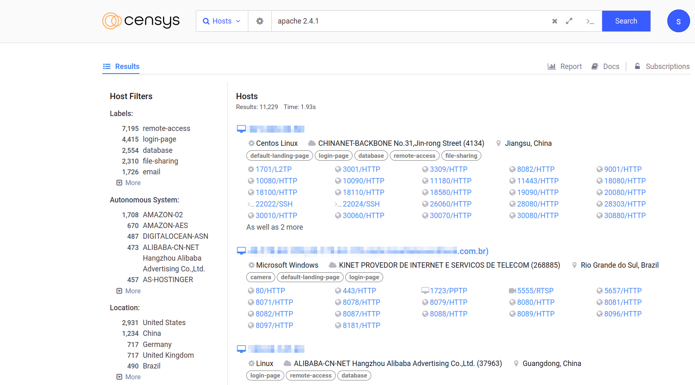
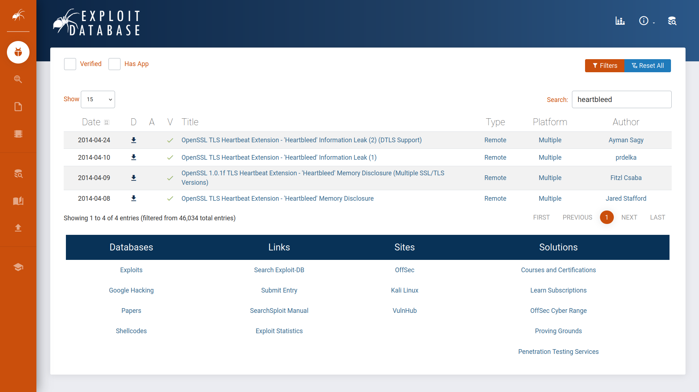
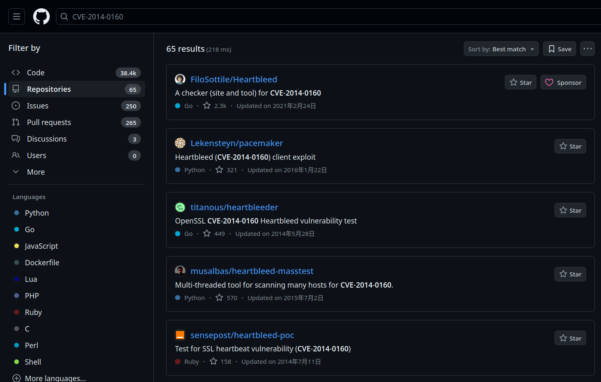
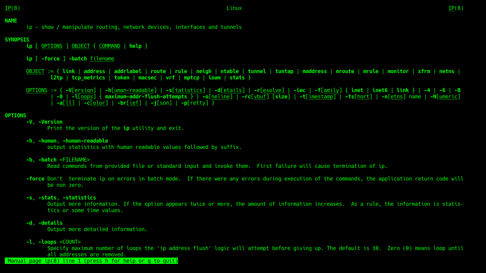
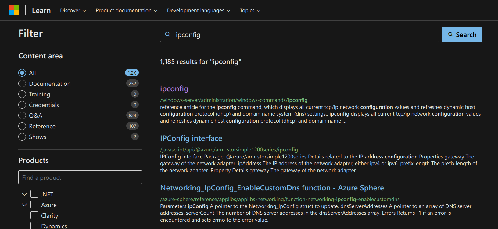

# Search Skills

## Task 1: Introduction

A quick Google search for “learn cyber security” returned around 600 million hits, while a search for “learn hacking” returned more than double that number! The number might have grown even further when you go through this room.

We are surrounded by information. Do you prefer to surrender in the face of information overload and accept the first few results you get? Or do you like to acquire the necessary search skills to find and access what you are looking for? This room aims to help you with the latter.

### Learning Objectives

The goal of this room is to teach:

- Evaluate information sources
- Use search engines efficiently
- Explore specialized search engines
- Read technical documentation
- Make use of social media
- Check news outlets

***Answer the questions below***

Check how many results you get when searching for **learn hacking**.
At the time of writing, we got 1.5 billion results when searching on Google.

***Correct answer: No answer needed***

## Task 2: Evaluation of Search Results

On the Internet, everyone can publish their writings.
It can be in the form of blog posts, articles, or social media posts.
It can be even in more subtle ways, such as by editing a public wiki page.
This ability makes it possible for anyone to voice their unfounded claims.
Everyone can express their opinion about best cyber security practices,
future programming trends, and how to best prepare for a DevSecOps interview.

It is our job, as readers, to evaluate the information.
We will mention a few things to consider when evaluating information:

- **Source:** Identify the author or organization publishing the information.
Consider whether they are reputable and authoritative on the subject matter.
Publishing a blog post does not make one an authority on the subject.
- **Evidence and reasoning:** Check whether the claims are backed by
credible evidence and logical reasoning.
We are seeking hard facts and solid arguments.
- **Objectivity and bias:** Evaluate whether the information is presented
impartially and rationally, reflecting multiple perspectives.
We are not interested in authors pushing shady agendas,
whether to promote a product or attack a rival.
- **Corroboration and consistency:** Validate the presented information
by corroboration from multiple independent sources.
Check whether multiple reliable and reputable sources agree on the central claims.

***Answer the questions below***

What do you call a cryptographic method or product considered bogus or fraudulent?

***Correct answer: snake oil***

What is the name of the command replacing `netstat` in Linux systems?

***Correct answer: ss***

## Task 3: Search Engines

Every one of us has used an Internet search engine;
however, not everyone has tried to harness the full power of an
Internet search engine. Almost every Internet search engine allows
you to carry out advanced searches. Consider the following examples:

- Google
- Bing
- DuckDuckGo

Let's consider the search operators supported by Google.

- `"exact phrase"`:
Double quotes indicate that you are looking for pages with the exact word or phrase.
For example, one might search for "passive reconnaissance"
to get pages with this exact phrase.
- `site:`: This operator lets you specify the domain name to
which you want to limit your search.
For example, we can search for success stories on TryHackMe using
`site:tryhackme.com` success stories.
- `-`: The minus sign allows you to omit search results that contain a
particular word or phrase.
For example, you might be interested in learning about the pyramids,
but you don't want to view tourism websites;
one approach is to search for `pyramids -tourism` or `-tourism pyramids`.
- `filetype:`: This search operator is indispensable for finding files
instead of web pages. Some of the file types you can search for using Google are
  - Portable Document Format (PDF),
  - Microsoft Word Document (DOC),
  - Microsoft Excel Spreadsheet (XLS), and
  - Microsoft PowerPoint Presentation (PPT).
For example, to find cyber security presentations,
try searching for `filetype:ppt` cyber security.

You can check more advanced controls in various search engines in this advanced
[search operators list](https://github.com/cipher387/Advanced-search-operators-list);
however, the above provides a good starting point.
Check your favourite search engine for the supported search operators.

***Answer the questions below***

How would you limit your Google search to PDF
files containing the terms cyber warfare report?

***Correct answer: filetype:pdf cyber warfare report***

What phrase does the Linux command `ss` stand for?

***Correct answer: socket statistics***

## Task 4: Specialized Search Engines

You are familiar with Internet search engines;
however, how much are you familiar with specialized search engines?
By that, we refer to search engines used to find specific types of results.

### Shodan

Let's start with [Shodan](https://www.shodan.io/),
a search engine for devices connected to the Internet.
It allows you to search for specific types and versions of servers,
networking equipment, industrial control systems, and IoT devices.
You may want to see how many servers are still running Apache 2.4.1
and the distribution across countries.
To find the answer, we can search for `apache 2.4.1`,
which will return the list of servers with the string
“apache 2.4.1” in their headers.

Consider visiting Shodan [Search Query Examples](https://www.shodan.io/search/examples)
for more examples. Furthermore, you can check [Shodan trends](https://trends.shodan.io/)
for historical insights if you have a subscription.

### Censys

At first glance, [Censys](https://search.censys.io/) appears similar to Shodan.
However, Shodan focuses on Internet-connected devices and systems,
such as servers, routers, webcams, and IoT devices.
Censys, on the other hand, focuses on Internet-connected hosts,
websites, certificates, and other Internet assets.
Some of its use cases include enumerating domains in use,
auditing open ports and services, and discovering rogue assets within a network.
You might want to check
[Censys Search Use Cases](https://support.censys.io/hc/en-us/articles/20720064229140-Censys-Search-Use-Cases).

### VirusTotal

[VirusTotal](https://www.virustotal.com/) is an online website that
provides a virus-scanning service for files using multiple antivirus engines.
It allows users to upload files or provide URLs to scan them against
numerous antivirus engines and website scanners in a single operation.
They can even input file hashes to check the results of previously uploaded files.

The screenshot below shows the result of checking the submitted file
against 67 antivirus engines.
Furthermore, one can check the community's comments for more insights.
Occasionally, a file might be flagged as a virus or a Trojan;
however, this might not be accurate for various reasons,
and that's when community members can provide a more in-depth explanation.

### Have I Been Pwned

[Have I Been Pwned](https://haveibeenpwned.com/) (HIBP) does one thing;
it tells you if an email address has appeared in a leaked data breach.
Finding one's email within leaked data indicates leaked private information and,
more importantly, passwords. Many users use the same password across
multiple platforms, if one platform is breached, their password on
other platforms is also exposed.
Indeed, passwords are usually stored in encrypted format;
however, many passwords are not that complex and can be recovered
using a variety of attacks.

***Answer the questions below***

What is the top country with `lighttpd` servers?

***Correct answer: United States***

What does BitDefenderFalx detect the file with the hash
`2de70ca737c1f4602517c555ddd54165432cf231ffc0e21fb2e23b9dd14e7fb4` as?

***Correct answer: Android.Riskware.Agent.LHH***

## Task 5: Vulnerabilities and Exploits

### CVE

We can think of the Common Vulnerabilities and Exposures (CVE)
program as a dictionary of vulnerabilities.
It provides a standardized identifier for vulnerabilities and
security issues in software and hardware products.
Each vulnerability is assigned a CVE ID with a standardized format like CVE-2024-29988.
This unique identifier (CVE ID) ensures that everyone from
security researchers to vendors and IT professionals is referring to the same
vulnerability, [CVE-2024-29988](https://nvd.nist.gov/vuln/detail/CVE-2024-29988)
in this case.

The MITRE Corporation maintains the CVE system.
For more information and to search for existing CVEs,
visit the [CVE Program](https://www.cve.org/) website.
Alternatively, visit the [National Vulnerability Database](https://nvd.nist.gov/)
(NVD) website. The screenshot below shows CVE-2014-0160, also known as Heartbleed.

### Exploit Database

There are many reasons why you would want to exploit a vulnerable application;
one would be assessing a company's security as part of its red team.
Needless to say, we should not try to exploit a vulnerable system unless
we are given permission, usually via a legally binding agreement.

Now that we have permission to exploit a vulnerable system,
we might need to find a working exploit code.
One resource is the [Exploit Database](https://www.exploit-db.com/).
The Exploit Database lists exploit codes from various authors;
some of these exploit codes are tested and marked as verified.

### Github

[GitHub](https://github.com), a web-based platform for software development,
can contain many tools related to CVEs, along with proof-of-concept (PoC)
and exploit codes. To demonstrate this idea, check the screenshot below of
search results on GitHub that are related to the Heartbleed vulnerability.

***Answer the questions below***

What utility does CVE-2024-3094 refer to?

***Correct answer: xz***

## Task 6: Technical Documentation

One vital skill to acquire is to look up official documentation.
We will cover a few examples of official documentation pages.

### Linux Manual Pages

Long before the Internet was everywhere,
how would you get help using a command in a Linux or Unix-like system?
The answer would be checking the manual page, man page for short.
On Linux and every Unix-like system, each command is expected to have a man page.
In fact, man pages also exist for system calls,
library functions, and even configuration files.

Let's say we want to check the manual page for the command `ip`.
We issue the command `man ip`. The screenshot below shows the page we received.
You might want to start the AttackBox and run `man ip` on the terminal.
Press `q` to quit.

If you prefer to read the man page of `ip` in your web browser,
just type `man ip` in your favourite search engine.
This page might be at the top of the results.

The AttackBox is a Linux system accessible from your browser.
Clicking on the Start AttackBox button will display the AttackBox in a split screen,
making it convenient to read the task text and apply the instructions
within the same browser window. If you hide the AttackBox window,
you can show it again by clicking the blue Show Split View button at the top.
In this task, you can start the AttackBox and use it to try Linux commands such as `man`.

### Microsoft Windows

Microsoft provides an official [Technical Documentation](https://learn.microsoft.com/)
page for its products.
The screenshot below shows the search results for the command `ipconfig`.

### Product Documentation

Every popular product is expected to have well-organized documentation.
This documentation provides an official and reliable source of information
about the product features and functions.
Examples include

- [Snort Official Documentation](https://www.snort.org/documents),
- [Apache HTTP Server Documentation](https://httpd.apache.org/docs/),
- [PHP Documentation](https://www.php.net/manual/en/index.php), and
- [Node.js Documentation](https://nodejs.org/docs/latest/api/).

It is always rewarding to check the official documentation as it is
the most up-to-date and offers the most complete product information.

***Answer the questions below***

What does the Linux command `cat` stand for?

***Correct answer: concatenate***

What is the `netstat` parameter in MS Windows that displays the
executable associated with each active connection and listening port?

***Correct answer: -b***

## Task 7: Social Media

There are billions of users registered on social media platforms such as
Facebook, Twitter, and LinkedIn.
We expect you to be familiar with popular platforms.
However, if you are aware of any platform you are not familiar with,
we recommend that you check it out and learn about it.
Ideally, one would want to explore a platform without creating an account;
however, this severely limits your experience.
Instead, one recommendation is to use a temporary email address to
discover these platforms without linking them to your real email addresses;
once done, you can terminate the accounts and associated email addresses.
One reason for not using your primary account is that you don't want
your contacts to start connecting with you there when you are only
temporarily exploring a platform.

The power of social media is that it allows you to connect with companies
and people you are interested in.
Furthermore, social media offers a wealth of information for cyber security
professionals, whether they are searching for people or technical information.
Why is searching for people important, you ask?

When protecting a company, you should ensure that the people you protect
are not oversharing on social media.
For instance, their social media might give away the answer to their secret questions,
such as, “Which school did you go to as a child?”.
Such information might allow adversaries to reset their passwords
and take over their accounts effortlessly.

Furthermore, as a cyber security professional, you want to stay updated
with new cyber security trends, technologies, and products.
Following the proper channels and groups can provide a suitable
environment for growing your technical expertise.

Besides staying updated via social media channels and groups,
we should mention news outlets.
Hundreds of news websites would offer valuable cyber-security-related news.
Try different ones and stick with the ones you like most.

***Answer the questions below***

You are hired to evaluate the security of a particular company.
What is a popular social media website you would use to learn
about the technical background of one of their employees?

***Correct answer: LinkedIn***

Continuing with the previous scenario, you are trying to find the
answer to the secret question, “Which school did you go to as a child?”.
What social media website would you consider
checking to find the answer to such secret questions?

***Correct answer: Facebook***

## Task 8: Conclusion

This room focused on the most common sources of information for cyber
security professionals. There are plenty more.
As the information landscape keeps changing,
it is impossible to cover all the sources.
However, by subscribing to relevant cyber security groups,
one can stay ahead and be aware whenever new interesting sources arise.

***Answer the questions below***

Ensure you have noted the various search engines and resources mentioned in
this room as they will be convenient in any cyber security path you follow.

***Correct answer: No answer needed***
