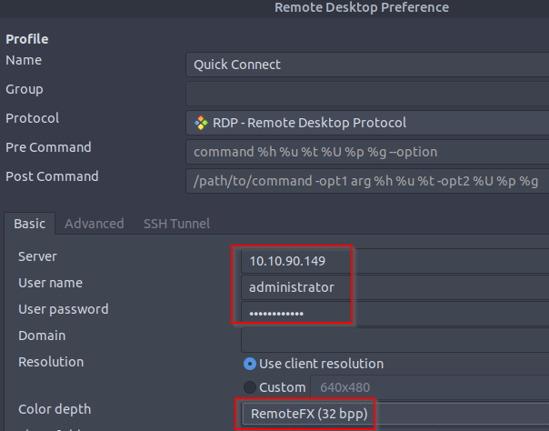
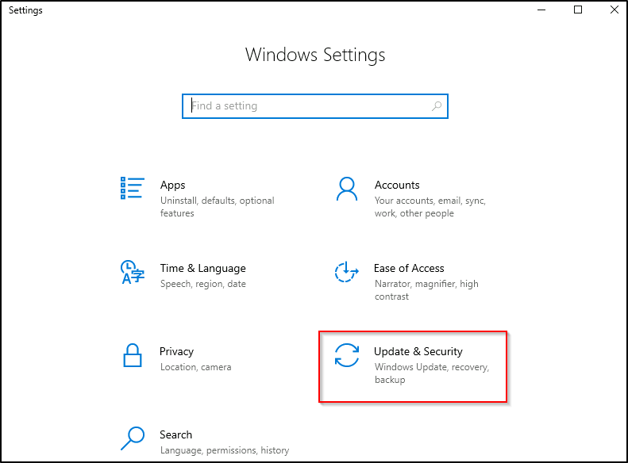
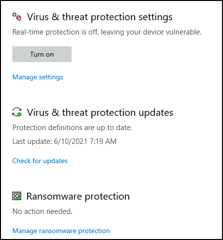
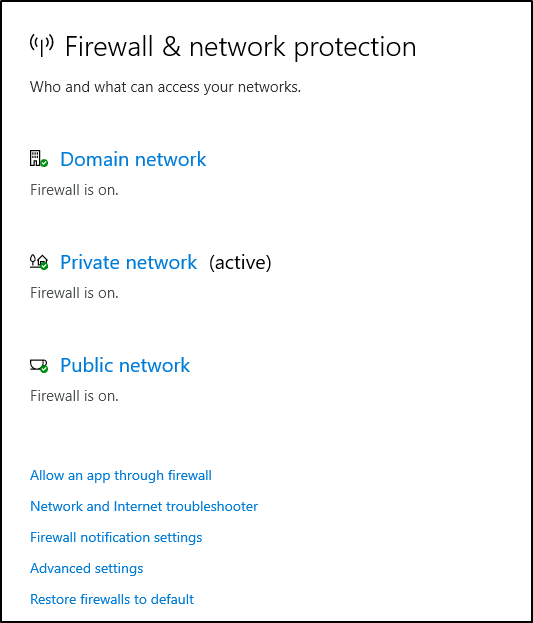

# Windows Fundamentals 3

## Task 1: Introduction

We will continue our journey exploring the Windows operating system.

To summarize the previous two rooms:

- In [Windows Fundamentals 1](https://tryhackme.com/room/windowsfundamentals1xbx),
we covered the desktop, the file system, user account control,
the control panel, settings, and the task manager.
- In [Windows Fundamentals 2](https://tryhackme.com/room/windowsfundamentals2x0x),
we covered various utilities, such as System Configuration,
Computer Management, Resource Monitor, etc.

This module will attempt to provide an overview of
the security features within the Windows operating system.

Press the Start Machine button below to launch the attached virtual machine.

If you wish to access the virtual machine via Remote Desktop, use the credentials below.

**Machine IP:** MACHINE_IP

**User:** administrator

**Password:** letmein123!

Accept the Certificate when prompted,
and you should be logged into the remote system now.

Note: The virtual machine may take up to 3 minutes to load.

***Answer the questions below***

Read the above and start the virtual machine.

***Correct answer: No answer needed***

## Task 2: Windows Updates

Let's start things off with **Windows Update**.

Windows Update is a service provided by Microsoft to provide security updates,
feature enhancements, and patches for the Windows operating system
and other Microsoft products, such as Microsoft Defender.

Updates are typically released on the 2nd Tuesday of each month.
This day is called **Patch Tuesday**.
That doesn't necessarily mean that a critical update/patch has to wait
for the next Patch Tuesday to be released.
If the update is urgent, then Microsoft will push the update via
the Windows Update service to the Windows devices.

Refer to the following link to see the Microsoft Security Update
[Guide here](https://msrc.microsoft.com/update-guide).

Windows Update is located in Settings. See below.

**Tip:** Another way to access Windows Update is from the Run dialog box, or CMD, by running the command `control /name Microsoft.WindowsUpdate`.

In the attached VM, there are a few things to highlight.

- The Windows Update settings are 'managed'.
(Typically, home users will not see this type of message)
- There are no available updates available for the virtual machine.
(The attached virtual machine does not have Internet access
to communicate with Microsoft to obtain new updates)

Throughout the years, Windows users have grown accustomed to pushing Windows Updates
off to a later date or not installing the updates at all. Various reasons caused this
action, one being the fact that a reboot is typically required after a Windows update.

Microsoft notably addressed this issue with Windows 10. The updates can no longer be
ignored or pushed to the side until forgotten. Windows updates can only be postponed,
but eventually, the update will happen, and your computer will reboot. Microsoft
provides these updates to keep the device safe and secure.

Below is an image showing how a Restart required looks and
the several options available regarding scheduling the restart.

Refer to the Windows Updates
[FAQ](https://support.microsoft.com/en-us/windows/windows-update-faq-8a903416-6f45-0718-f5c7-375e92dddeb2)
for more information.

***Answer the questions below***

There were two definition updates installed in the attached VM.
On what date were these updates installed?

*Solution:* From the Start Menu, open Windows Updates.
Then click on "History of Updates".
Then click on "Definition Updates".

***Correct answer: 5/3/2021***

## Task 3: Windows Security

Per Microsoft, *"Windows Security is your home to manage the tools
that protect your device and your data".*

In case you missed it, **Windows Security** is also available in **Settings**.

In the above image, focus your attention on **Protection areas**.

- Virus & threat protection
- Firewall & network protection
- App & browser control
- Device security

Each following task will briefly touch on these areas.

Before proceeding, let's provide a quick comment on the status icons.

- **Green** means your device is sufficiently protected,
and there aren't any recommended actions.
- **Yellow** means there is a safety recommendation for you to review.
- **Red** is a warning that something needs your immediate attention.

Click on `Open Windows Security`.

**Note:** Since the attached VM is a Windows Server 2019 edition,
it looks different from a Windows 10 Home or Professional edition.

The below image is from a Windows 10 device.

Next, we'll look at Virus & threat protection.

***Answer the questions below***

Checking the Security section on your VM, which area needs immediate attention?

***Correct answer: Virus & threat protection***

## Task 4: Virus & threat protection

Virus & threat protection is divided into two parts:

- Current threats
- Virus & threat protection settings

The image below only focuses on **Current threats**.

### Current threats

#### Scan options

- Quick scan - Checks folders in your system where threats are commonly found.
- Full scan - Checks all files and running programs on your hard disk.
This scan could take longer than one hour.
- Custom scan - Choose which files and locations you want to check.

#### Threat history

- Last scan - Windows Defender Antivirus automatically scans your
device for viruses and other threats to help keep it safe.
- Quarantined threats - Quarantined threats have been isolated and
prevented from running on your device. They will be periodically removed.
- Allowed threats - Allowed threats are items identified as threats,
which you allowed to run on your device.

Warning: Allow an item to run that has been identified as a threat only if you are 100% sure of what you are doing.

Next is Virus & threat protection settings.

### Virus & threat protection settings

#### Manage settings

- **Real-time protection** - Locates and stops malware from
installing or running on your device.
- **Cloud-delivered protection** - Provides increased and faster
protection with access to the latest protection data in the cloud.
- **Automatic sample submission** - Send sample files to Microsoft
to help protect you and others from potential threats.
- **Controlled folder access** - Protect files, folders, and memory areas
on your device from unauthorized changes by unfriendly applications.
- **Exclusions** - Windows Defender Antivirus won't scan items that you've excluded.
- **Notifications** - Windows Defender Antivirus will send notifications
with critical information about the health and security of your device.

Warning: Excluded items could contain threats that make your device vulnerable.
Only use this option if you are 100% sure of what you are doing.

#### Virus & threat protection updates

- **Check for updates** -
Manually check for updates to update Windows Defender Antivirus definitions.

#### Ransomware protection

- Controlled folder access - Ransomware protection requires this feature to be enabled,
which in turn requires Real-time protection to be enabled.

**Note:** Real-time protection is turned off in the attached VM to decrease the
chances of performance issues. Since the VM can't reach the Internet and there aren't
any threats in the VM, this is safe to do. Real-time protection should definitely be
enabled in your personal Windows devices unless you have a 3rd party product that
provides the same protection. Ensure it's always up-to-date and enabled.

**Tip:** You can perform on-demand scans on any file/folder by right-clicking
the item and selecting 'Scan with Microsoft Defender'.

The below image was taken from another Windows device to show this feature.

***Answer the questions below***

Specifically, what is turned off that Windows is notifying you to turn on?

***Correct answer: Real-time protection***

## Task 5: Firewall & network protection

### What is a firewall?

Per Microsoft, "Traffic flows into and out of devices via what we call ports.
A firewall is what controls what is - and more importantly isn't - allowed to pass
through those ports. You can think of it like a security guard standing at the door,
checking the ID of everything that tries to enter or exit".

The below image will reflect what you will see
when you navigate to Firewall & network protection.

**Note:** Each network may have different status icons for you.

What is the difference between the 3 (Domain, Private, and Public)?

Per Microsoft,
"Windows Firewall offers three firewall profiles: domain, private and public".

- Domain - The domain profile applies to networks where the host system can
authenticate to a domain controller.
- Private - The private profile is a user-assigned profile and is used to designate
private or home networks.
- Public - The default profile is the public profile, used to designate public networks
such as Wi-Fi hotspots at coffee shops, airports, and other locations.

If you click on any firewall profile, another screen will appear with two options:
turn the firewall on/off and block all incoming connections.

**Warning:** Unless you are 100% confident in what you are doing,
it is recommended that you leave your Windows Defender Firewall enabled.

#### Allow an app through firewall

You can view what the current settings for any firewall profile are. In the above image, several apps have access in the Private and/or Public firewall profile. Some of the apps will provide additional information if it's available via the Details button.

#### Advanced Settings

Configuring the Windows Defender Firewall is for advanced Windows users. Refer to the following Microsoft documentation on best practices here.

**Tip:** Command to open the Windows Defender Firewall is WF.msc.

***Answer the questions below***

If you were connected to airport Wi-Fi,
what most likely will be the active firewall profile?

***Correct answer: Public network***

## Task 6: App & browser control

In this section, you can change the settings for the Microsoft Defender SmartScreen.

Per Microsoft, "Microsoft Defender SmartScreen protects against phishing or malware
websites and applications, and the downloading of potentially malicious files".

Refer to the official Microsoft document for more information on
Microsoft Defender
[SmartScreen here](https://docs.microsoft.com/en-us/windows/security/threat-protection/microsoft-defender-smartscreen/microsoft-defender-smartscreen-overview).

### Check apps and files

- Windows Defender SmartScreen helps protect your device
by checking for unrecognized apps and files from the web.

### Exploit protection

- Exploit protection is built into Windows 10 (and, in our case, Windows Server 2019)
to help protect your device against attacks.

**Warning:** Unless you are 100% confident in what you are doing, it is recommended that you leave the default settings.

***Answer the questions below***

Read the above.

***Correct answer: No answer needed***

## Task 7: Device Security

Even though you'll probably never change any of these settings,
for completion's sake, it will be covered briefly.

### Core isolation

- Memory Integrity - Prevents attacks from inserting malicious code into high-security processes.

**Warning:** Unless you are 100% confident in what you are doing,
it is recommended that you leave the default settings.

The below images are from another machine to show another security
feature that should be available in a personal Windows 10 device.

### Security processor

Below are the Security processor details.

#### What is the Trusted Platform Module (TPM)?

Per Microsoft, "Trusted Platform Module (TPM) technology is designed to provide
hardware-based, security-related functions. A TPM chip is a secure crypto-processor
that is designed to carry out cryptographic operations. The chip includes multiple
physical security mechanisms to make it tamper-resistant, and malicious software is
unable to tamper with the security functions of the TPM".

***Answer the questions below***

What is the TPM?

***Correct answer: Trusted Platform Module***

## Task 8: BitLocker

### What is BitLocker?

Per Microsoft, "BitLocker Drive Encryption is a data protection feature that integrates
with the operating system and addresses the threats of data theft or exposure from
lost, stolen, or inappropriately decommissioned computers".

On devices with TPM installed, BitLocker offers the best protection.

Per Microsoft, "BitLocker provides the most protection when used with a Trusted
Platform Module (TPM) version 1.2 or later. The TPM is a hardware component installed
in many newer computers by the computer manufacturers. It works with BitLocker to help
protect user data and to ensure that a computer has not been tampered with
while the system was offline".

Refer to the official Microsoft documentation to learn more about
[BitLocker here](https://docs.microsoft.com/en-us/windows/security/information-protection/bitlocker/bitlocker-overview).

**Note:** The BitLocker feature is not included in the attached VM.

***Answer the questions below***

We should use a removable drive on systems without a TPM version 1.2 or later.
What does this removable drive contain?

*Solution:* Follow the link to Microsoft documentation.
Then search the page  with Ctrl+F for "removable drive".

***Correct answer: startup key***

## Task 9: Volume Shadow Copy Service

Per Microsoft, the Volume Shadow Copy Service (VSS) coordinates the required actions to
create a consistent shadow copy (also known as a snapshot or a point-in-time copy) of
the data that is to be backed up.

Volume Shadow Copies are stored on the System Volume Information
folder on each drive that has protection enabled.

If VSS is enabled (System Protection turned on), you can perform
the following tasks from within advanced system settings.

- Create a restore point
- Perform system restore
- Configure restore settings
- Delete restore points

From a security perspective, malware writers know of this Windows feature and write
code in their malware to look for these files and delete them. Doing so makes it
impossible to recover from a ransomware attack unless you have an
offline/off-site backup.

If you wish to configure Shadow Copies within the attached VM, see below.

**Bonus:** If you wish to interact hands-on with VSS, I suggest exploring Day 23 of
[Advent of Cyber 2](https://tryhackme.com/room/adventofcyber2).

***Answer the questions below***

What is VSS?

***Correct answer: Volume Shadow Copy Service***

## Task 10: Conclusion

In this room, we covered several built-in Windows security tools that ship
with the Windows OS to help keep the device protected.

There is still so much to explain and cover regarding the Windows OS. As mentioned in
the Windows Fundamentals 1 [room](https://tryhackme.com/room/windowsfundamentals1xbx),
"The content is aimed at those who wish to understand and use
the Windows OS on a more comfortable level ."

To learn more about the Windows OS, you'll need to continue the journey on your own.

Further reading material:

- [Antimalware Scan Interface](https://docs.microsoft.com/en-us/windows/win32/amsi/antimalware-scan-interface-portal)
- [Credential Guard](https://docs.microsoft.com/en-us/windows/security/identity-protection/credential-guard/credential-guard-manage)
- [Windows 10 Hello](https://support.microsoft.com/en-us/windows/learn-about-windows-hello-and-set-it-up-dae28983-8242-bb2a-d3d1-87c9d265a5f0#:~:text=Windows%2010,in%20with%20just%20your%20PIN.)
- [CSO Online - The best new Windows 10 security features](https://www.csoonline.com/article/3253899/the-best-new-windows-10-security-features.html)

**Note:** Attackers use built-in Windows tools and utilities in an attempt to go
undetected within the victim environment.  This tactic is known as Living Off The Land.
Refer to the following [resource here](https://lolbas-project.github.io/)
to learn more about this.

***Answer the questions below***

Read the above.

***Correct answer: No answer needed***
