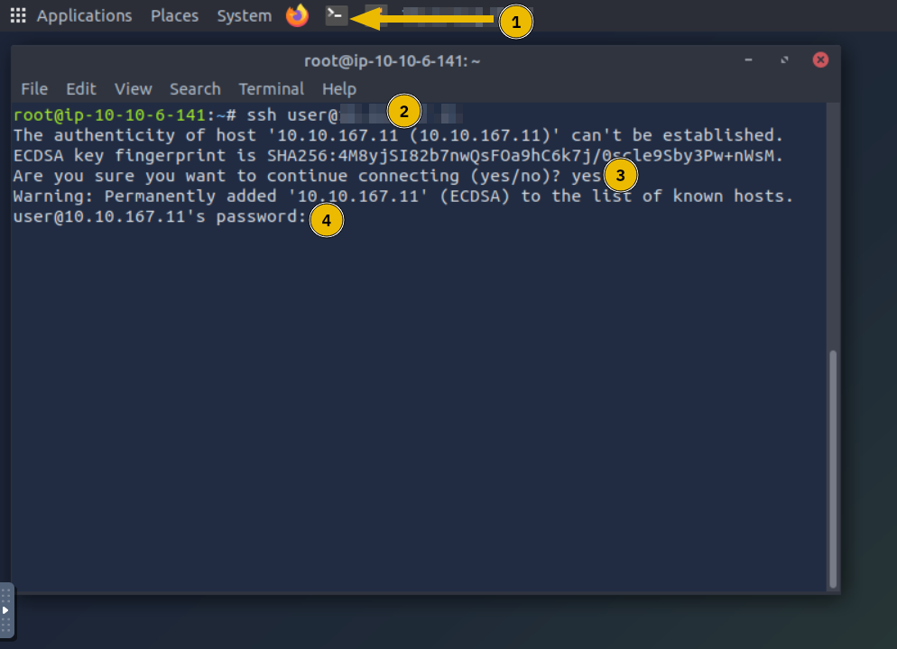

# Windows Command Line

## Task 1: Introduction

Everyone prefers a graphical user interface (GUI) until they master a
command-line interface (CLI). There are many reasons for that.
One reason is that GUIs are usually intuitive.
If someone offers you a GUI interface you are unfamiliar with,
you can quickly poke around and discover a non-trivial part.
Compare this with dealing with a CLI, i.e., a prompt.

CLI interfaces usually have a learning curve; however, as you master the command line,
you will find it faster and more efficient. Consider this trivial example:
How many clicks do you need to find your IP address using the graphical desktop?
Using the command-line interface, you don’t even need to raise your hands off
the keyboard. Let’s say you want to recheck your IP address.
You need to issue the same command instead of moving
the mouse pointer to every corner of your screen.

There are many other advantages to using a CLI besides speed and efficiency.
We will mention a few:

- Lower resource usage:
  CLIs require fewer system resources than graphics-intensive GUIs.
  In other words, you can run your CLI system on older hardware or systems
  with limited memory. If you are using cloud computing,
  your system will require lower resources, which in turn will lower your bill.
- Automation:
  While you can automate GUI tasks,
  creating a batch file or script with the commands you need to repeat is much easier.
- Remote management:
  CLI makes it very convenient to use SSH to manage a remote system
  such as a server, router, or an IoT device.
  This approach works well on slow network speeds and systems with limited resources.

### Learning Objectives

The purpose of this room is to teach you how to use MS Windows Command Prompt
`cmd.exe`, the default command-line interpreter in the Windows environment.
We will learn how to use the command line to:

- Display basic system information
- Check and troubleshoot network configuration
- Manage files and folders
- Check running processes

### Room Prerequisites

Before starting this room, you should have finished
the Windows and AD Fundamentals module.

Press the Start Machine button below.

Start the AttackBox by pressing the Start AttackBox button at the top of this page.
The AttackBox machine will start in Split-Screen view.
If it is not visible, use the blue Show Split View button at the top of the page.

You can use the SSH client on the AttackBox to connect to
MACHINE_IP with the following credentials:

- Username: `user`
- Password: `Tryhackme123!`

### Establishing an SSH Connection from the AttackBox

If this is the first time you initiate an SSH connection from the AttackBox to a target
system, the steps are shown in the screenshot below, and they are the following:

- Start the AttackBox’s terminal by clicking the terminal icon marked with 1.
- To connect to the target VM, issue the command
  `ssh user@MACHINE_IP` as user is the username in this case.
- Because this is your first time connecting to this target VM,
  you will be asked to trust this connection. Answer with yes as marked with 3.
- Enter your password `Tryhackme123!`.
  Please note that the password will not appear as you type it.



***Answer the questions below***

What is the default command line interpreter in the Windows environment?

***Correct answer: cmd.exe***

## Task 2: Basic System Information

Before issuing commands, we should note that we can only issue the commands within the
Windows Path. You can issue the command set to check your path from the command line.
The terminal output below shows the path where MS Windows will execute commands,
as indicated by the line starting with `Path=`.

```powershell
C:\>set
ALLUSERSPROFILE=C:\ProgramData
[...]
LOGNAME=strategos
NUMBER_OF_PROCESSORS=2
OS=Windows_NT
Path=C:\Windows\system32;C:\Windows;C:\Windows\System32\Wbem;C:\Windows\System32\WindowsPowerShell\v1.0\;C:\Windows\System32\OpenSSH\;C:\Windows\system32\config\systemprofile\AppData\Local\Microsoft\WindowsApps;C:\Users\strategos\AppData\Local\Microsoft\WindowsApps;
[...]
```

Let’s use the `ver` command to determine the operating system (OS) version.
The terminal below shows an example output.

```powershell
C:\>ver
Microsoft Windows [Version 10.0.17763.1821]
```

Enough warming up. Let’s discover more in-depth information about the system.
We can run the systeminfo command to list various information about the system
such as OS information, system details, processor and memory.
The terminal below shows a snippet of the displayed output.

```powershell
C:\>systeminfo

Host Name:                 WIN-SRV-2019
OS Name:                   Microsoft Windows Server 2019 Datacenter
OS Version:                10.0.17763 N/A Build 17763
OS Manufacturer:           Microsoft Corporation
OS Configuration:          Standalone Server
OS Build Type:             Multiprocessor Free
[...]
```

Before moving on, it is good to mention a couple of tricks.

First, you can pipe it through more if the output is too long.
Then, you can view it page after page by pressing the space bar button.
To demonstrate this, try running driverquery and compare it with running
`driverquery | more`. In the latter,
you can display the output page by page and you can exit it using `CTRL + C`.

- `help` - Provides help information for a specific command
- `cls` - Clears the Command Prompt screen.

***Answer the questions below***

What is the OS version of the Windows VM?

***Correct answer: 10.0.20348.2655***

What is the hostname of the Windows VM?

***Correct answer: WINSRV2022-CORE***

## Task 3: Network Troubleshooting

Most of us are used to looking up MS Windows network configuration from the GUI
interface. The command-line interface provides many networking-related commands
to look up your current configuration,
check ongoing connections, and troubleshoot networking issues.

### Network Configuration

You can check your network information using `ipconfig`.
The terminal output below shows our IP address, subnet mask, and default gateway.

```powershell
C:\>ipconfig

Windows IP Configuration

Ethernet adapter Ethernet:

   Connection-specific DNS Suffix  . : eu-west-1.compute.internal
   Link-local IPv6 Address . . . . . : fe80::90df:4861:ba40:f2a8%4
   IPv4 Address. . . . . . . . . . . : 10.10.230.237
   Subnet Mask . . . . . . . . . . . : 255.255.0.0
   Default Gateway . . . . . . . . . : 10.10.0.1
```

You can also use `ipconfig /all` for more information about your network configuration.
As shown in the terminal below, we can view our DNS servers
and confirm that DHCP is enabled.

```powershell
C:\>ipconfig /all

Ethernet adapter Ethernet 3:

   Connection-specific DNS Suffix  . : eu-west-1.compute.internal
   Description . . . . . . . . . . . : Amazon Elastic Network Adapter
   Physical Address. . . . . . . . . : 02-B7-DF-1D-0D-99
   DHCP Enabled. . . . . . . . . . . : Yes
   Autoconfiguration Enabled . . . . : Yes
   Link-local IPv6 Address . . . . . : fe80::90df:4861:ba40:f2a8%4(Preferred)
   IPv4 Address. . . . . . . . . . . : 10.10.230.237(Preferred)
   Subnet Mask . . . . . . . . . . . : 255.255.0.0
   Lease Obtained. . . . . . . . . . : Wednesday, May 1, 2024 2:38:05 PM
   Lease Expires . . . . . . . . . . : Wednesday, May 1, 2024 4:08:07 PM
   Default Gateway . . . . . . . . . : 10.10.0.1
   DHCP Server . . . . . . . . . . . : 10.10.0.1
   DHCPv6 IAID . . . . . . . . . . . : 134353458
   DHCPv6 Client DUID. . . . . . . . : 00-01-00-01-27-E3-D1-2B-0E-F8-30-D0-72-3F
   DNS Servers . . . . . . . . . . . : 10.0.0.2
   NetBIOS over Tcpip. . . . . . . . : Enabled
```

### Network Troubleshooting

One common troubleshooting task is checking if the server can access a particular server
on the Internet. The command syntax is `ping target_name`. Inspired by ping-pong,
we send a specific ICMP packet and listen for a response. If a response is received,
we know that we can reach the target and that the target can reach us.

Let’s find out if we reach example.com. In the terminal output below,
we can see that we have successfully received four replies. Furthermore,
we got some statistics; for instance, the average round trip time is 78 milliseconds.

```powershell
C:\>ping example.com

Pinging example.com [93.184.215.14] with 32 bytes of data:
Reply from 93.184.215.14: bytes=32 time=78ms TTL=52
Reply from 93.184.215.14: bytes=32 time=78ms TTL=52
Reply from 93.184.215.14: bytes=32 time=78ms TTL=52
Reply from 93.184.215.14: bytes=32 time=78ms TTL=52

Ping statistics for 93.184.215.14:
    Packets: Sent = 4, Received = 4, Lost = 0 (0% loss),
Approximate round trip times in milli-seconds:
    Minimum = 78ms, Maximum = 78ms, Average = 78ms
```

Another valuable tool for troubleshooting is `tracert`, which stands for trace route.
The command `tracert target_name` traces the network route traversed to reach the target.
Without getting into more details, it expects the routers on the path to notify us if
they drop a packet because its time-to-live (TTL) has reached zero. The terminal
output below shows that we passed through 15 routers before reaching our target.

```powershell
C:\>tracert example.com

Tracing route to example.com [93.184.215.14]
over a maximum of 30 hops:

  1    59 ms    32 ms    42 ms  ec2-3-248-240-3.eu-west-1.compute.amazonaws.com [3.248.240.3]
  2     *        *        *     Request timed out.
  3     *        *        *     Request timed out.
  4     *        *        *     Request timed out.
  5     *        *        *     Request timed out.
  6     *        *        *     Request timed out.
  7     *        *        *     Request timed out.
  8     *        *        *     Request timed out.
  9    <1 ms    13 ms    <1 ms  100.100.2.56
 10    15 ms    11 ms    11 ms  ae-42.a03.londen12.uk.bb.gin.ntt.net [131.103.117.104]
 11    17 ms    11 ms    12 ms  ae-14.r20.londen12.uk.bb.gin.ntt.net [129.250.3.248]
 12    81 ms    80 ms    80 ms  ae-7.r20.nwrknj03.us.bb.gin.ntt.net [129.250.6.147]
 13    83 ms    83 ms    86 ms  ae-0.a02.nycmny17.us.bb.gin.ntt.net [129.250.3.9]
 14    79 ms    79 ms    96 ms  ce-0-3-0.a02.nycmny17.us.ce.gin.ntt.net [128.241.1.14]
 15    81 ms    86 ms    79 ms  ae-67.core1.nyd.edgecastcdn.net [152.195.68.135]
 16    78 ms    78 ms    78 ms  93.184.215.14

Trace complete.
```

### More Networking Commands

One networking command worth knowing is `nslookup`.
It looks up a host or domain and returns its IP address.
The syntax `nslookup example.com` will look up `example.com` using the default name
server; however, `nslookup example.com 1.1.1.1` will use the name server
`one.one.one.one`. The terminal below shows the output of both commands.
The results are identical; however, you can see that the answers
were retrieved from different name servers.

```powershell
C:\>nslookup example.com
Server:  ip-10-0-0-2.eu-west-1.compute.internal
Address:  10.0.0.2

Non-authoritative answer:
Name:    example.com
Addresses:  2606:2800:21f:cb07:6820:80da:af6b:8b2c
          93.184.215.14

C:>nslookup example.com 1.1.1.1
Server:  one.one.one.one
Address:  1.1.1.1

Non-authoritative answer:
Name:    example.com
Addresses:  2606:2800:21f:cb07:6820:80da:af6b:8b2c
          93.184.215.14
```

The final networking command we will cover in this room is `netstat`.
This command displays current network connections and listening ports.
A basic `netstat` command with no arguments will show you established connections,
as shown below. In this case, we only have one SSH connection;
we figured out it is SSH because it is bound to port 22.

```powershell
C:\>netstat

Active Connections

  Proto  Local Address          Foreign Address        State
  TCP    10.10.230.237:22       ip-10-11-81-126:53486  ESTABLISHED
```

If you are curious about the other options, you can run `netstat -h`,
where `-h` displays the help page. We opted for the following options:

- `-a` displays all established connections and listening ports
- `-b` shows the program associated with each listening port and established connection
- `-o` reveals the process ID (PID) associated with the connection
- `-n` uses a numerical form for addresses and port numbers

We combine these four options and execute the `netstat -abon` command.
The result is quite long, but we display the first few lines in the terminal below.
It is clear now that the executable `sshd.exe` is responsible for listening for incoming
connections on port 22, as shown in the first line.
We can also see the process ID (PID) associated with each connection.

```powershell
C:\>netstat -abon

Active Connections

  Proto  Local Address          Foreign Address        State           PID
  TCP    0.0.0.0:22             0.0.0.0:0              LISTENING       2116
 [sshd.exe]
  TCP    0.0.0.0:135            0.0.0.0:0              LISTENING       820
  RpcSs
 [svchost.exe]
[...]
  TCP    0.0.0.0:49669          0.0.0.0:0              LISTENING       2036
 [spoolsv.exe]
  TCP    0.0.0.0:49670          0.0.0.0:0              LISTENING       584
 Can not obtain ownership information
  TCP    0.0.0.0:49686          0.0.0.0:0              LISTENING       592
 [lsass.exe]
  TCP    10.10.230.237:22       10.11.81.126:53486     ESTABLISHED     2116
 [sshd.exe]
 [...]
```

***Answer the questions below***

Which command can we use to look up the server’s physical address (MAC address)?

***Correct answer: ipconfig /all***

What is the name of the service listening on port 135?

***Correct answer: RpcSs***

What is the name of the service listening on port 3389?

***Correct answer: TermService***

## Task 4: File and Disk Management

You have learned to look up basic system information and check the network configuration.
Now, let’s discover how to browse the directories and move files around.

### Working With Directories

You can use `cd` without parameters to display the current drive and directory.
It is the equivalent of asking the system, where am I?

You can view the child directories using `dir`.

```powershell
C:\Users\strategos>cd
C:\Users\strategos

C:\Users\strategos>dir
 Volume in drive C has no label.
 Volume Serial Number is A8A4-C362

 Directory of C:\Users\strategos

05/01/2024  02:40 PM    <DIR>          .
05/01/2024  02:40 PM    <DIR>          ..
11/14/2018  06:56 AM    <DIR>          Desktop
05/01/2024  02:40 PM    <DIR>          Documents
09/15/2018  07:19 AM    <DIR>          Downloads
09/15/2018  07:19 AM    <DIR>          Favorites
09/15/2018  07:19 AM    <DIR>          Links
09/15/2018  07:19 AM    <DIR>          Music
09/15/2018  07:19 AM    <DIR>          Pictures
09/15/2018  07:19 AM    <DIR>          Saved Games
09/15/2018  07:19 AM    <DIR>          Videos
               0 File(s)              0 bytes
              11 Dir(s)  14,984,953,856 bytes free
```

Note that you can use the following options with dir:

- `dir /a` - Displays hidden and system files as well.
- `dir /s` - Displays files in the current directory and all subdirectories.

You can type tree to visually represent the child directories and subdirectories.

```powershell
C:\Users\strategos>tree
Folder PATH listing
Volume serial number is A8A4-C362
C:.
├───Desktop
├───Documents
├───Downloads
├───Favorites
├───Links
├───Music
├───Pictures
├───Saved Games
└───Videos
```

You can change to any directory by using the command `cd target_directory`;
this is equivalent to double-clicking the target_directory on your desktop.
Furthermore, you can use `cd ..` to go up one level.
An example is shown in the terminal output below.

```powershell
C:\>cd
C:\

C:\>cd Users

C:\Users>cd
C:\Users

C:\Users>cd ..

C:\>cd
C:\
```

To create a directory, use `mkdir directory_name`; `mkdir` stands for make directory.
To delete a directory, use `rmdir directory_name`; `rmdir` stands for remove directory.
The terminal output below shows creating and deleting a directory.

```powershell
C:\example>mkdir backup_files

strategos@WIN-SRV-2019 C:\example>dir
 Directory of C:\example

05/02/2024  07:36 AM    <DIR>          .
05/02/2024  07:36 AM    <DIR>          ..
05/02/2024  07:36 AM    <DIR>          backup_files
               0 File(s)              0 bytes
               3 Dir(s)  14,984,724,480 bytes free

C:\example>rmdir backup_files

C:\example>dir
 Directory of C:\example

05/02/2024  07:36 AM    <DIR>          .
05/02/2024  07:36 AM    <DIR>          ..
               0 File(s)              0 bytes
               2 Dir(s)  14,984,724,480 bytes free
```

### Working With Files

You are working with the command line. You are curious about the contents of a particular
text file. You can easily view text files with the command type. This command will dump
the contents of the text file on the screen; this is convenient for files that fit within
your terminal window. You might want to consider more for longer text files. This command
will display enough text file contents to fill your terminal window. In other words, for
long text files, more will display a single page and wait for you to press
Spacebar to move by one page (flip the page) or Enter to move by one line.

The copy command allows you to copy files from one location to another.
The following terminal output provides an example.

```powershell
C:\example>dir
 Directory of C:\example

05/02/2024  08:12 AM    <DIR>          .
05/02/2024  08:12 AM    <DIR>          ..
05/02/2024  07:57 AM                17 test.txt
               1 File(s)             17 bytes
               2 Dir(s)  14,983,409,664 bytes free

C:\example>copy test.txt test2.txt
        1 file(s) copied.

C:\example>dir
 Directory of C:\example

05/02/2024  08:12 AM    <DIR>          .
05/02/2024  08:12 AM    <DIR>          ..
05/02/2024  07:57 AM                17 test.txt
05/02/2024  07:57 AM                17 test2.txt
               2 File(s)             34 bytes
               2 Dir(s)  14,983,409,664 bytes free
```

Similarly, you can move files using the `move` command.
An example is shown in the terminal output below.

```powershell
C:\example>dir
 Directory of C:\example

05/02/2024  08:12 AM    <DIR>          .
05/02/2024  08:12 AM    <DIR>          ..
05/02/2024  07:57 AM                17 test.txt
05/02/2024  07:57 AM                17 test2.txt
               2 File(s)             34 bytes
               2 Dir(s)  14,983,409,664 bytes free

C:\example>move test2.txt ..
        1 file(s) moved.

C:\example>dir
 Directory of C:\example

05/02/2024  08:13 AM    <DIR>          .
05/02/2024  08:13 AM    <DIR>          ..
05/02/2024  07:57 AM                17 test.txt
               1 File(s)             17 bytes
               2 Dir(s)  14,983,409,664 bytes free
```

Finally, we can delete a file using `del` or `erase`.

```powershell
C:\example>dir
 Directory of C:\example

05/02/2024  08:16 AM    <DIR>          .
05/02/2024  08:16 AM    <DIR>          ..
05/02/2024  07:57 AM                17 test.txt
05/02/2024  07:57 AM                17 test2.txt
               2 File(s)             34 bytes
               2 Dir(s)  14,983,409,664 bytes free

C:\example>erase test2.txt

C:\example>dir
 Directory of C:\example

05/02/2024  08:16 AM    <DIR>          .
05/02/2024  08:16 AM    <DIR>          ..
05/02/2024  07:57 AM                17 test.txt
               1 File(s)             17 bytes
               2 Dir(s)  14,983,409,664 bytes free
```

***Answer the questions below***

What are the file’s contents in C:\Treasure\Hunt?

***Correct answer: THM{CLI_POWER}***

## Task 5: Task and Process Management

You must be familiar with MS Windows Task Manager and might be familiar
with killing non-responsive processes.
Let’s discover how to achieve a similar functionality using the command line.

We can list the running processes using tasklist.

```powershell
C:\>tasklist

Image Name                     PID Session Name        Session#    Mem Usage
========================= ======== ================ =========== ============
System Idle Process              0 Services                   0          8 K
System                           4 Services                   0         88 K
Registry                        84 Services                   0     50,700 K
smss.exe                       276 Services                   0      1,132 K
csrss.exe                      372 Services                   0      5,264 K
wininit.exe                    448 Services                   0      6,892 K
csrss.exe                      456 Console                    1      5,028 K
winlogon.exe                   516 Console                    1     11,144 K
services.exe                   584 Services                   0      7,492 K
lsass.exe                      592 Services                   0     16,108 K
svchost.exe                    704 Services                   0     23,432 K
fontdrvhost.exe                736 Console                    1      4,256 K
[...]
```

Some filtering is helpful because the output is expected to be very long.
You can check all available filters by displaying the help page using `tasklist /?`.
Let’s say that we want to search for tasks related to `sshd.exe`,
we can do that with the command `tasklist /FI "imagename eq sshd.exe"`.
Note that `/FI` is used to set the filter image name equals `sshd.exe`.

```powershell
C:\>tasklist /FI "imagename eq sshd.exe"

Image Name                     PID Session Name        Session#    Mem Usage
========================= ======== ================ =========== ============
sshd.exe                      2116 Services                   0      6,992 K
sshd.exe                      2712 Services                   0      7,668 K
sshd.exe                      4752 Services                   0      7,372 K
```

With the process ID (PID) known, we can terminate any task using
`taskkill /PID target_pid`.
For example, if we want to kill the process with PID 4567,
we would issue the command taskkill /PID 4567.

***Answer the questions below***

What command would you use to find the running processes related to notepad.exe?

***Correct answer: tasklist /FI "imagename eq notepad.exe"***

What command can you use to kill the process with PID 1516?

***Correct answer: taskkill /PID 1516***

## Task 6: Conclusion

In this room, we focused on the most practical commands for
accessing a networked system over the command line.

We intentionally omitted a few common commands as we didn’t see a real value for
including them in a beginner room. We mention them below
so that you know that the command line can be used for other tasks.

- `chkdsk`: checks the file system and disk volumes for errors and bad sectors.
- `driverquery`: displays a list of installed device drivers.
- `sfc /scannow`: scans system files for corruption and repairs them if possible.

It is important to remember all the commands covered in the previous tasks;
moreover, it is equally important to know that `/?`
can be used with most commands to display a help page.

In this room, we used the command more in two ways:

- Display text files: `more file.txt`
- Pipe long output to view it page by page: `some_command | more`

Equipped with this knowledge, we now know how to display the help
page of a new command and how to display long output one page at a time.

Now that you know the Windows command line, it is time to move to the
[Windows PowerShell](https://tryhackme.com/r/room/windowspowershell) room.

***Answer the questions below***

The command `shutdown /s` can shut down a system.
What is the command you can use to restart a system?

***Correct answer: shutdown /r***

What command can you use to abort a scheduled system shutdown?

***Correct answer: shutdown /a***
