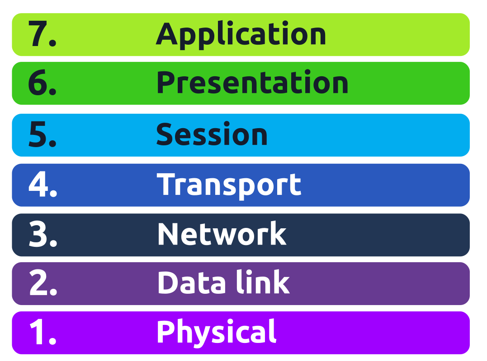
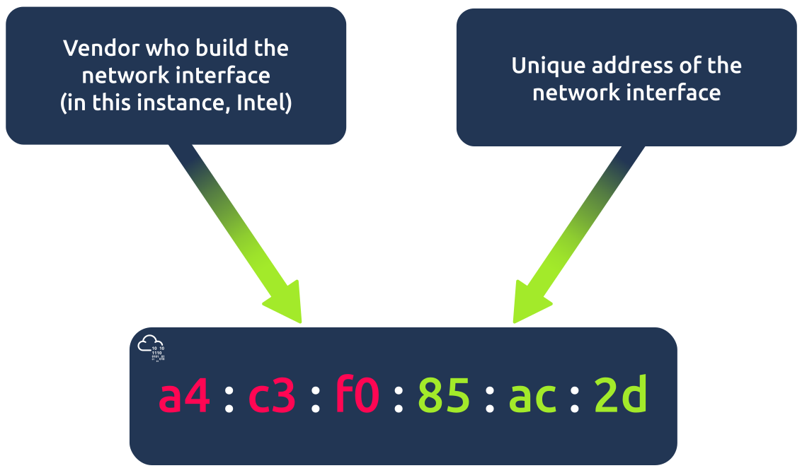
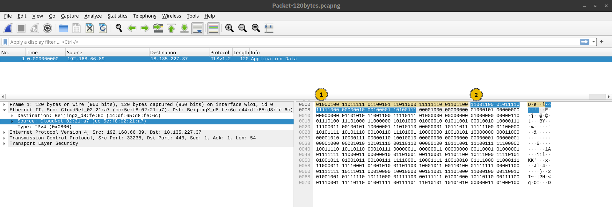
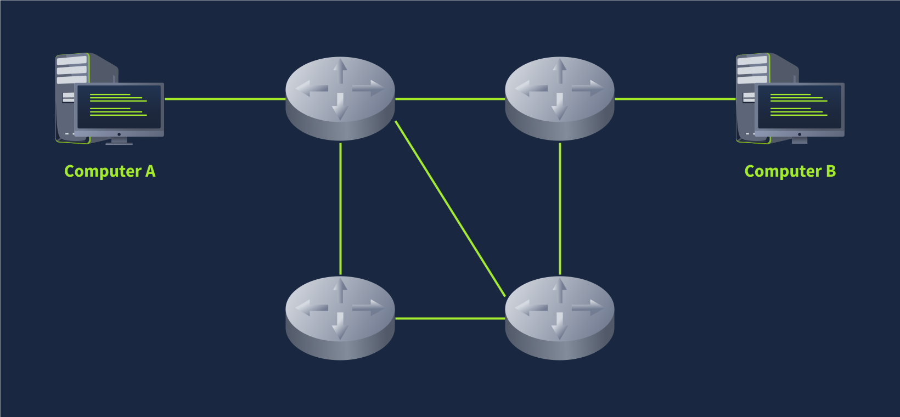
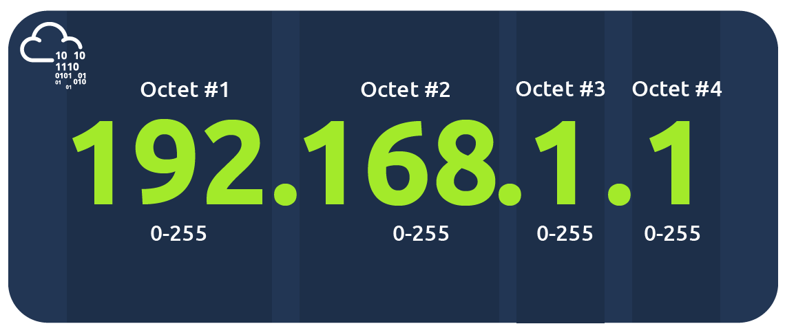
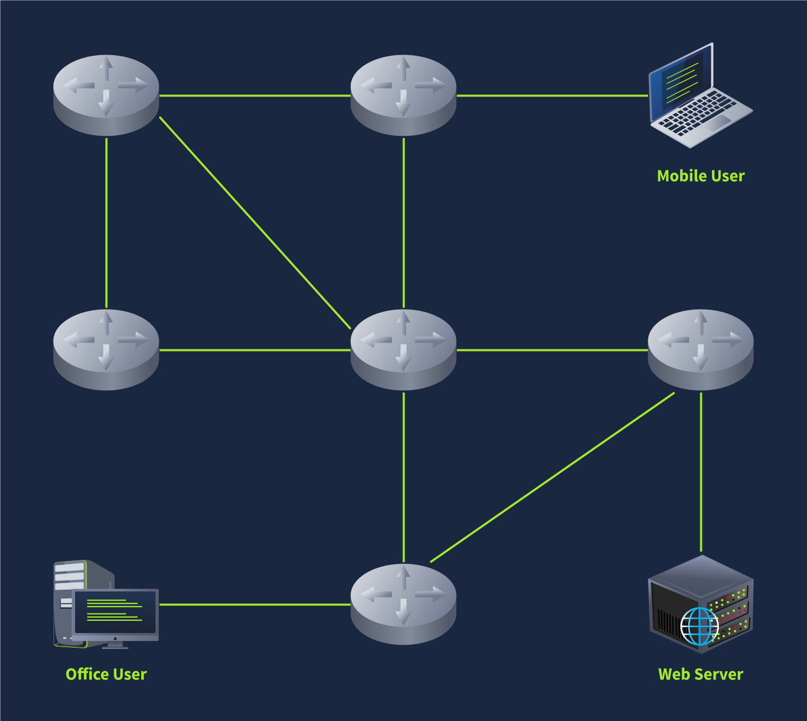
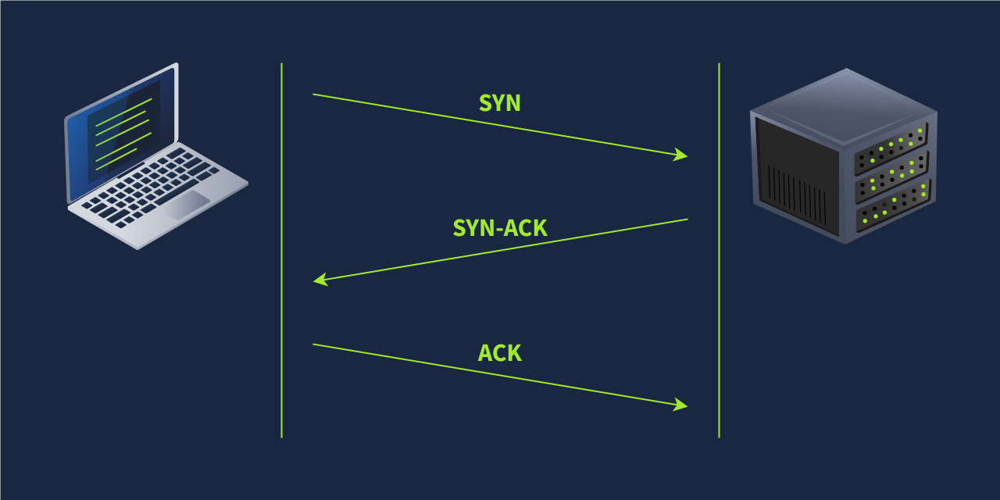
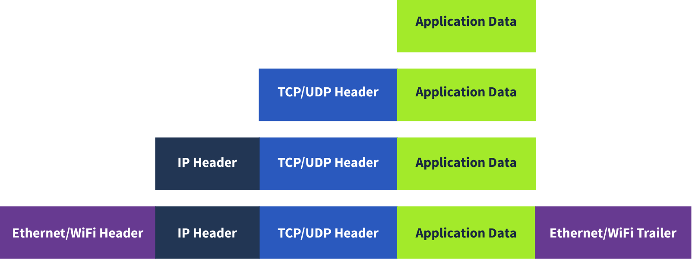

# Networking Concepts

## Task 1: Introduction

Have you ever wondered why you need an IP address to access the Internet?
Is it true that an IP address can uniquely identify the user?
Are you curious to learn what the life of a packet looks like?
If the answer is yes, let’s dive in!

This room is the first room in a series of four rooms
dedicated to introducing the user to vital networking concepts
and the most common networking protocols:

- Networking Concepts (this room)
- Networking Essentials
- Networking Core Protocols
- Networking Secure Protocols

### Room Prerequisites

This room expects that you know terms such as IP address and TCP port number;
however, we don’t expect that the reader is able to explain such terms in proper
technical depth. If you are unfamiliar with these terms,
please consider joining the Pre Security path.

### Learning Objectives

By the time you finish this room, you will have learned about the following:

- ISO OSI network model
- IP addresses, subnets, and routing
- TCP, UDP, and port numbers
- How to connect to an open TCP port from the command line

***Answer the questions below***

Get your notepad ready, and let’s begin.

***Correct answer: No answer needed***

## Task 2: OSI Model

Before we start, we should note that the OSI model might initially seem complicated.
Don’t worry if you encounter cryptic acronyms,
as we provide examples of the OSI model layers.
We assure you that by the time you finish this module,
this task will feel like a piece of cake.

The OSI (Open Systems Interconnection) model is a conceptual model developed by the
International Organization for Standardization (ISO) that describes how communications
should occur in a computer network. In other words, the OSI model defines a
framework for computer network communications. Although this model is theoretical,
it is vital to learn and understand as it helps grasp networking concepts
on a deeper level. The OSI model is composed of seven layers:

- Physical Layer
- Data Link Layer
- Network Layer
- Transport Layer
- Session Layer
- Presentation Layer
- Application Layer

The numbering starts with the physical layer being layer 1, while the top layer,
the application layer, is layer 7. To help you remember the layers from bottom to top,
you can use a mnemonic such as “Please Do Not Throw Spinach Pizza Away.”
You can check the Internet for other easy-to-remember acronyms if this
helps you memorise them. Remembering the OSI model layers with their layer
numbers is important; otherwise, you will struggle to
understand terms such as “layer 3 switch” or “layer 7 firewall.”



### Layer 1: Physical Layer

The physical layer, also referred to as layer 1, deals with the physical connection
between devices; this includes the medium, such as a wire, and the definition of the
binary digits 0 and 1. Data transmission can be via an electrical, optical, or wireless
signal. Consequently, we need data cables or antennas, depending on our physical medium.

In addition to Ethernet cable, shown in the illustration below, and optical fibre cable,
examples of the physical layer medium include the WiFi radio bands,
the 2.4 GHz band, the 5 GHz band, and the 6 GHz band.

### Layer 2: Data Link Layer

The physical layer defines a medium to transmit our signal. The data link layer, i.e.,
layer 2, represents the protocol that enables data transfer between nodes on the same
network segment. Let’s put it in simpler terms. The data link layer describes an
agreement between the different systems on the same network segment on how to
communicate. A network segment refers to a group of networked devices using a shared
medium or channel for information transfer. For example, consider a company
office with ten computers connected to a network switch; that’s a network segment.

Examples of layer 2 include Ethernet, i.e., 802.3, and WiFi, i.e., 802.11.
Ethernet and WiFi addresses are six bytes. Their address is called a MAC address,
where MAC stands for Media Access Control. They are usually expressed in hexadecimal
format with a colon separating each two hexadecimal digits (one byte).
The three leftmost bytes identify the vendor.



We expect to see two MAC addresses in each frame in real network
communication over Ethernet or WiFi. The packet in the screenshot below shows:

- The destination data-link address (MAC address) highlighted in yellow
- The source data link address (MAC address) is highlighted in blue
- The remaining bits show the data being sent



### Layer 3: Network Layer

The data link layer focuses on sending data between two nodes on the same network
segment. The network layer, i.e., layer 3, is concerned with sending data between
different networks. In more technical terms, the network layer handles
logical addressing and routing, i.e., finding a path to transfer the
network packets between the diverse networks.

In the data link layer, we gave an example of one company office with ten computers,
where the data link layer is responsible for providing a connection between them.
Let’s say that this company has multiple offices distributed across various cities,
countries, or even continents. The network layer is responsible
for connecting the different offices together.

The network below shows that computers A and B are connected,
although on different networks. You can also notice two paths connecting
the two computers; the network layer will route the network
packets through the path it deems better.



Examples of the network layer include

- Internet Protocol (IP),
- Internet Control Message Protocol (ICMP), and
- Virtual Private Network (VPN) protocols such as
  - IPSec and
  - SSL/TLS VPN.

### Layer 4: Transport Layer

Layer 4, the transport layer, enables end-to-end communication between running applications on different hosts. Your web browser is connected to the TryHackMe web server over the transport layer, which can support various functions like flow control, segmentation, and error correction.

Examples of layer 4 are Transmission Control Protocol (TCP) and User Datagram Protocol (UDP).

### Layer 5: Session Layer

The session layer is responsible for establishing, maintaining, and synchronising communication between applications running on different hosts. Establishing a session means initiating communication between applications and negotiating the necessary parameters for the session. Data synchronisation ensures that data is transmitted in the correct order and provides mechanisms for recovery in case of transmission failures.

Examples of the session layer are Network File System (NFS) and Remote Procedure Call (RPC).

### Layer 6: Presentation Layer

The presentation layer ensures the data is delivered in a form the application layer can understand. Layer 6 handles data encoding, compression, and encryption. An example of encoding is character encoding, such as ASCII or Unicode.

Various standards are used at the presentation layer. Consider the scenario where we want to send an image via email. First, we use JPEG, GIF, and PNG to save our images; furthermore, although hidden from the user by the email client, we use MIME (Multipurpose Internet Mail Extensions) to attach the file to our email. MIME encodes a binary file using 7-bit ASCII characters.

### Layer 7: Application Layer

The application layer provides network services directly to end-user applications. Your web browser would use the HTTP protocol to request a file, submit a form, or upload a file.

The application layer is the top layer, and you might have encountered many of its protocols as you use different applications. Examples of Layer 7 protocols are HTTP, FTP, DNS, POP3, SMTP, and IMAP. Don’t worry if you are not familiar with all of them.

### Summary

Reading about the ISO OSI model for the first time can be intimidating; however, it becomes easier as you progress in your study of networking protocols. To help with your studies, we have summarised the ISO OSI layers in the table below.

|Layer Number|Layer Name|Main Function|Example Protocols and Standards|
|:-----------|:---------|:------------|:------------------------------|
|Layer 7|Application layer |Providing services and interfaces to applications |HTTP, FTP, DNS, POP3, SMTP, IMAP|
|Layer 6|Presentation layer |Data encoding, encryption, and compression |Unicode, MIME, JPEG, PNG, MPEG|
|Layer 5|Session layer |Establishing, maintaining, and synchronising sessions |NFS, RPC|
|Layer 4|Transport layer |End-to-end communication and data segmentation |UDP, TCP|
|Layer 3|Network layer |Logical addressing and routing between networks |IP, ICMP, IPSec|
|Layer 2|Data link layer |Reliable data transfer between adjacent nodes |Ethernet (802.3), WiFi (802.11)|
|Layer 1| Physical layer |Physical data transmission media |Electrical, optical, and wireless signals|

***Answer the questions below***

Which layer is responsible for end-to-end communication between running applications?

***Correct answer: 4***

Which layer is responsible for routing packets to the proper network?

***Correct answer: 3***

In the OSI model, which layer is responsible for encoding the application data?

***Correct answer: 6***

Which layer is responsible for transferring data between
hosts on the same network segment?

***Correct answer: 2***

## Task 3: TCP/IP Model

Now that we have covered the conceptual ISO OSI model, it is time to study an
implemented model, the TCP/IP model. TCP/IP stands for Transmission Control Protocol/
Internet Protocol and was developed in the 1970s by the Department of Defense (DoD).
I hear you ask why DoD would create such a model.
One of the strengths of this model is that it allows a network to continue to
function as parts of it are out of service, for instance, due to a military attack.
This capability is possible in part due to the design of the routing
protocols to adapt as the network topology changes.

In our presentation of the ISO OSI model, we went from bottom to top,
from layer 1 to layer 7. In this task, let’s look at things from a
different perspective, from top to bottom. From top to bottom, we have:

- Application Layer: The OSI model application,
  presentation and session layers, i.e., layers 5, 6, and 7,
  are grouped into the application layer in the TCP/IP model.
- Transport Layer: This is layer 4.
- Internet Layer: This is layer 3. The OSI model’s network layer
  is called the Internet layer in the TCP/IP model.
- Link Layer: This is layer 2.

The table below shows how the TCP/IP model layers map to the ISO/OSI model layers.

|Layer Number|ISO OSI Model|TCP/IP Model (RFC 1122)|Protocols|
|:-|:-|:-|:-|
|7|Application Layer|Application Layer|HTTP, HTTPS, FTP, POP3, SMTP, IMAP, Telnet, SSH|
|6|Presentation Layer|||
|5|Session Layer|||
|4|Transport Layer|Transport Layer|TCP, UDP|
|3|Network Layer|Internet Layer|IP, ICMP, IPSec|
|2|Data Link Layer|Link Layer|Ethernet 802.3, WiFi 802.11|
|1|Physical Layer|||

Many modern networking textbooks show the TCP/IP model as five layers instead of four.
For example, in Computer Networking: A Top-Down Approach 8th Edition, Kurose and Ross
describe the following five-layer Internet protocol stack by including the physical layer:

- Application
- Transport
- Network
- Link
- Physical

In the following tasks, we will cover the IP protocol from the
Internet layer and the UDP and TCP protocols from the transport layer.

***Answer the questions below***

To which layer does HTTP belong in the TCP/IP model?

***Correct answer: Application Layer***

How many layers of the OSI model does the application layer in the TCP/IP model cover?

***Correct answer: 3***

## Task 4: IP Addresses and Subnets

When you hear the word IP address, you might think of an address like 192.168.0.1 or
something less common, such as 172.16.159.243. In both cases, you are right.
Both of these are IP addresses; IPv4 (IP version 4) addresses to be specific.

Every host on the network needs a unique identifier for other hosts to communicate
with him. Without a unique identifier, the host cannot be found without ambiguity.
When using the TCP/IP protocol suite, we need to assign an
IP address for each device connected to the network.

One analogy of an IP address is your home postal address. Your postal address allows
you to receive letters and parcels from all over the world. Furthermore,
it can identify your home without ambiguity; otherwise, you cannot shop online!

As you might already know, we have IPv4 and IPv6 (IP version 6). IPv4 is still the
most common, and whenever you come across a text mentioning
IP without the version, we expect them to mean IPv4.

So, what makes an IP address? An IP address comprises four octets, i.e., 32 bits.
Being 8 bits, an octet allows us to represent a decimal number
between 0 and 255. An IP address is shown in the image below.



At the risk of oversimplifying things, the 0 and 255 are reserved for the network and
broadcast addresses, respectively. In other words, 192.168.1.0 is the network address,
while 192.168.1.255 is the broadcast address. Sending to the broadcast address targets
all the hosts on the network. With simple math, you can conclude that we cannot have more
than 4 billion unique IPv4 addresses. If you are curious about the math, it is
approximately 232 because we have 32 bits. This number is approximate
because we didn’t consider network and broadcast addresses.

### Looking Up Your Network Configuration

You can look up your IP address on the MS Windows command line using the command
`ipconfig`. On Linux and UNIX-based systems, you can issue the command `ifconfig`
or `ip address show`, which can be typed as `ip a s`.
In the terminal window below, we show ifconfig.

```bash

user@TryHackMe$ ifconfig
[...]
wlo1: flags=4163<UP,BROADCAST,RUNNING,MULTICAST>  mtu 1500
        inet 192.168.66.89  netmask 255.255.255.0  broadcast 192.168.66.255
        inet6 fe80::73e1:ca5e:3f93:b1b3  prefixlen 64  scopeid 0x20<link>
        ether cc:5e:f8:02:21:a7  txqueuelen 1000  (Ethernet)
        RX packets 19684680  bytes 18865072842 (17.5 GiB)
        RX errors 0  dropped 364  overruns 0  frame 0
        TX packets 14439678  bytes 8773200951 (8.1 GiB)
        TX errors 0  dropped 0 overruns 0  carrier 0  collisions 0
```

The terminal output above indicates the following:

- The host (laptop) IP address is 192.168.66.89
- The subnet mask is 255.255.255.0
- The broadcast address is 192.168.66.255

Let’s use ip a s to compare how the network card IP address is presented.

```bash

user@TryHackMe$ ip a s
[...]
4: wlo1: <BROADCAST,MULTICAST,UP,LOWER_UP> mtu 1500 qdisc noqueue state UP group default qlen 1000
    link/ether cc:5e:f8:02:21:a7 brd ff:ff:ff:ff:ff:ff
    altname wlp3s0
    inet 192.168.66.89/24 brd 192.168.66.255 scope global dynamic noprefixroute wlo1
       valid_lft 36795sec preferred_lft 36795sec
    inet6 fe80::73e1:ca5e:3f93:b1b3/64 scope link noprefixroute
       valid_lft forever preferred_lft forever
```

The terminal output above indicates the following:

- The host (laptop) IP address is 192.168.66.89/24
- The broadcast address is 192.168.66.255

If you are wondering, a subnet mask of 255.255.255.0 can also be written as /24.
The /24 means that the leftmost 24 bits within the IP address do not change across the
network, i.e., the subnet. In other words, the leftmost three octets are the same across
the whole subnet; therefore, we can expect to find addresses that range from 192.168.66.1
to 192.168.66.254. Similar to what was mentioned earlier, 192.168.66.0
and 192.168.66.255 are the network and broadcast addresses, respectively.

### Private Addresses

As we are explaining IP addresses, it is useful to mention that for
most practical purposes, there are two types of IP addresses:

- Public IP addresses
- Private IP addresses

RFC 1918 defines the following three ranges of private IP addresses:

- 10.0.0.0 - 10.255.255.255 (10/8)
- 172.16.0.0 - 172.31.255.255 (172.16/12)
- 192.168.0.0 - 192.168.255.255 (192.168/16)

We presented earlier an analogy stating that a public IP address is like your home
postal address. A private IP address is different; the original idea is that it cannot
reach or be reached from the outside world. It is like an isolated city or a compound,
where all houses and apartments are numbered systematically and can easily exchange mail
with each other, but not with the outside world. For a private IP address to access the
Internet, the router must have a public IP address and must support Network Address
Translation (NAT). At this stage, let’s not worry about understanding how NAT works,
as we will revisit it later in this module.

Before moving on, I recommend memorising the private IP address ranges.
Otherwise, you might see an IP address such as 10.1.33.7 or 172.31.33.7
and try to access it from a public IP address.

### Routing

A router is like your local post office; you hand them the mail parcel, and they would
know how to deliver it. If we dig deeper, you might mail something to an address in
another city or country. The post office will check the address and decide
where to send it next. For example, if it is to leave the country,
we expect one central office to handle all shipments abroad.

In technical terms, a router forwards data packets to the proper network.
Usually, a data packet passes through multiple routers before it reaches its final
destination. The router functions at layer 3, inspecting the IP address and forwarding
the packet to the best network (router) so the packet gets closer to its destination.



***Answer the questions below***

Which of the following IP addresses is not a private IP address?

- 192.168.250.125
- 10.20.141.132
- 49.69.147.197
- 172.23.182.251

***Correct answer: 49.69.147.197***

Which of the following IP addresses is not a valid IP address?

- 192.168.250.15
- 192.168.254.17
- 192.168.305.19
- 192.168.199.13

***Correct answer: 192.168.305.19***

## Task 5: UDP and TCP

The IP protocol allows us to reach a destination host on the network; the host is identified by its IP address. We need protocols that would enable processes on networked hosts to communicate with each other. There are two transport protocols to achieve that: UDP and TCP.

### UDP

UDP (User Datagram Protocol) allows us to reach a specific process on this target host. UDP is a simple connectionless protocol that operates at the transport layer, i.e., layer 4. Being connectionless means that it does not need to establish a connection. UDP does not even provide a mechanism to know that the packet has been delivered.

An IP address identifies the host; we need a mechanism to determine the sending and receiving process. This can be achieved by using port numbers. A port number uses two octets; consequently, it ranges between 1 and 65535; port 0 is reserved. (The number 65535 is calculated by the expression 216 − 1.)

A real-life example similar to UDP is the standard mail service, with no delivery confirmation. In other words, there is no guarantee that the UDP packet has been received successfully, similar to the case of sending a parcel using standard mail with no confirmation of delivery. In the case of standard mail, it means a cheaper cost than the mail delivery options with confirmation. In the case of UDP, it means better speed than a transport protocol that provides “confirmation.”

But what if we want a transport protocol that acknowledges received packets? The answer lies in using TCP instead of UDP.

### TCP

TCP (Transmission Control Protocol) is a connection-oriented transport protocol.
It uses various mechanisms to ensure reliable data delivery sent by the different
processes on the networked hosts. Like UDP, it is a layer 4 protocol.
Being connection-oriented, it requires the establishment of a
TCP connection before any data can be sent.

In TCP, each data octet has a sequence number; this makes it easy for the receiver to
identify lost or duplicated packets. The receiver, on the other hand, acknowledges the
reception of data with an acknowledgement number specifying the last received octet.

A TCP connection is established using what’s called a three-way handshake.
Two flags are used:

- SYN (Synchronise) and
- ACK (Acknowledgment).

The packets are sent as follows:

- SYN Packet: The client initiates the connection by sending a SYN packet to the server.
  This packet contains the client’s randomly chosen initial sequence number.
- SYN-ACK Packet: The server responds to the SYN packet with a SYN-ACK packet,
  which adds the initial sequence number randomly chosen by the server.
- ACK Packet: The three-way handshake is completed as the client sends an
  ACK packet to acknowledge the reception of the SYN-ACK packet.



Similar to UDP, TCP identifies the process of initiating or waiting (listening)
for a connection using port numbers. As stated, a valid port number ranges
between 1 and 65535 because it uses two octets and port 0 is reserved.

***Answer the questions below***

Which protocol requires a three-way handshake?

***Correct answer: TCP***

What is the approximate number of port numbers (in thousands)?

***Correct answer: 65***

## Task 6: Encapsulation

Before wrapping up, it is crucial to explain another key concept: encapsulation.
In this context, encapsulation refers to the process of every layer adding a header
(and sometimes a trailer) to the received unit of data
and sending the “encapsulated” unit to the layer below.

Encapsulation is an essential concept as it allows each layer to focus on
its intended function. In the image below, we have the following four steps:

- Application data: It all starts when the user inputs the data they want to send into
  the application. For example, you write an email or an instant message and hit the
  send button. The application formats this data and starts sending it according
  to the application protocol used, using the layer below it, the transport layer.
- Transport protocol segment or datagram: The transport layer, such as TCP or UDP, adds
  the proper header information and creates the TCP segment (or UDP datagram).
  This segment is sent to the layer below it, the network layer.
- Network packet: The network layer, i.e. the Internet layer, adds an IP header to the
  received TCP segment or UDP datagram. Then, this IP packet
  is sent to the layer below it, the data link layer.
- Data link frame: The Ethernet or WiFi receives the IP packet and
  adds the proper header and trailer, creating a frame.

We start with application data. At the transport layer, we add a TCP or UDP header to
create a TCP segment or UDP datagram. Again, at the network layer, we add the proper
IP header to get an IP packet that can be routed over the Internet. Finally, we add
the appropriate header and trailer to get a WiFi or Ethernet frame at the link layer.



The process has to be reversed on the receiving end
until the application data is extracted.

### The Life of a Packet

Based on what we have studied so far, we can explain a simplified version of the
packet’s life. Let’s consider the scenario where you search for a room on TryHackMe.

1. On the TryHackMe search page, you enter your search query and hit enter.
   Your web browser, using HTTPS, prepares an HTTP request
   and pushes it to the layer below it, the transport layer.
2. The TCP layer needs to establish a connection via a three-way handshake between
   your browser and the TryHackMe web server. After establishing the TCP connection,
   it can send the HTTP request containing the search query.
   Each TCP segment created is sent to the layer below it, the Internet layer.
3. The IP layer adds the source IP address, i.e., your computer, and the destination IP
   address, i.e., the IP address of the TryHackMe web server. For this packet to
   reach the router, your laptop delivers it to the layer below it, the link layer.
4. Depending on the protocol, The link layer adds the proper
   link layer header and trailer, and the packet is sent to the router.
5. The router removes the link layer header and trailer, inspects the IP destination,
   among other fields, and routes the packet to the proper link.
   Each router repeats this process until it reaches the router of the target server.

The steps will then be reversed as the packet reaches the router of
the destination network. As we cover additional protocols,
we will revisit this exercise and create a more in-depth version.

***Answer the questions below***

On a WiFi, within what will an IP packet be encapsulated?

***Correct answer: Frame***

What do you call the UDP data unit that encapsulates the application data?

***Correct answer: Datagram***

What do you call the data unit that encapsulates the application data sent over TCP?

***Correct answer: Segment***

## Task 7: Telnet

Press the Start Machine button below.

Start the AttackBox by pressing the Start AttackBox button at the top of this page.
The AttackBox machine will start in Split-Screen view. If it is not visible,
use the blue Show Split View button at the top of the page.

Give them about 2 minutes each to properly boot up. Once the two machines are ready,
we need to start the terminal on the AttackBox to experiment with telnet.

The TELNET (Teletype Network) protocol is a network protocol for remote terminal
connection. In simpler words, telnet, a TELNET client, allows you to connect to and
communicate with a remote system and issue text commands.
Although initially it was used for remote administration,
we can use telnet to connect to any server listening on a TCP port number.

On the target virtual machine, different services are running.
We will experiment with three of them:

- Echo server: This server echoes everything you send it.
  By default, it listens on port 7.
- Daytime server: This server listens on port 13 by default
  and replies with the current day and time.
- Web (HTTP) server: This server listens on TCP port 80 by default and serves web pages.

Before continuing, we should mention that the echo and daytime servers are considered
security risks and should not be run; however, we started them explicitly to demonstrate
communication with the server using telnet. In the terminal below,
we connect to the target VM at the echo server’s TCP port number 7.
To close the connection, press the `CTRL + ]` keys simultaneously.

```bash
user@TryHackMe$ telnet MACHINE_IP 7
telnet MACHINE_IP 7
Trying MACHINE_IP...
Connected to MACHINE_IP.
Escape character is '^]'.
Hi
Hi
How are you?
How are you?
Bye
Bye
^]

telnet> quit
Connection closed.
```

In the terminal below, we use telnet to connect to the
daytime server listening at port 13. We noticed that
the connection closes once the current date and time are returned.

```bash
user@TryHackMe$ telnet MACHINE_IP 13
Trying MACHINE_IP...
Connected to MACHINE_IP.
Escape character is '^]'.
Thu Jun 20 12:36:32 PM UTC 2024
Connection closed by foreign host.
```

Finally, let’s request a web page using telnet. After connecting to port 80, you need to
issue the command `GET / HTTP/1.1` and identify the host where anything goes,
such as `Host: telnet.thm`. Next, you need to press
Enter twice so your last input line is a blank line.
The output below shows the exchange. (The page has been redacted.)

Note: You may have to press Enter after sending the information
in case you don’t get a response.

```bash
user@TryHackMe$ telnet MACHINE_IP 80
Trying MACHINE_IP...
Connected to MACHINE_IP.
Escape character is '^]'.
GET / HTTP/1.1
Host: telnet.thm

HTTP/1.1 200 OK
Content-Type: text/html
[...]

Connection closed by foreign host.
```

***Answer the questions below***

Use `telnet` to connect to the web server on `MACHINE_IP`.
What is the name and version of the HTTP server?

***Correct answer:***

What flag did you get when you viewed the page?

***Correct answer:***

## Task 8: Conclusion

In this room, we covered the ISO OSI and TCP/IP models, comparing and contrasting the
two. We also covered IP addresses and subnets, briefly explaining routing. Furthermore,
after diving into TCP and UDP, we explained encapsulation.
For demonstration purposes, we used telnet to “talk” to different servers over TCP.

Now that you have finished Networking Concepts, it is time to join Networking Essentials.

***Answer the questions below***

Please note and remember all the concepts, network layers,
and protocols explained in this room.

***Correct answer: No answer needed***
