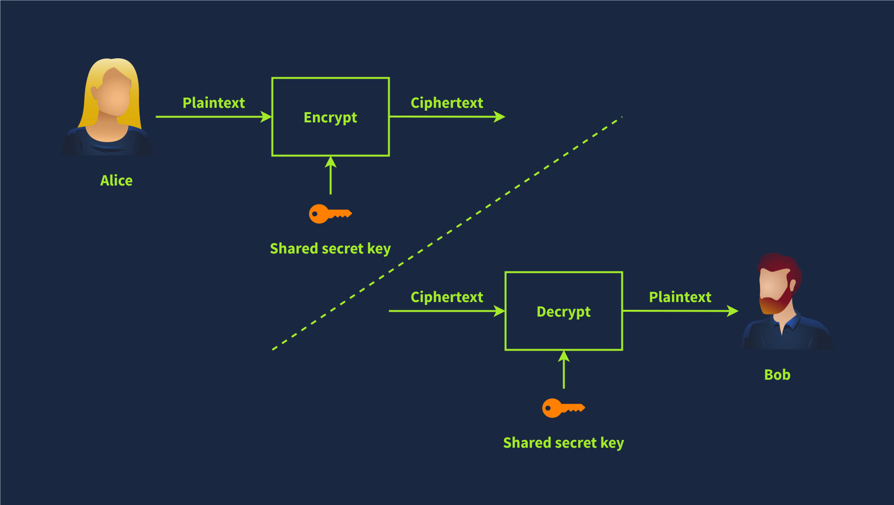

# Cyrptography Basics

## Task 1: Introduction

Have you ever wondered how to prevent third parties from reading your messages?
How can your app or web browser build a secure channel with a remote server?
By secure, we mean that no one can read or alter the exchanged data;
furthermore, we can be confident that we are connecting with the real server.
Thanks to cryptography, these requirements are satisfied.

Cryptography lays the foundation for our digital world. While networking protocols
have made it possible for devices spread across the globe to communicate,
cryptography has made it possible to trust this communication.

This room is the first of three introductory rooms about cryptography.
There are no learning prerequisites except basic abilities to use the Linux command line.
If you are not sure, please consider joining the Pre Security path.

- Cryptography Basics (this room)
- Public Key Cryptography Basics
- Hashing Basics

### Learning Objectives

Upon completing this room, you will learn the following:

- Cryptography key terms
- Importance of cryptography
- Caesar Cipher
- Standard symmetric ciphers
- Common asymmetric ciphers
- Basic mathematics commonly used in cryptography

***Answer the questions below***

I’m ready to start learning about cryptography!

***Correct answer: No answer needed***

## Task 2: Importance of Cryptography

Cryptography’s ultimate purpose is to ensure secure communication in the presence of
adversaries. The term secure includes confidentiality and integrity of the communicated
data. Cryptography can be defined as the practice and study of techniques for secure
communication and data protection where we expect the presence of
adversaries and third parties. In other words, these adversaries
should not be able to disclose or alter the contents of the messages.

Cryptography is used to protect confidentiality, integrity, and authenticity. In this
age, you use cryptography daily, and you’re almost certainly reading this over an
encrypted connection. Consider the following scenarios where you would use cryptography:

- When you log in to TryHackMe, your credentials are encrypted and sent to the server so
  that no one can retrieve them by snooping on your connection.
- When you connect over SSH, your SSH client and the server establish an
  encrypted tunnel so no one can eavesdrop on your session.
- When you conduct online banking, your browser checks the remote server’s certificate to
  confirm that you are communicating with your bank’s server and not an attacker’s.
- When you download a file, how do you check if it was downloaded correctly?
  Cryptography provides a solution through hash functions to
  confirm that your file is identical to the original one.

As you can see, you rarely have to interact directly with cryptography, but its solutions
and implications are everywhere in the digital world. Consider the case where a company
wants to handle credit card information and process related transactions. When handling
credit cards, the company must follow and enforce the Payment Card Industry Data Security
Standard (PCI DSS). In this case, the PCI DSS ensures a minimum level of
security to store, process, and transmit data related to card credits.
If you check the PCI DSS for Large Organizations, you will learn that the data should be
encrypted both while being stored (at rest) and while being transmitted (in motion).

In the same way that handling payment card details requires complying with PCI DSS,
handling medical records requires complying with their respective standards. Unlike
credit cards, the standards for handling medical records vary from one country to
another. Example laws and regulations that should be considered when handling medical
records include HIPAA (Health Insurance Portability and Accountability Act) and HITECH
(Health Information Technology for Economic and Clinical Health) in the USA, GDPR
(General Data Protection Regulation) in the EU, DPA (Data Protection Act) in the UK.
Although the list is not exhaustive, it gives an idea about the legal requirements
that healthcare providers should consider depending on their country.
These laws and regulations show that cryptography is a necessity that
should be present yet usually hidden from direct user access.

***Answer the questions below***

What is the standard required for handling credit card information?

***Correct answer: PCI DSS***

## Task 3: Plaintext to Ciphertext

Let’s start with an illustration before introducing the key terms. We begin with the
plaintext that we want to encrypt. The plaintext is the readable data; it can be anything
from a simple “hello”, a cat photo, credit card information, or medical health records.
From a cryptography perspective, these are all “plaintext” messages waiting to be
encrypted. The plaintext is passed through the encryption function along with a proper
key; the encryption function returns a ciphertext. The encryption function is part of the
cipher; a cipher is an algorithm to convert a plaintext into a ciphertext and vice versa.

To recover the plaintext, we must pass the ciphertext along with the proper
key via the decryption function, which would give us the original plaintext.
This is shown in the illustration below.

We have just introduced several new terms, and we need to learn them to
understand any text about cryptography. The terms are listed below:

- Plaintext is the original, readable message or data before it’s encrypted.
  It can be a document, an image, a multimedia file, or any other binary data.
- Ciphertext is the scrambled, unreadable version of the message after encryption.
  Ideally, we cannot get any information about
  the original plaintext except its approximate size.
- Cipher is an algorithm or method to convert plaintext into ciphertext and back again.
  A cipher is usually developed by a mathematician.
- Key is a string of bits the cipher uses to encrypt or decrypt data.
  In general, the used cipher is public knowledge; however,
  the key must remain secret unless it is the public key in asymmetric encryption.
  We will visit asymmetric encryption in a later task.
- Encryption is the process of converting plaintext into ciphertext using
  a cipher and a key. Unlike the key, the choice of the cipher is disclosed.
- Decryption is the reverse process of encryption, converting ciphertext back into
  plaintext using a cipher and a key. Although the cipher would be public knowledge, recovering the plaintext without knowledge of the key should be impossible (infeasible).

***Answer the questions below***

What do you call the encrypted plaintext?

***Correct answer: ciphertext***

What do you call the process that returns the plaintext?

***Correct answer: decryption***

## Task 4: Historical Ciphers

Cryptography’s history is long and dates back to ancient Egypt in 1900 BCE. However, one
of the simplest historical ciphers is the Caesar Cipher from the first century BCE.
The idea is simple: shift each letter by a certain number to encrypt the message.

Consider the following example:

- Plaintext: `TRYHACKME`
- Key: 3 (Assume it is a right shift of 3.)
- Cipher: Caesar Cipher

We can easily figure out that T becomes W, R becomes U, Y becomes B, and so on.
As you noticed, once we reach Z, we start all over, as shown in the figure below.
Consequently, we get the ciphertext of WUBKDFNPH.

To decrypt, we need the following information:

- Ciphertext: `WUBKDFNPH`
- Key: 3
- Cipher: Caesar Cipher

For encryption, we shift to the right by three; for decryption, we shift to the left by
three and recover the original plaintext, as illustrated in the image above.
However, if someone gives you a ciphertext and tells you that it was encrypted using
Caesar Cipher, recovering the original text would be a trivial task as there are only 25
possible keys. The English alphabet is 26 letters, and shifting by 26 will keep the
letter unchanged; hence, 25 valid keys for encryption with Caesar Cipher.
The figure below shows how decryption will succeed by attempting all the possible keys;
in this case, we recovered the original message with Key = 5. Consequently, by today’s
standards, where the cipher is publicly known, Caesar Cipher is considered insecure.

You would come across many more historical ciphers in movies and cryptography books. Examples include:

- The Vigenère cipher from the 16th century
- The Enigma machine from World War II
- The one-time pad from the Cold War

***Answer the questions below***

Knowing that `XRPCTCRGNEI` was encrypted using Caesar Cipher,
what is the original plaintext?

***Correct answer:***

## Task 5: Types of Encryption

The two main categories of encryption are symmetric and asymmetric.

### Symmetric Encryption

Symmetric encryption, also known as symmetric cryptography, uses the same key to encrypt
and decrypt the data, as shown in the figure below. Keeping the key secret is a must; it
is also called private key cryptography. Furthermore, communicating the key to the
intended parties can be challenging as it requires a secure communication channel.
Maintaining the secrecy of the key can be a significant challenge, especially if there
are many recipients. The problem becomes more severe in the presence of a
powerful adversary; consider the threat of industrial espionage, for instance.

Consider the simple case where you created a password-protected document to share it with
your colleague. You can easily email the encrypted document to your colleague, but most
likely, you cannot email them the password. The reason is that anyone with access to
their mailbox would access both the password-protected document and its password.
Therefore, you need to think of a different way, i.e., channel, to share the password.
Unless you think of a secure, accessible channel, one solution would be
to meet in person and communicate the password to them.

Examples of symmetric encryption are DES (Data Encryption Standard),
3DES (Triple DES) and AES (Advanced Encryption Standard).

- DES was adopted as a standard in 1977 and uses a 56-bit key.
  With the advancement in computing power, in 1999, a DES key
  was successfully broken in less than 24 hours, motivating the shift to 3DES.
- 3DES is DES applied three times; consequently, the key size is 168 bits, though the
  effective security is 112 bits. 3DES was more of an ad-hoc solution when DES was no
  longer considered secure. 3DES was deprecated in 2019 and should be replaced by AES;
  however, it may still be found in some legacy systems.
- AES was adopted as a standard in 2001. Its key size can be 128, 192, or 256 bits.

There are many more symmetric encryption ciphers used in various applications;
however, they have not been adopted as standards.

### Asymmetric Encryption

Unlike symmetric encryption, which uses the same key for encryption and decryption,
asymmetric encryption uses a pair of keys, one to encrypt and the other to decrypt,
as shown in the illustration below. To protect confidentiality, asymmetric encryption
or asymmetric cryptography encrypts the data using the public key;
hence, it is also called public key cryptography.

Examples are RSA, Diffie-Hellman, and Elliptic Curve cryptography (ECC).
The two keys involved in the process are referred to as a public key and a private key.
Data encrypted with the public key can be decrypted with the private key.
Your private key needs to be kept private, hence the name.

Asymmetric encryption tends to be slower, and many asymmetric encryption ciphers use
larger keys than symmetric encryption. For example, RSA uses 2048-bit, 3072-bit, and
4096-bit keys; 2048-bit is the recommended minimum key size. Diffie-Hellman also has a
recommended minimum key size of 2048 bits but uses 3072-bit and 4096-bit keys for
enhanced security. On the other hand, ECC can achieve equivalent security
with shorter keys. For example, with a 256-bit key,
ECC provides a level of security comparable to a 3072-bit RSA key.

Asymmetric encryption is based on a particular group of mathematical problems that are
easy to compute in one direction but extremely difficult to reverse. In this context,
extremely difficult means practically infeasible. For example, we can rely on a
mathematical problem that would take a very long time, for example,
millions of years, to solve using today’s technology.

We will visit various asymmetric encryption ciphers in the next room.
For now, the important thing to note is that asymmetric encryption provides you
with a public key that you share with everyone and
a private key that you keep guarded and secret.

### Summary of New Terms

Alice and Bob are fictional characters commonly used in cryptography examples to
represent two parties trying to communicate securely. Symmetric encryption is a method in
which the same key is used for both encryption and decryption. Consequently, this key
must remain secure and never be disclosed to anyone except the intended party.
Asymmetric encryption is a method that uses two different keys:
a public key for encryption and a private key for decryption.

***Answer the questions below***

Should you trust DES? (Yea/Nay)

***Correct answer: Nay***

When was AES adopted as an encryption standard?

***Correct answer: 2001***

## Task 6: Basic Math

The building blocks of modern cryptography lie in mathematics. To demonstrate some basic
algorithms, we will cover two mathematical operations that are used in various algorithms:

- XOR Operation
- Modulo Operation

### XOR Operation

XOR, short for “exclusive OR”, is a logical operation in binary arithmetic that plays a
crucial role in various computing and cryptographic applications. In binary, XOR compares
two bits and returns 1 if the bits are different and 0 if they are the same, as shown in
the truth table below. This operation is often represented by the symbol `⊕` or `^`.

|A |B |A⊕B|
|:-|:-|:--|
|0 |0 |0  |
|0 |1 |1  |
|1 |0 |1  |
|1 |1 |0  |

If this is the first time you work with a truth table,
it is a table that shows all possible outcomes.
The XOR truth table above states all four cases:
0 ⊕ 0 = 0, 0 ⊕ 1 = 1, 1 ⊕ 0 = 1, and 1 ⊕ 1 = 0.

Let’s consider an example where we want to apply XOR to the binary numbers 1010 and 1100.
In this case, we perform the operation bit by bit:
1 ⊕ 1 = 0, 0 ⊕ 1 = 1, 1 ⊕ 0 = 1, and 0 ⊕ 0 = 0, resulting in 0110.

You may be wondering how XOR can play any role in cryptography.
XOR has several interesting properties that make it useful in cryptography and error
detection. One key property is that applying XOR to a value with itself results in 0, and
applying XOR to any value with 0 leaves it unchanged. This means A ⊕ A = 0, and A ⊕ 0 = A
for any binary value A. Additionally, XOR is commutative, i.e., A ⊕ B = B ⊕ A.
And it is associative, i.e., (A ⊕ B) ⊕ C = A ⊕ (B ⊕ C).

Let’s see how we can make use of the above in cryptography. We will demonstrate how XOR
can be used as a basic symmetric encryption algorithm. Consider the binary values P and
K, where P is the plaintext, and K is the secret key. The ciphertext is C = P ⊕ K.

Now, if we know C and K, we can recover P. We start with C ⊕ K = (P ⊕ K) ⊕ K. But we know
that (P ⊕ K) ⊕ K = P ⊕ (K ⊕ K) because XOR is associative. Furthermore, we know that
K ⊕ K = 0; consequently, (P ⊕ K) ⊕ K = P ⊕ (K ⊕ K) = P ⊕ 0 = P. In other words,
XOR served as a simple symmetric encryption algorithm. In practice,
it is more complicated as we need a secret key as long as the plaintext.

### Modulo Operation

Another mathematical operation we often encounter in cryptography is the modulo operator,
commonly written as % or as mod. The modulo operator, X%Y, is the remainder when X is
divided by Y. In our daily life calculations, we focus more on the result of division
than on the remainder. The remainder plays a significant role in cryptography.

You need to work with large numbers when solving some cryptography exercises. If your
calculator fails, we suggest using a programming language such as Python. Python has a
built-in int type that can handle integers of arbitrary size and would automatically
switch to larger types as needed. Many other programming languages have dedicated
libraries for big integers. If you prefer to do your math online, consider WolframAlpha.

Let’s consider a few examples.

- 25%5 = 0 because 25 divided by 5 is 5, with a remainder of 0, i.e., 25 = 5 × 5 + 0
- 23%6 = 5 because 23 divided by 6 is 3, with a remainder of 5, i.e., 23 = 3 × 6 + 5
- 23%7 = 2 because 23 divided by 7 is 3 with a remainder of 2, i.e., 23 = 3 × 7 + 2

An important thing to remember about modulo is that it’s not reversible.
If we are given the equation x%5 = 4, infinite values of x would satisfy this equation.

The modulo operation always returns a non-negative result less than the divisor.
This means that for any integer a and positive integer n,
the result of a%n will always be in the range 0 to n − 1.

***Answer the questions below***

What’s 1001 ⊕ 1010?

***Correct answer:***

What’s 118613842%9091?

***Correct answer:***

What’s 60%12?

***Correct answer:***

## Task 7: Summary

In this room, we learned about the importance of cryptography and some of the problems
that it solves. We also introduced symmetric and asymmetric encryption ciphers.
Finally, we explained the XOR and the modulo operations. In the next room,
Public Key Cryptography Basics, we will visit various asymmetric cryptosystems
and see how they solve the problems we face in the digital world.

***Answer the questions below***

Before proceeding to the next room, make sure you have taken note
of all the key terms and concepts introduced in this room.

***Correct answer: No answer needed***
