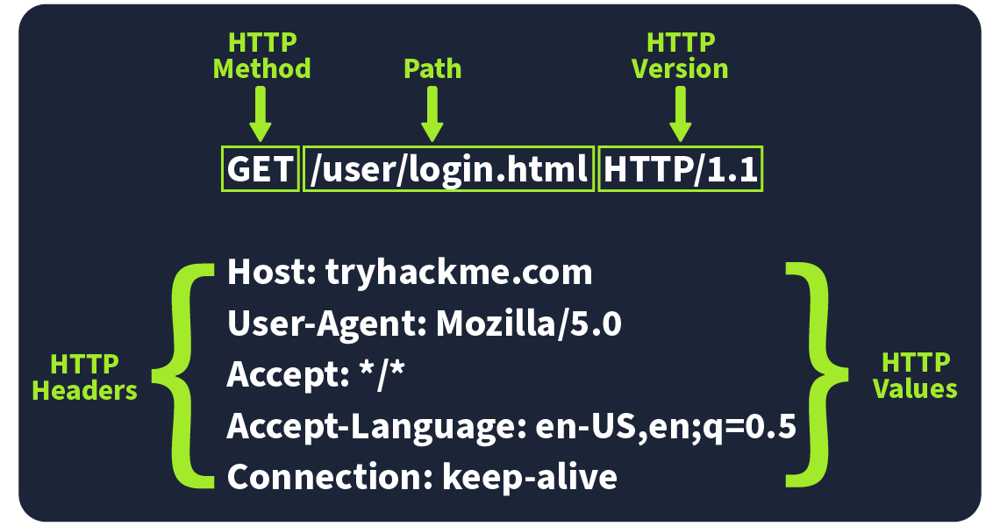

# Web Application Basics

Learn the basics of web applications: HTTP, URLs,
request methods, response codes, and headers.

## Task 1: Introduction

### Introduction

Welcome to Web Application Basics! In this room, we’ll walk through the key elements
of a web application, such as URLs, HTTP requests, and responses.
This is perfect if you're starting and want to get a handle on the essentials
or if you're looking to build or work with web apps.

### Learning Objectives

By completing this room, you will:

- Understand what a web application is and how it runs in a web browser.
- Break down the components of a URL and see how it helps access web resources.
- Learn how HTTP requests and responses work.
- Get familiar with the different types of HTTP request methods.
- Understand what different HTTP response codes mean.
- Check out how HTTP headers work and why they matter for security.

***Answer the questions below***

I am ready to learn about Web Applications!

***Correct answer: No answer needed***

## Task 2: Web Application Overview

Consider an analogy of a web application as a planet.
Astronauts travel to the planet to explore its surface,
similar to how someone uses a web browser to explore or browse a web application.
Although we only see the surface of a planet, a lot is going on under the surface.
You can imagine the whole planet as a web server with many things going on under the
surface of the web server, yet all we can usually see is the surface of web pages or apps.
We will now explore the various components that make up a web application.

### Front End

The Front End can be considered similar to the surface of the planet,
the parts that an astronaut can see and interact with based on the laws of nature.
A web application would have a user interact with it and use a number of
technologies such as HTML, CSS, and JavaScript to do this.

HTML (Hypertext Markup Language) is a foundational aspect of web applications.
It is a set of instructions or code that instructs a web browser on what
to display and how to display it. It could be compared to simple organisms
living on the planet; these organisms have DNA, which is the instructions
for how simple organisms are put together.

CSS (Cascading Style Sheets) in web applications describes a standard appearance,
such as certain colours, types of text, and layouts. Continuing the analogy with DNA,
these could be compared to the parts of DNA that describe the
colour, shape, size, and texture of the simple organism.

JS (JavaScript) is part of a web application front end that enables more complex
activity in the web browser. Whereas HTML can be considered a simple set of
instructions on what to display, JavaScript is a more advanced set of instructions
that allows choices and decisions to be made on what to display.
In the planet analogy, JavaScript can be considered the brain of an advanced organism,
which allows decisions to be made based on what and how something interacts with it.

### Back End

The Back End of a web application is things you don’t see within a web browser
but are important for the web application to work. On a planet, these are the
non-visual things: the structures that keep a building standing, the air,
and the gravity that keeps feet on the ground.

A Database is where information can be stored, modified, and retrieved.
A web application may want to store and retrieve information about a visitor's
preferences on what to show or not; this would be stored in a database.
A planet may have more advanced inhabitants who store information about locations in maps,
write notes in a diary or put books in a library and files in a filing cabinet.

There are many other Infrastructure components underpinning Web Applications,
such as web servers, application servers, storage, various networking devices,
and other software that support the web application. On a planet, these are the
roads that are present, the cars that run on those roads, the fuel that powers the cars.

WAF (Web Application Firewall) is an optional component for web applications.
It helps filter out dangerous requests away from the Web Server and provides
an element of protection. This could be considered similar to how a planet's
atmosphere can protect inhabitants from harmful UV rays.

### Summary

There are many components involved in delivering a web application.
Front End components like HTML, CSS, and JavaScript focus on the experience
inside the browser. Back End components such as the Web Server, Database,
or WAF are the engine under the surface that enable the web application to function.
This simple introduction will be built upon in the upcoming tasks.

***Answer the questions below***

Which component on a computer is responsible for hosting
and delivering content for web applications?

***Correct answer: web server***

Which tool is used to access and interact with web applications?

***Correct answer: web browser***

Which component acts as a protective layer, filtering incoming traffic to
block malicious attacks, and ensuring the security of the the web application?

***Correct answer: web application firewall***

## Task 3: Uniform Resource Locator

### Uniform Resource Locator

A Uniform Resource Locator (URL) is a web address that lets you access all kinds
of online content—whether it’s a webpage, a video, a photo, or other media.
It guides your browser to the right place on the Internet.

### Anatomy of a URL

Think of a URL as being made up of several parts, each playing a different role
in helping you find the right resource. Understanding how these parts fit
together is important for browsing the web, developing web applications,
and even troubleshooting problems.

Here’s a breakdown of the key components:

### Scheme

The scheme is the protocol used to access the website.
The most common are HTTP (HyperText Transfer Protocol) and
HTTPS (Hypertext Transfer Protocol Secure).
HTTPS is more secure because it encrypts the connection,
which is why browsers and cyber security experts recommend it.
Websites often enforce HTTPS for added protection.

### User

Some URLs can include a user’s login details (usually a username) for sites that
require authentication. This happens mostly in URLs that need credentials to
access certain resources. However, it’s rare nowadays because putting login
details in the URL isn’t very safe—it can expose sensitive information,
which is a security risk.

### Host/Domain

The host or domain is the most important part of the URL because it tells you
which website you’re accessing. Every domain name has to be unique and is
registered through domain registrars. From a security standpoint,
look for domain names that appear almost like real ones but have small differences
(this is called typosquatting). These fake domains are often used in phishing
attacks to trick people into giving up sensitive info.

### Port

The port number helps direct your browser to the right service on the web server.
It’s like telling the server which doorway to use for communication.
Port numbers range from 1 to 65,535,
but the most common are 80 for HTTP and 443 for HTTPS.

### Path

The path points to the specific file or page on the server that you’re trying to access.
It’s like a roadmap that shows the browser where to go.
Websites need to secure these paths to make sure only authorised users can access
sensitive resources.

### Query String

The query string is the part of the URL that starts with a question mark (?).
It’s often used for things like search terms or form inputs.
Since users can modify these query strings, it’s important to handle them securely
to prevent attacks like injections, where malicious code could be added.

### Fragment

The fragment starts with a hash symbol (#) and helps point to a specific section
of a webpage—like jumping directly to a particular heading or table.
Users can modify this too, so like with query strings, it’s important to
check and clean up any data here to avoid issues like injection attacks.

***Answer the questions below***

Which protocol provides encrypted communication to ensure secure data
transmission between a web browser and a web server?

***Correct answer:***

What term describes the practice of registering domain names
that are misspelt variations of popular websites to exploit
user errors and potentially engage in fraudulent activities?

***Correct answer:***

What part of a URL is used to pass additional
information, such as search terms or form inputs, to the web server?

***Correct answer:***

## Task 4: HTTP Messages

HTTP messages are packets of data exchanged between a user (the client)
and the web server. These messages are very important for understanding
how web applications work because they show how users' requests and
the server's responses are communicated.

Imagine an example of an HTTP Request and an HTTP Response,
where you can see key parts like the method, URL, headers,
and status codes. These are what make the client-server interaction possible.

There are two types of HTTP messages:

- HTTP Requests: Sent by the user to trigger actions on the web application.
- HTTP Responses: Sent by the server in response to the user’s request.

Each message follows a specific format that helps both
the user and the server communicate smoothly.

### Start Line

The start line is like the introduction of the message.
It tells you what kind of message is being sent—whether it's a request
from the user or a response from the server.
This line also gives important details about how the message should be handled.

### Headers

Headers are made up of key-value pairs that provide extra information about
the HTTP message. They give instructions to both the client and the server
handling the request or response. These headers cover all sorts of things,
like security, content types, and more,
making sure everything goes smoothly in the communication.

### Empty Line

The empty line is a little divider that separates the header from the body.
It’s essential because it shows where the headers stop and where the actual
content of the message begins. Without this empty line, the message might get messed up,
and the client or server could misinterpret it, causing errors.

### Body

The body is where the actual data is stored. In a request,
the body might include data the user wants to send to the server
(like form data). In a response, it’s where the server puts the content
that the user requested (like a webpage or API data).

### Why Understanding HTTP Messages Matters

- These messages are the foundation of how web applications communicate.
  If they’re structured properly, everything works smoothly.
- Knowing how they work will help you diagnose issues in web communication,
  which means better performance and reliability for your web application.
- It’s also crucial for security. Understanding HTTP messages
  helps you implement strong security measures to protect data during transmission.

***Answer the questions below***

Which HTTP message is returned by the web server after processing a client's request?

***Correct answer:***

What follows the headers in an HTTP message?

***Correct answer:***

## Task 5: HTTP Request: Request Line and Methods

An HTTP request is what a user sends to a web server to interact with a web
pplication and make something happen. Since these requests are often the first
point of contact between the user and the web server, knowing how they work
is super important—especially if you’re into cyber security.

Imagine an HTTP request showing the key parts like the method (e.g., GET or POST), path (e.g., /login), and version (e.g., HTTP/1.1). These elements make up the basics of how a client (user) communicates with a server.
Request Line

The request line (or start line) is the first part of an HTTP request and tells the server what kind of request it’s dealing with. It has three main parts: the HTTP method, the URL path, and the HTTP version.

Example: METHOD /path HTTP/version
HTTP Methods

The HTTP method tells the server what action the user wants to perform on the resource identified by the URL path. Here are some of the most common methods and their possible security issue:

GET
Used to fetch data from the server without making any changes. Reminder! Make sure you’re only exposing data the user is allowed to see. Avoid putting sensitive info like tokens or passwords in GET requests since they can show up as plaintext.

POST
Sends data to the server, usually to create or update something. Reminder! Always validate and clean the input to avoid attacks like SQL injection or XSS.

PUT
Replaces or updates something on the server. Reminder! Make sure the user is authorised to make changes before accepting the request.

DELETE
Removes something from the server. Reminder! Just like with PUT, make sure only authorised users can delete resources.

Besides these common methods, there are a few others used in specific cases:

PATCH
Updates part of a resource. It’s useful for making small changes without replacing the whole thing, but always validate the data to avoid inconsistencies.

HEAD
Works like GET but only retrieves headers, not the full content. It’s handy for checking metadata without downloading the full response.

OPTIONS
Tells you what methods are available for a specific resource, helping clients understand what they can do with the server.

TRACE
Similar to OPTIONS, it shows which methods are allowed, often for debugging. Many servers disable it for security reasons.

CONNECT
Used to create a secure connection, like for HTTPS. It’s not as common but is critical for encrypted communication.

Each of these methods has its own set of security rules. For example, PATCH requests should be validated to avoid inconsistencies, and OPTIONS and TRACE should be turned off if not needed to avoid possible security risks.
URL Path

The URL path tells the server where to find the resource the user is asking for. For instance, in the URL <https://tryhackme.com/api/users/123>, the path /api/users/123 identifies a specific user.

Attackers often try to manipulate the URL path to exploit vulnerabilities, so it’s crucial to:

    Validate the URL path to prevent unauthorised access
    Sanitise the path to avoid injection attacks
    Protect sensitive data by conducting privacy and risk assessments

Following these practices helps protect your web application from common attacks.
HTTP Version

The HTTP version shows the protocol version used to communicate between the client and server. Here’s a quick rundown of the most common ones:

HTTP/0.9 (1991)
The first version, only supported GET requests.

HTTP/1.0 (1996)
Added headers and better support for different types of content, improving caching.

HTTP/1.1 (1997)
Brought persistent connections, chunked transfer encoding, and better caching. It’s still widely used today.

HTTP/2 (2015)
Introduced features like multiplexing, header compression, and prioritisation for faster performance.

HTTP/3 (2022)
Built on HTTP/2, but uses a new protocol (QUIC) for quicker and more secure connections.

Although HTTP/2 and HTTP/3 offer better speed and security, many systems still use HTTP/1.1 because it’s well-supported and works with most existing setups. However, upgrading to HTTP/2 or HTTP/3 can provide significant performance and security improvements as more systems adopt them.

***Answer the questions below***

***Correct answer:***

## Task 6: HTTP Request: Headers and Body

### Subheading

***Answer the questions below***

***Correct answer:***

## Task 7: HTTP Response: Status Line and Status Codes

### Subheading

***Answer the questions below***

***Correct answer:***

## Task 8: HTTP Response: Headers and Body

### Subheading

***Answer the questions below***

***Correct answer:***

## Task 9: Security Headers

### Subheading

***Answer the questions below***

***Correct answer:***

## Task 10: Practical Task: Making HTTP Requests

### Subheading

***Answer the questions below***

***Correct answer:***

## Task 11: Conclusion

### Subheading

***Answer the questions below***

***Correct answer:***
