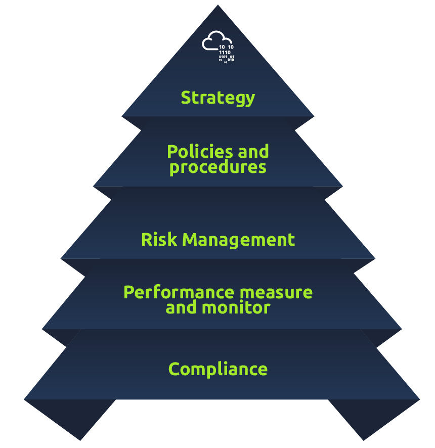
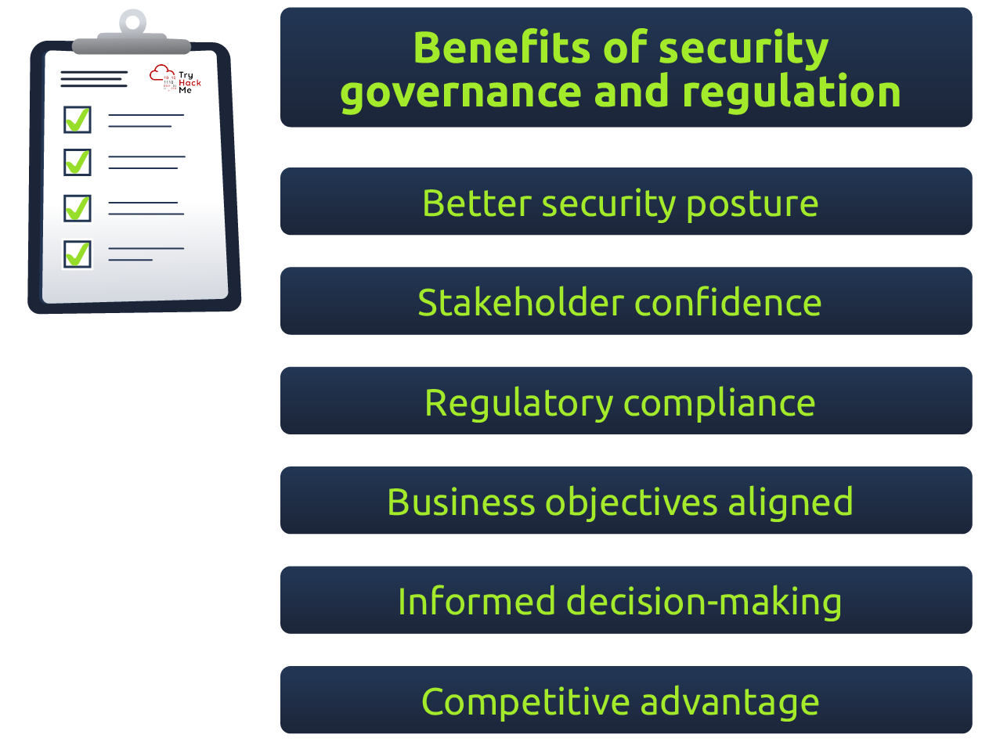

# Governance & Regulation

## Task 1: Introduction

Cyber security is a rapidly evolving landscape wherein malicious actors relentlessly
endeavour to exploit vulnerabilities in highly-sensitive systems, often with the intent
of causing severe damage, disruption, and stealing of sensitive corporate data.
To combat this evolving threat, a comprehensive approach to information security
governance & regulation is necessary. Such an approach requires establishing robust
policies and guidelines and implementing rigorous monitoring and enforcement mechanisms
to ensure compliance. By adopting a proactive and strategic stance towards cyber security,
organisations can mitigate the risks posed by malicious actors and safeguard their
sensitive systems against potentially catastrophic breaches.

### Learning Objectives

- Understanding the role and importance of governance and regulation in cyber security
- Gain an understanding of relevant international laws,
regulations, policies, standards & guidelines
- Understanding Governance, Risk Management & Compliance (GRC) framework
- Develop & raise own cyber security posture as per international standards,
including ISO 27001, NIST 800-53, and many more

### Prerequisite

A basic understanding of the following two rooms is suggested; however, not mandatory:

- [Principles of Security](https://tryhackme.com/room/principlesofsecurity)
- [Web Application Security](https://tryhackme.com/room/introwebapplicationsecurity)

We are all set to start if you have already gone through the above rooms.

***Answer the questions below***

I am ready to start the room.

***Correct answer: No answer needed***

## Task 2: Why is it important?

### Important Terminologies

- Governance: Managing and directing an organisation or system to achieve
its objectives and ensure compliance with laws, regulations, and standards.
- Regulation: A rule or law enforced by a governing
body to ensure compliance and protect against harm.
- Compliance: The state of adhering to laws, regulations,
and standards that apply to an organisation or system.

### Information Security Governance

Information security governance represents an organisation's established structure,
policies, methods, and guidelines designed to guarantee the privacy, reliability,
and accessibility of its information assets. Given the escalating complexity of
cyber threats, the significance of information security governance is
continually growing. It is essential for risk management, safeguarding
confidential data from unauthorised intrusion, and adhering to pertinent regulations.
Information security governance falls under the purview
of top-tier management and includes the following processes:

- Strategy: Developing and implementing a comprehensive information security
strategy that aligns with the organisation's overall business objectives.
- Policies and procedures: Preparing policies and procedures
that govern the use and protection of information assets.
- Risk management: Conduct risk assessments to identify potential threats to
the organisation's information assets and implement risk mitigation measures.
- Performance measurement: Establishing metrics and key performance indicators
(KPIs) to measure the effectiveness of the information security governance program.
- Compliance: Ensuring compliance with relevant regulations and industry best practices.

### Information Security Regulation

Governance and regulation are closely linked in the information security
paradigm but have distinct meanings. Information security regulation refers
to legal and regulatory frameworks that govern the use and protection of
information assets. Regulations are designed to protect sensitive data
from unauthorized access, theft, and misuse. Compliance with regulations is
typically mandatory and enforced by government agencies or other regulatory bodies.
Examples of information security regulations/standards include

- the General Data Protection Regulation (GDPR),
- Payment Card Industry Data Security Standard (PCI DSS),
- Personal Information Protection and Electronic Documents Act (PIPEDA),
- and many more.

### Key Benefits

The following are the benefits of implementing governance and regulation:

- More Robust Security Posture:
Implementing a comprehensive security governance program and complying
with relevant regulations can help an organisation reduce the risk of
security breaches and protect sensitive information from unauthorised access,
theft, and misuse.benefits of security governance and regulations
- Increased Stakeholder Confidence:
Effective security governance and regulation can enhance stakeholder trust by
demonstrating that an organisation takes cyber security seriously and
has implemented measures to protect sensitive data.
- Regulatory Compliance:
Compliance with relevant regulations, such as
GDPR, HIPAA, and PCI DSS, can help organisations avoid legal and
financial penalties and reputational damage resulting from non-compliance.
- Better alignment with business objectives:
Security governance frameworks can help organisations align their
information security strategies with their overall business objectives
and ensure that security measures are cost-effective and contribute
to the organisation's success.
- Informed decision-making:
Security governance programs can provide decision-makers with the
knowledge they need to make sophisticated decisions about information
security risks and ensure that security measures are implemented
where they are most needed.
- Competitive advantage:
Effective security governance and compliance with relevant regulations
can provide a competitive advantage by demonstrating an organisation's
commitment to protecting sensitive data and enhancing stakeholder trust.

### Relevant Laws and Regulations

Specific laws and regulations operate the security governance and regulatory ecosystem.
They provide a structured framework for establishing minimum compliance standards,
promoting accountability and trust, and fostering innovative approaches
to safeguarding critical systems and data. By offering clear and concise rules,
they reduce ambiguity and provide a common language for organisations to
measure their security posture and ensure regulatory compliance.
Following is an overview of some relevant laws and regulations:

|Law / Regulation|Domain|Description|
|:-|:-|:-|
|General Data Protection Regulation (GDPR)|Data Privacy & Protection|GDPR is a regulation propagated by the European Union that sets strict requirements for how organisations handle and protect and  secure the personal data of EU citizens and residents.|
|Health Insurance Portability and Accountability Act (HIPAA)|Healthcare|A US-based official law to maintain the sensitivity of health-related information of citizens.|
|Payment Card Industry Data Security Standard (PCI-DSS)|Financial|Set technical and operational requirements to ensure the secure handling, storage, processing, and transmission of cardholder data by merchants, service providers, and other entities that handle payment cards.|
|Gramm-Leach-Bliley Act (GLBA)|Financial|Financial companies must be sensitive to their customers' nonpublic personal information (NPI), including implementing information security programs, providing privacy notices, and disclosing information-sharing practices.|

***Answer the questions below***

A rule or law enforced by a governing body to ensure
compliance and protect against harm is called?

***Correct answer: Regulation***

Health Insurance Portability and Accountability Act (HIPAA)
targets which domain for data protection?

***Correct answer: Healthcare***

## Task 3: Information Security Frameworks

### Information Security Frameworks

The information security framework provides a comprehensive set of
documents that outline the organisation's approach to information
security and governs how security is implemented, managed,
and enforced within the organisation. This mainly includes:

- Policies: A formal statement that outlines an organisation's goals,
principles, and guidelines for achieving specific objectives.
- Standards: A document establishing specific requirements or specifications
for a particular process, product, or service.
- Guidelines: A document that provides recommendations and best
practices (non-mandatory) for achieving specific goals or objectives.
- Procedures: Set of specific steps for undertaking a particular task or process.
- Baselines: A set of minimum security standards or
requirements that an organisation or system must meet.

### Developing Governance Documents

Here are some generalised steps used to develop policies,
standards, guidelines, etc.how to develop governance documents

- Identify the scope and purpose:
Determine what the document will cover and why it is needed.
For example, a password policy might be required to ensure robust
and secure user passwords. In contrast, a baseline might be required
to establish a minimum level of security for all systems.
- Research and review:
Research relevant laws, regulations, industry standards,
and best practices to ensure your document is comprehensive and up-to-date.
Review existing policies, procedures, and other documents to avoid
duplicating efforts or contradicting existing guidance.
- Draft the document:
Develop an outline and start drafting the document,
following best practices for writing clear and concise policies,
procedures, standards, guidelines, and baselines.
Ensure the document is specific, actionable, and aligned with
the organisation's goals and values.
- Review and approval:
Have the document reviewed by stakeholders, such as subject matter experts,
legal and compliance teams, and senior management.
Incorporate their feedback and ensure the document aligns with organisational
goals and values. Obtain final approval from appropriate stakeholders.
- Implementation and communication:
Communicate the document to all relevant employees and stakeholders,
and ensure they understand their roles and responsibilities in implementing it.
Develop training and awareness programs
to ensure the document is understood and followed.
- Review and update:
Periodically review and update the document to ensure it
remains relevant and practical. Monitor compliance and adjust the
document based on feedback and changes in the
threat landscape or regulatory environment.

### Explanation through Real-world Scenarios

We will go through some real-world scenarios to
fully understand the steps to develop these documents.

### Preparing a Password Policy

- Define password requirements: Minimum length, complexity, and expiration.
- Define password usage guidelines:
Specify how passwords should be used, such as requiring unique passwords
for each account, prohibiting the sharing of passwords,
and prohibiting default passwords.
- Define password storage and transmission guidelines:
Using encryption for password storage and requiring
secure connections for password transmission.
- Define password change and reset guidelines:
How often passwords should be changed etc.
- Communicate the policy:
Communicate the password policy to all relevant employees and stakeholders,
and ensure that they understand the requirements and guidelines.
Develop training and awareness programs to ensure that employees follow the policy.
- Monitor compliance:
Monitor compliance with the password policy and adjust the policy
as needed based on feedback and changes in the
threat landscape or regulatory environment.

### Making an Incident Response Procedure

- Define incident types:
Unauthorised access, malware infections, or data breaches.
- Define incident response roles and responsibilities:
Identify the stakeholders, such as incident response team members,
IT personnel, legal and compliance teams, and senior management.
- Detailed Steps:
Develop step-by-step procedures for responding to each type of incident,
including initial response steps, such as containing the incident and
preserving evidence; analysis and investigation steps,
such as identifying the root cause and assessing the impact;
response and recovery steps, such as mitigating the incident,
reporting and restoring normal operations.
- Report the incident to management and
document the incident response process for future reference.
- Communicate the incident response procedures.
Review and update the incident response procedures.

Organisations only sometimes need to make a standard, frameworks, or baselines;
instead, they follow and use already made documents related to their
field or discipline, as the financial sector may follow PCI-DSS and GLBA;
healthcare may follow HIPPA, etc. There are numerous factors upon which we
decide which standard framework of baseline checklist should be used;
these include regulatory requirements primarily related to the particular
geographical areas, scope, objectives, available resources, and many more.

***Answer the questions below***

The step that involves monitoring compliance and adjust the document based on
feedback and changes in the threat landscape or regulatory environment is called?

***Correct answer: Review and update***

A set of specific steps for undertaking a particular task or process is called?

***Correct answer: Procedure***

## Task 4: Governance Risk and Compliance (GRC)

***Answer the questions below***

***Correct answer: No answer needed***

## Task 5: Privacy and Data Protection

***Answer the questions below***

***Correct answer: No answer needed***

## Task 6: NIST Special Publications

***Answer the questions below***

***Correct answer: No answer needed***

## Task 7: Information Security Management and Compliance

***Answer the questions below***

***Correct answer: No answer needed***

## Task 8: Conclusion

***Answer the questions below***

***Correct answer: No answer needed***
