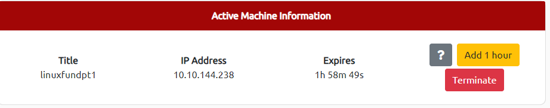
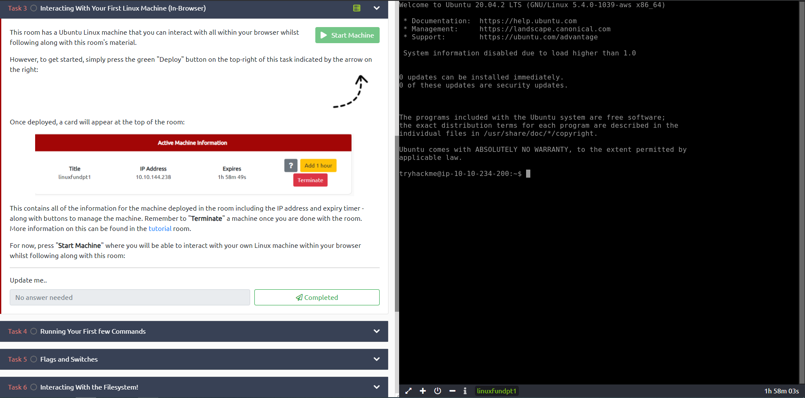

# Linux Fundamentals Part 1

## Task 1: Introduction

Welcome to the first part of the "Linux Fundamentals" room series. You're most likely
using a Windows or Mac machine, both are different in visual design and how they operate.
Just like Windows, iOS and MacOS, Linux is just another operating system and one of the
most popular in the world powering smart cars, android devices, supercomputers, home
appliances, enterprise servers, and more.

We'll be covering some of the history behind Linux and then eventually starting
your journey of being a Linux-wizard! This room will have you:

- Running your very first commands in an interactive Linux machine in your browser
- Teaching you some essential commands used to interact with the file system
- Demonstrate how you can search for files and introduce shell operators

***Answer the questions below***

Let's get started!

***Correct answer: No answer needed***

## Task 2: A Bit of Background on Linux

### Where is Linux Used?

It's fair to say that Linux is a lot more intimidating to approach than Operating
System's (OSs) such as Windows. Both variants have their own advantages and
disadvantages. For example, Linux is considerably much more lightweight and you'd be
surprised to know that there's a good chance you've used Linux in some form or another
every day! Linux powers things such as:

- Websites that you visit
- Car entertainment/control panels
- Point of Sale (PoS) systems such as checkout tills and registers in shops
- Critical infrastructures such as traffic light controllers or industrial sensors

### Flavours of Linux

The name "Linux" is actually an umbrella term for multiple OS's that are based on UNIX
(another operating system). Thanks to Linux being open-source, variants of Linux come in
all shapes and sizes - suited best for what the system is being used for.

For example, Ubuntu & Debian are some of the more commonplace distributions of Linux
because it is so extensible. I.e. you can run Ubuntu as a server (such as websites & web
applications) or as a fully-fledged desktop.
For this series, we're going to be using Ubuntu.

*Note: Ubuntu Server can run on systems with only 512MB of RAM!*

Similar to how you have different versions Windows (7, 8 and 10),
there are many different versions/distributions of Linux.

***Answer the questions below***

Research: What year was the first release of a Linux operating system?

***Correct answer: 1991***

## Task 3: Interacting With Your First Linux Machine (In-Browser)

This room has a Ubuntu Linux machine that you can interact with all
within your browser whilst following along with this room's material.

However, to get started, simply press the green Start Machine button below.

Once deployed, a card will appear at the top of the room:



This contains all of the information for the machine deployed in the room including the
IP address and expiry timer - along with buttons to manage the machine.
Remember to "Terminate" a machine once you are done with the room.
More information on this can be found in the tutorial room.

For now, press "Start Machine" where you will be able to interact with your own
Linux machine within your browser whilst following along with this room:



***Answer the questions below***

I've deployed my first Linux machine!

***Correct answer: No answer needed***

## Task 4: Running Your First Few Commands

As we previously discussed, a large selling point of using OSs such as Ubuntu is how
lightweight they can be. This, of course, doesn't come without its disadvantages, where
for example, often there is no GUI (Graphical User Interface) or what is also known as a
desktop environment that we can use to interact with the machine (unless it has been
installed). A large part of interacting with these systems is using the "Terminal".

The "Terminal" is purely text-based and is intimidating at first.
However, if we break down some of the commands, after some time,
you quickly become familiar with using the terminal!

```bash
# This is what a terminal looks like
tryhackme@linux1:~$ enter commands here
```

We need to be able to do basic functions like navigate to files, output their contents and make files! The commands to do so are self-explanatory (once you know what they are of course...)

Let's get started with two of the first commands which
I have broken down in the table below:

|Command|Description|
|:-:|:-:|
|echo|Output any text that we provide|
|whoami|Find out what user we're currently logged in as!|

See the snippets below for an example of each command being used

```bash
# Using echo
tryhackme@linux1:~$ echo Hello
Hello
tryhackme@linux1:~$ echo "Hello Friend!"
Hello Friend!
```

As shown in the terminal above, if we want to "echo" a single word, we don't need to use
double quotes, for example, echo Hello. However, the string should be enclosed within
double quotes if one or more spaces are present, for example, `echo "Hello Friend!"`.

`whoami` can be used to find the username we are logged in as.

***Answer the questions below***

If we wanted to output the text "TryHackMe", what would our command be?

***Correct answer: echo TryHackMe***

What is the username of who you're logged in as on your deployed Linux machine?

***Correct answer: tryhackme***

## Task 5: Interacting With The Filesystem

So far we've only covered the "echo" and "whoami" commands.
Not all that useful when you consider things that we need to do -
including navigating the filesystem, read and write to it as well.

In this task, we're going to be learning the commands so that we can do just that.
Just like the previous task, I'll display the commands in the
table in the next heading & show examples of these commands being used.

### Interacting With the Filesystem

As I previously stated, being able to navigate the machine that you are logged into
without relying on a desktop environment is pretty important.
After all, what's the point of logging in if we can't go anywhere?

|Command|Full Name|
|:-:|:-:|
|ls|listing|
|cd|change directory|
|cat|concatenate|
|pwd|print working directory|

### Listing Files in Our Current Directory (ls)

Before we can do anything such as finding out the contents of any files or folders,
we need to know what exists in the first place.
This can be done using the "ls" command (short for listing)

```bash
# Using "ls" to list the contents of the current directory
tryhackme@linux1:~$ ls
'Important Files' 'My Documents' Notes Pictures
```

In the screenshot above, we can see there are the following directories/folders:

- Important Files
- My Documents
- Notes
- Pictures

Great! You can probably take a guess as to what to expect
a folder to contain given by its name.

*Pro tip: You can list the contents of a directory without having to navigate
to it by using ls and the name of the directory. I.e. `ls Pictures`*

### Changing Our Current Directory (cd)

Now that we know what folders exist, we need to use the "cd" command (short for change
directory) to change to that directory. Say if I wanted to open the "Pictures" directory
I'd do "cd Pictures". Where again, we want to find out the contents of this "Pictures"
directory and to do so, we'd use "ls" again:

```bash
# Listing our new directory after we have used "cd"
tryhackme@linux1:~/Pictures$ ls
dog_picture1.jpg dog_picture2.jpg dog_picture3.jpg dog_picture4.jpg
```

In this case, it looks like there are 4 pictures of dogs!

### Outputting the Contents of a File (cat)

Whilst knowing about the existence of files is great,
it's not all that useful unless we're able to view the contents of them.

We will come on to discuss some of the tools available to us that allows us to transfer
files from one machine to another in a later room. But for now, we're going to talk about
simply seeing the contents of text files using a command called "cat".

"Cat" is short for concatenating & is a fantastic way for us
to output the contents of files (not just text files!).

In the screenshot below, you can see how I have combined the
use of "ls" to list the files within a directory called "Documents":

```bash
# Using "ls" to to list the contents of the current directory
tryhackme@linux1:~/Documents$ ls
todo.txt
tryhackme@linux1:~/Documents$ cat todo.txt
Here's something important for me to do later!
```

We've applied some knowledge from earlier in this task to do the following:

1. Used "ls" to let us know what files are available in the "Documents"
folder of this machine. In this case, it is called "todo.txt".
2. We have then used cat todo.txt to concatenate/output the contents of this "todo.txt"
file, where the contents are "Here's something important for me to do later!"

*Pro tip: You can use cat to output the contents of a file within directories without
having to navigate to it by using cat and the name of the directory.
I.e. `cat /home/ubuntu/Documents/todo.txt`*

Sometimes things like usernames, passwords (yes - really...), flags or configuration
settings are stored within files where "cat" can be used to retrieve these.

### Finding out the full Path to our Current Working Directory (pwd)

You'll notice as you progress through navigating your Linux machine, the name of the
directory that you are currently working in will be listed in your terminal.

It's easy to lose track of where we are on the filesystem exactly, which is why I want to
introduce "pwd". This stands for print working directory.

Using the example machine from before, we are currently in the "Documents" folder, but
where is this exactly on the Linux machine's filesystem? We can find this out using this
"pwd" command like within the screenshot below:

```bash
# Using "pwd" to list the full path of the current directory
tryhackme@linux1:~/Documents$ pwd
/home/ubuntu/Documents
tryhackme@linux1:~/Documents$
```

Let's break this down:

1. We already know we're in "Documents" thanks to our terminal, but at this point in
time, we have no idea where "Documents" is stored so
that we can get back to it easily in the future.
2. I have used the "pwd" (print working directory) command
to find the full file path of this "Documents" folder.
3. We're helpfully told by Linux that this "Documents" directory is stored at
"`/home/ubuntu/Documents`" on the machine — great to know!
4. Now in the future, if we find ourselves in a different location, we can just use
`cd /home/ubuntu/Documents` to change our working directory to this "Documents" directory.

***Answer the questions below***

On the Linux machine that you deploy, how many folders are there?

***Correct answer:4***

Which directory contains a file?

***Correct answer: folder4***

What is the contents of this file?

***Correct answer: Hello World***

Use the cd command to navigate to this file and find out the new
current working directory. What is the path?

***Correct answer: /home/tryhackme/folder4***

## Task 6: Searching For Files

Although it doesn't seem like it so far, one of the redeeming features of Linux is truly
how efficient you can be with it. With that said, you can only be as efficient as you are
familiar with it of course. As you interact with OSs such as Ubuntu over time, essential
commands like those we've already covered will start to become muscle-memory.

One fantastic way to show just how efficient you can be with systems like this is using a
set of commands to quickly search for files across the entire system that our user has
access to. No need to consistently use `cd` and `ls` to find out what is where.
Instead, we can use commands such as find to automate things like this for us!

This is where Linux starts to become a bit more intimidating to approach,
but we'll break this down and ease you into it.

### Using `find`

The `find` command is fantastic in the sense that it can be used both very simply or
rather complex depending upon what it is you want to do exactly.
However, let's stick to the fundamentals first.

Take the snippet below; we can see a list of directories available to us:

```bash
#  Using "ls" to list the contents of the current directory
tryhackme@linux1:~$ ls
Desktop Documents Pictures folder1
tryhackme@linux1:~$
```

1. Desktop
2. Documents
3. Pictures
4. folder1

Now, of course, directories can contain even more directories within themselves. It
becomes a headache when we're having to look through every single one just to try and
look for specific files. We can use find to do just this for us!

Let's start simple and assume that we already know the name of the file we're looking
for, but can't remember where it is exactly!
In this case, we're looking for "passwords.txt"

If we remember the filename, we can simply use `find -name passwords.txt` where the
command will look through every folder in our current
directory for that specific file like so:

```bash
#  Using "find" to find a file with the name of "passwords.txt"
tryhackme@linux1:~$ find -name passwords.txt
./folder1/passwords.txt
tryhackme@linux1:~$
```

"Find" has managed to find the file — it turns out it is located in
`folder1/passwords.txt`, sweet. But let's say that we don't know the name of the file,
or want to search for every file that has an extension such as "`.txt`".
Find let's us do that too!

We can simply use what's known as a wildcard (`*`) to search for anything that has `.txt`
at the end. In our case, we want to find every .txt file that's in our current directory.
We will construct a command such as `find -name*.txt .`
Where "Find" has been able to find every `.txt` file and
has then given us the location of each one:

```bash
# Using "find" to find any file with the extension of ".txt"
tryhackme@linux1:~$ find -name *.txt
./folder1/passwords.txt
./Documents/todo.txt
tryhackme@linux1:~$
```

Find has managed to find:

- "passwords.txt" located within "folder1"
- "todo.txt" located within "Documents"

That wasn't so tough, huh!

### Using `grep`

Another great utility that is a great one to learn about is the use of `grep`.
The grep command allows us to search the contents of files
for specific values that we are looking for.

Take for example, the access log of a web server.
In this case, the `access.log` of a web server has 244 entries.

```bash
# Using "wc" to count the number of entries in "access.log"
tryhackme@linux1:~$ wc -l access.log
244 access.log
tryhackme@linux1:~$
```

Using a command like `cat` isn't going to cut it too well here.
Let's say for example if we wanted to search this log file to see the things that a
certain user/IP address visited? Looking through 244 entries
isn't all that efficient considering we want to find a specific value.

We can use grep to search the entire contents of this file for any entries of the value
that we are searching for. Going with the example of a web server's access log, we want
to see everything that the IP address "81.143.211.90" has visited
(note that this is fictional)

```bash
# Using "grep" to find any entries with the IP address of "81.143.211.90" in "access.log"
tryhackme@linux1:~$ grep "81.143.211.90" access.log
81.143.211.90 - - [25/Mar/2021:11:17 + 0000] "GET / HTTP/1.1" 200 417 "-" "Mozilla/5.0 (Linux; Android 7.0; Moto G(4))"
tryhackme@linux1:~$
```

"Grep" has searched through this file and has shown us any entries of
what we've provided and that is contained within this log file for the IP.

***Answer the questions below***

Use grep on "access.log" to find the flag that has a prefix of "THM".
What is the flag?
Note: The "access.log" file is located in the "/home/tryhackme/" directory.

***Correct answer: THM{ACCESS}***

And I still haven't found what I'm looking for!

***Correct answer: No answer needed***

## Task 7: An Introduction to Shell Operators

Linux operators are a fantastic way to power up your knowledge of working with Linux.
There are a few important operators that are worth noting.
We'll cover the basics and break them down accordingly to bite-sized chunks.

At an overview, I'm going to be showcasing the following operators:

|Symbol / Operator|Description|
|:-:|:-:|
|&|This operator allows you to run commands in the background of your terminal.|
|&&|This operator allows you to combine multiple commands together in one line of your terminal.|
|>|This operator is a redirector - meaning that we can take the output from a command (such as using cat to output a file) and direct it elsewhere.|
|>>|This operator does the same function of the `>` operator but appends the output rather than replacing (meaning nothing is overwritten).|

Let's cover these in a bit more detail.

### Operator `&`

This operator allows us to execute commands in the background. For example, let's say we
want to copy a large file. This will obviously take quite a long time and will leave us
unable to do anything else until the file successfully copies.

The "&" shell operator allows us to execute a command and have it run in the background
(such as this file copy) allowing us to do other things!

### Operator `&&`

This shell operator is a bit misleading in the sense of how familiar is to its partner "&
". Unlike the "&" operator, we can use "&&" to make a list of commands to run for example
`command1 && command2`.
However, it's worth noting that `command2` will only run if `command1` was successful.

### Operator `>`

This operator is what's known as an output redirector. What this essentially means is
that we take the output from a command we run and send that output to somewhere else.

A great example of this is redirecting the output of the echo command that we learned in
Task 4. Of course, running something such as echo howdy will return "howdy" back to our
terminal, that isn't super useful. What we can do instead, is redirect "howdy" to
something such as a new file!

Let's say we wanted to create a file named "welcome" with the message "hey". We can run
`echo hey > welcome` where we want the file created with the contents "hey" like so:

```bash
# Using the > Operator
tryhackme@linux1:~$ echo hey > welcome
#  Using cat to output the "welcome" file
tryhackme@linux1:~$ cat welcome
hey
```

*Note: If the file i.e. "welcome" already exists, the contents will be overwritten!*

### Operator `>>`

This operator is also an output redirector like in the previous operator (>) we
discussed. However, what makes this operator different is that rather than overwriting
any contents within a file, for example, it instead just puts the output at the end.

Following on with our previous example where we have the file "welcome" that has the
contents of "hey". If were to use echo to add "hello" to the file using the > operator,
the file will now only have "hello" and not "hey".

The >> operator allows to append the output to the bottom of the file,
rather than replacing the contents like so:

```bash
# Using the >> Operator
tryhackme@linux1:~$ echo hello >> welcome
# Using cat to output the "welcome" file
tryhackme@linux1:~$ cat welcome
hey
hello
```

***Answer the questions below***

If we wanted to run a command in the background, what operator would we want to use?

***Correct answer: &***

If I wanted to replace the contents of a file named
"passwords" with the word "password123", what would my command be?

***Correct answer: echo password123 > passwords***

Now if I wanted to add "tryhackme" to this file named
"passwords" but also keep "passwords123", what would my command be?

***Correct answer: echo tryhackme >> passwords***

Now use the deployed Linux machine to put these into practice.

***Correct answer: No answer needed***

## Task 8: Conclusions & Summaries

Nice work on getting to this stage! We covered quite a bit for your first interactions with Linux. However, these are the most essential/functions you're going to be using whenever you interact with a Linux machine.

I hope this room hasn't been too daunting for you to power-on through with. It's as I previously mentioned, you're going to become familiar with these things very quickly because of how often you're going to be using them.

To quickly recap, we've covered the following:

- Understanding why Linux is so commonplace today
- Interacting with your first-ever Linux machine!
- Ran some of the most fundamental commands
- Had an introduction to navigating around the filesystem &
how we can use commands like find and grep to make finding data even more efficient!
- Power up your commands by learning about some of the important shell operators.

Take some time to have a play around in this room. When you feel a little bit more comfortable, progress onto
[Linux Fundamentals Part 2](https://tryhackme.com/jr/linuxfundamentalspart2/)

***Answer the questions below***

I'll have a play around!

***Correct answer: No answer needed***

## Task 9: Linux Fundamentals Part 2

Visit part two of the Linux fundamentals series here!
[Part 2](https://tryhackme.com/linuxfundamentalspart2)

***Answer the questions below***

Terminate the machine deployed in this room from task 3.

***Correct answer: No answer needed***

Join [Part 2](https://tryhackme.com/linuxfundamentalspart2)!

***Correct answer: No answer needed***
