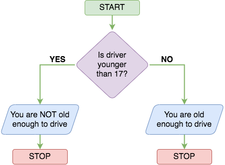

# Python Basics

## Task 1: Introduction to Python

In this room, you will get hands-on with and learn about the scripting programming
language Python. Although programming isn't required to succeed in security, it's a great
skill to have. As the "Scripting for Pentesters" module demonstrates, being able to
program allows you to create security tools and quick scripts that will aid you in
hacking (as well as defending and analysing).

This room will teach you:

- Variables
- Loops
- Functions
- Data Structures
- If statements
- Files

You will be using the code editor (on the right-hand side) to complete exercises and
solve challenges. This room will teach you the basics, just enough to give you the
knowledge to make your basic scripts. If you want to use your development environment to
code, download Python on the official website; which gives you an IDE (integrated
development environment) to code in.

In programming, syntax is important as it describes the structure of a valid programming
language. In simple terms, syntax tells the computer how to read code using rules that
control the structure of symbols, punctuation, and words of a programming language.

***Answer the questions below***

Run what's currently in the code editor by clicking the green "Run Code" button
(on the right-hand side of your screen), and move onto the next task.

***Correct answer: No answer needed***

## Task 2: Hello World

To begin, let's create a simple program that outputs some text.

```py
# This is an example comment
print("Hello World")
```

As you can see from the example code block above, it's just one line (shown on line 2),
and when we run this code, it will output the text Hello World. Let's break this down.
In the example, line 1 is a comment, a line starting with a hashtag (#) symbol and is not
run by the computer. A comment is written by the programmer (you) to help other people
reading the code understand what is going on.

We can control what is output to the screen by using the `print()` statement. Anything
inside of the parenthesis () will be output. However, because we are printing a string
(more on data types later in this room), we have to put them inside of quotations `""`.

Please note, this room's examples are for Python3.

***Answer the questions below***

On the code editor, print "Hello World". What is the flag?

***Correct answer: THM{PRINT_STATEMENTS}***

## Task 3: Mathematical Operators

Let's now cover mathematical operators and how they can be applied to Python. Like a
calculator, there are operations such as adding, subtracting, multiplying, and dividing;
using Python, we can code our calculator; after all, programming is just writing rules
for the computer to follow given specific inputs and conditions.
The table below shows the different operations.

|Operator|Syntax|Example|
|:-:|:-:|:-:|
|Addition|+|1 + 1 = 2|
|Subtraction|-|5 - 1 = 4|
|Multiplication|*|10 * 10 = 100|
|Division|/|10 / 2 = 5|
|Modulus|%|10 % 2 = 0|
|Exponent|**|5**2 = 25|

Now that we know basic mathematical operators, let's move on to comparison operators;
these play a big part in Python and will be built upon when we look at loops and if
statements. These operators are used to evaluate a
program's condition at a particular state.

|Symbol|Syntax|
|:-:|:-:|
|Greater than|>|
|Less than|<|
|Equal to|==|
|Not equal to|!=|
|Greater than or equal to|>=|
|Less than or equal to|<=|

***Answer the questions below***

In the code editor, print the result of 21 + 43. What is the flag?

***Correct answer: THM{ADDITI0N}***

Print the result of 142 - 52. What is the flag?

***Correct answer: THM{SUBTRCT}***

Print the result of `10 * 342`. What is the flag?

***Correct answer: THM{MULTIPLICATION_PYTHON}***

Print the result of 5 squared. What is the flag?

***Correct answer: THM{EXP0N3NT_POWER}***

## Task 4: Variables and Data Types

Variables allow you to store and update data in a computer program.
You have a variable name and store data to that name.

```py
food = "ice cream"
money = 2000
```

In the example above, we have 2 variables. The variable name "food" stores the string
(words) ice cream, while another variable called "money" stores a number (2000).

Variables are powerful as you can change them throughout your program. The following
example sets the age variable to 30, then we increase this age variable by 1, making the
final variable data 31. Feel free to copy and paste this into the editor,
run the code, and see its output.

```py
age = 30
age = age + 1
print(age)
```

Notice, on line 2, the way we update a variable, on the left, and we have the already
created variable name "age" followed by the = operator. On the right, we have what we're
setting the variable to; in our case, the age variable
(which is currently set to 30) is being increased by 1.

Let's talk about Data Types, which is the type of data being stored in a variable. You
can store text, or numbers, and many other types. The data types to know are:

- String - Used for combinations of characters, such as letters or symbols
- Integer - Whole numbers
- Float - Numbers that contain decimal points or for fractions
- Boolean - Used for data that is restricted to True or False options
- List - Series of different data types stored in a collection


***Answer the questions below***

In the code editor, create a variable called height and set its initial value to 200.

***Correct answer: No answer needed***

On a new line, add 50 to the height variable.

***Correct answer: No answer needed***

On another new line, print out the value of height. What is the flag that appears?

*Solution:* The code is

```py
height = 200
height += 50
print(height)
```

***Correct answer: THM{VARIABL3S}***

## Task 5: Logical and Boolean Operators

Logical operators allow assignment and comparisons to be made
and are used in conditional testing (such as if statements).

|Logical operation|Operator|Example|
|:-:|:-:|:-:|
|Equivalence|==|if x == 5|
|Less than|<|if x <> 5|
|Less than or equal to|<=|if x <>= 5|
|Greater than|>|if x > 5|
|Greater than or equal to|>=|if x >= 5|

Boolean operators are used to connect and compare relationships between statements.
Like an if statement, conditions can be true or false.

|Boolean Operation|Operator|Example|
|:-:|:-:|:-:|
|Both conditions must be true for the statement to be true|AND|if x >= 5 AND x <= 100 Returns TRUE if x is a number between 5 and 100|
|Only one condition of the statement needs to be true|OR|if x == 1 OR x == 10 Returns TRUE if X is 1 or 10|
|If a condition is the opposite of an argument|NOT|if NOT y Returns TRUE if the y value is False|

Let's look at a few Python code examples:

```py
a = 1
if a == 1 or a > 10:
    print("a is either 1 or above 10")
```

```py
name = "bob"
hungry = True
if name == "bob" and hungry == True:
    print("bob is hungry")
elif name == "bob" and not hungry:
    print("Bob is not hungry")
else: # If all other if conditions are not met
    print("Not sure who this is or if they are hungry")
```

***Answer the questions below***

Read the above section.

***Correct answer: No answer needed***

## Task 6: (Shipping Project) Introduction to If Statements

Using "if statements" allows programs to make decisions. They let a program chose a decision based on a condition. Below is an example of how an if statement can be used to determine the section of code (which print statement) to use.

```py
if age < 17:
    print('You are NOT old enough to drive')
else:
    print('You are old enough to drive')
```

In the example, if you are younger than 17, the program will output the text "You are NOT
old enough to drive"; however, if you are over the age of 17, the program will output
"You are old enough to drive". Depending on a condition (in this example, it's the age
variable), the program will run different code sections.

There are some key components we note from our code example above:

- The if keyword indicates the beginning of the if statement,
followed by a set of conditions.
- The if statement is only run if the condition (or sets of conditions) is true. In our
example, it's age < 17; if that condition is true (age is below 17), the code within the
if statement runs. Per the example, if certain conditions are not met, the program can
default to running code shown in the else part of the if statement.
- A colon : marks the end of the if statement.
- Note the indentation. Anything after the colon that is indented,
is considered part of the if statement, which the program will execute.



If statements are essential in programming and will be something you use a lot.

***Answer the questions below***

In this exercise, we will code a small application that calculates and outputs the
shipping cost for a customer based on how much they've spent.

In the code editor, click on the "shipping.py" tab and follow
the instructions to complete this task.

***Correct answer: No answer needed***

Once you've written the application in the code editor's shipping.py tab,
a flag will appear, which is the answer to this question.

*Solution:*

```py
"""
In this project, you'll create a program that calculates the total
cost of a customers shopping basket, including shipping.

- If a customer spends over $100, they get free shipping
- If a customer spends < $100, the shipping cost is $1.20 per kg of the baskets weight

Print the customers total basket cost (including shipping) to complete this exercise.

===> You've redeemed a hint. Replace the X's with code to complete this exercise.
"""

shipping_cost_per_kg = 1.20
customer_basket_cost = 34
customer_basket_weight = 44

if customer_basket_cost >= 100:
    print('Free shipping!')
else:
    shipping_cost = customer_basket_weight * shipping_cost_per_kg
    customer_basket_cost += shipping_cost

print("Total basket cost including shipping is " + str(customer_basket_cost))
```

***Correct answer: THM{IF_STATEMENT_SHOPPING}***

In shipping.py, on line 15 (when using the Code Editor's Hint), change the
customer_basket_cost variable to 101 and re-run your code. You will get a flag (if the
total cost is correct based on your code); the flag is the answer to this question.

***Correct answer: THM{MY_FIRST_APP}***

## Task 7: Loops

In programming, loops allow programs to iterate and perform actions a number of times. There are two types of loops, for and while loops.

### While Loops

Let's begin by looking at how we structure a while loop. We can have the loop run
indefinitely or (similar to an if statement) determine
how many times the loop should run based on a condition.

```py
i = 1
while i <= 10:
    print(i)
    i = i + 1
```

This while loop will run 10 times, outputting the value of the i
variable each time it iterates (loops). Let's break this down:

- The i variable is set to 1
- The while statement specifies where the start of the loop should begin
- Every time it loops, it will start at the top (outputting the value of i)
- Then it goes to the next line in the loop, which increases the value of i by 1
- Then (as there is no more code for the program to execute),
it goes to the top of the loop, starting the process over again
- The program will keep on looping until the value of the i variable is greater than 10

### For Loops

A for loop is used to iterate over a sequence such as a list. Lists are used to store
multiple items in a single variable, and are created using square brackets (see below).
Let's learn through the following example:

```py
websites = ["facebook.com", "google.com", "amazon.com"]
for site in websites:
     print(site)
```

This for loop shown in the code block above, will run 3 times,
outputting each website in the list. Let's break this down:

- The list variable called websites is storing 3 elements
- The loop iterates through each element, printing out the element
- The program stops looping when it's been through each element in the loop

To give a real-world scenario, you could create a program that checks if a website is
online or if an item is in stock. You would loop through the website list, add
functionality inside the loop to check the website, and output the results.
The ["Python for Pentesters"](https://tryhackme.com/room/pythonforcybersecurity)
room shows you how to use Python to enumerate a target,
build a keylogger, scan a network, and more.

In Python, we can also iterate through a range of numbers using the range function.
Below is some example Python code that will print the numbers from 0 to 4.
In programming, 0 is often the starting number, so counting to 5 is 0 to 4
(but has 5 numbers: 0, 1, 2, 3, and 4)

```py
for i in range(5):
     print(i)
```

***Answer the questions below***

On the code editor, click back on the "script.py" tab and
code a loop that outputs every number from 0 to 50.

*Solution:*

```py
for i in range(51):
    print(i)
```

***Correct answer: THM{L00PS_WHILE_FOR}***

## Task 8: (Bitcoin Project) Introduction to Functions

As programs start to get bigger and more complex, some of your code will be repetitive,
writing the same code to do the same calculations, and this is where functions come in.
A function is a block of code that can be called at different places in your program.

You could have a function to work out a calculation such as the distance between two
points on a map or output formatted text based on certain conditions. Having functions
removes repetitive code, as the function's purpose
can be used multiple times throughout a program.

```py
def sayHello(name):
    print("Hello " + name + "! Nice to meet you.")

sayHello("ben") # Output is: Hello Ben! Nice to meet you
```

There are some key components we can note from this function:

- The def keyword indicates the beginning of a function. The function is followed by a
name that the programmer defines (and is a function parameter).
In our example, it's sayHello.
- Following the function name is a pair of parenthesis () that holds input values,
data that we can pass into the function. In our example, it's a name.
- A colon `:` marks the end of the function header.

In the function, notice the indentation. Similar to if statements, anything after the
colons that is indented is considered part of the function.

A function can also return a result, see the code block below:

```py
def calcCost(item):
    if(item == "sweets"):
        return 3.99
    elif (item == "oranges"):
        return 1.99
    else:
        return 0.99

spent = 10
spent = spent + calcCost("sweets")
print("You have spent:" + str(spent))
```

If we call the calcCost function and pass in "sweets" as the item parameter, the function
will return a decimal number (float). In the code above, we take a variable called spent
and add the cost of "sweets" through the calcCost function;
when we call calcCost, it will return the number 3.99.

***Answer the questions below***

You've invested in Bitcoin and want to write a program that tells you when
the value of Bitcoin falls below a particular value in dollars.

In the code editor, click on the bitcoin.py tab. Write a function called bitcoinToUSD
with two parameters: bitcoin_amount, the amount of Bitcoin you own, and
bitcoin_value_usd, the value of bitcoin in USD. The function should return usd_value,
which is your bitcoin value in USD (to calculate this, in the function, you times
bitcoin_amount variable by bitcoin_value_usd variable and return the value).
The start of the function should look like this:

```py
def bitcoinToUSD(bitcoin_amount, bitcoin_value_usd):
```

Once you've written the bitcoinToUSD function, use it to calculate the value of your
Bitcoin in USD, and then create an if statement to determine if the value falls
below $30,000; if it does, output a message to alert you (via a print statement).

*Solution:*

```py
"""
In this project, you'll create a program that that tells
you when the value of your Bitcoin falls below $30,000.

You will need to:
- Create a function to convert Bitcoin to USD
- If your Bitcoin falls below $30,000 print a message.

You can assume that 1 Bitcoin is worth $40,000

===> You've redeemed a hint. Replace the _'s with code to complete this exercise.
"""
investment_in_bitcoin = 1.2
bitcoin_to_usd = 40000

# 1) write a function to calculate bitcoin to usd
def bitcoinToUSD(bitcoin_amount, bitcoin_value_usd):
    usd_value = bitcoin_amount * bitcoin_value_usd
    return usd_value

investment_in_usd = bitcoinToUSD(investment_in_bitcoin, bitcoin_to_usd)
if investment_in_usd <= 30000:
    print("Investment below $30,000! SELL!")
else:
    print("Investment above $30,000")
```

***Correct answer: THM{BITC0IN_INVESTOR}***

1 Bitcoin is now worth $24,000. In the code editor on line 14, update the bitcoin_to_usd
variable value to 24000 and see if your Python program recognises that
your investment is below the $30,000 threshold.

***Correct answer: No answer needed***

## Task 9: Files

In Python, you can read and write from files. We've seen that in cyber security, it's
common to write a script and import or export it from a file; whether that be as a way to
store the output of your script or to import a list of 100's of websites from a file to
enumerate. Let's dive straight into an example:

```py
f = open("file_name", "r")
    print(f.read())
```

To open the file, we use the built-in open() function, and the "r" parameter stands for
"read" and is used as we're reading the contents of the file. The variable has a read()
method for reading the contents of the file. You can also use the readlines() method and
loop over each line in the file; useful if you have a list where each item is on a new
line. In the example above, the file is in the same folder as the Python script; if it
were elsewhere, you would need to specify the full path of the file.

You can also create and write files. If you're writing to an existing file, you open the
file first and use the "a" in the open function after the filename call (which stands for
append). If you're writing to a new file, you use "w" (write) instead of "a".
See the examples below for clarity:

```py
f = open("demofile1.txt", "a") # Append to an existing file
f.write("The file will include more text..")
f.close()

f = open("demofile2.txt", "w") # Creating and writing to a new file
f.write("demofile2 file created, with this content in!")
f.close()
```

Notice we use the close() method after writing to a file;
this closes the file so no more writing to the file (within the program) can occur.

***Answer the questions below***

In the code editor, write Python code to read the flag.txt file.
What is the flag in this file?

*Solution:*

```py
f = open("flag.txt", "r")
print(f.read())
```

***Correct answer: THM{F1LE_R3AD}***

## Task 10: Imports

In Python, we can import libraries, which are a collection of files that contain
functions. Think of importing a library as importing functions you can use that have been
already written for you. For example, there is a "date" library that gives you access to
hundreds of different functions for anything date and time-related.

```py
import datetime
current_time = datetime.datetime.now()
print(current_time)
```

We import other libraries using the import keyword. Then in Python, we use that import's
library name to reference its functions. In the example above, we import datetime, then
access the .now() method by calling library_name.method_name().
Copy and paste the example above into the code editor.

Here are some popular libraries you may find useful in scripting as a pentester:

- Request - simple HTTP library.
- [Scapy](https://scapy.readthedocs.io/en/latest/introduction.html)
  - send, sniff, dissect and forge network packets
- [Pwntools](https://docs.pwntools.com/en/stable/)
  - a CTF & exploit development library.

Many of these libraries are already built into the programming language; however,
libraries written by other programmers not already installed in your machine can be
installed using an application called pip, which is Python's package manager. Let's say
you want to install the "scapy" library (which allows you to craft your own packets in
code and send them to other machines); you install it first by running the command pip
install scapy, after which in your program you can now import the scapy library.

***Answer the questions below***

Read the task and run the Python example code above in the code editor on the right.

***Correct answer: No answer needed***
