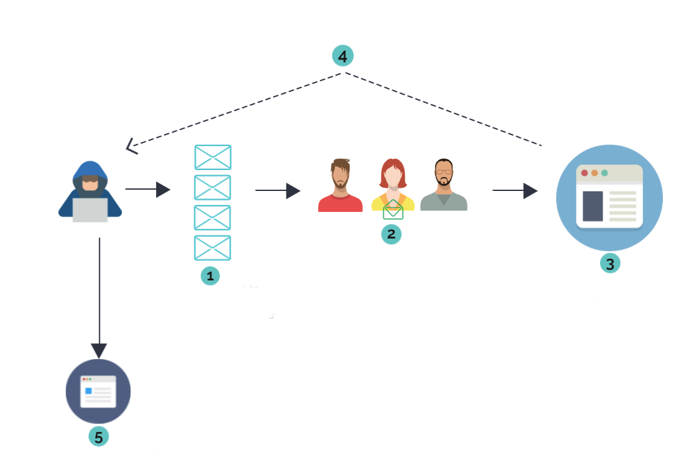
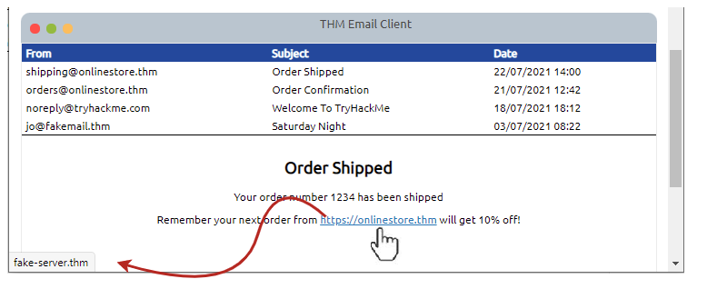
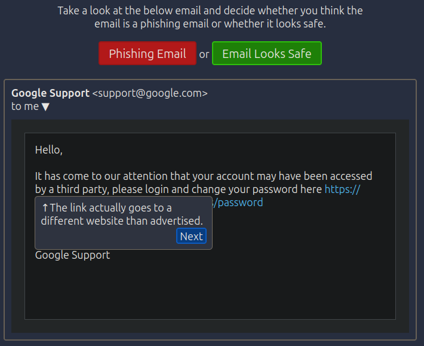
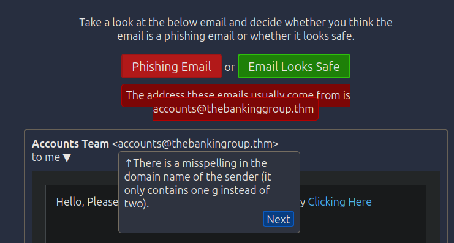
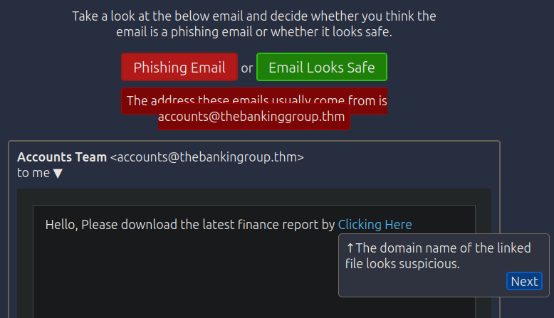
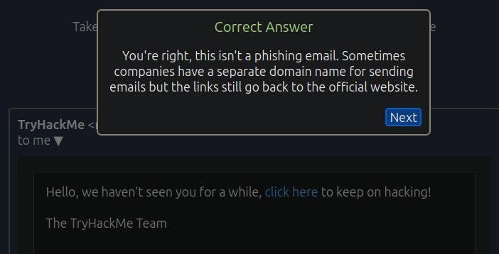
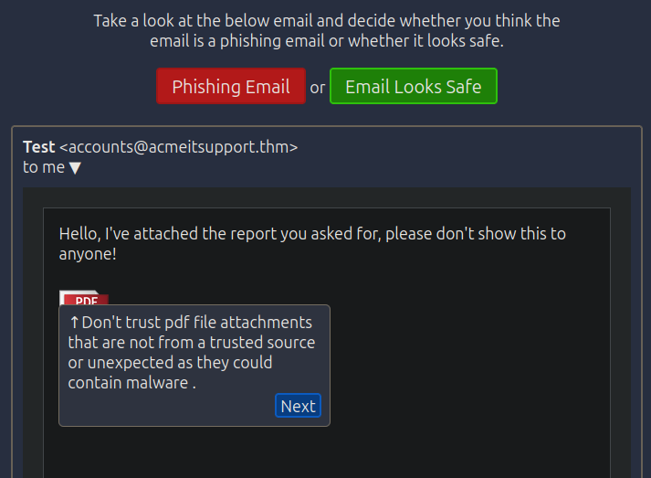
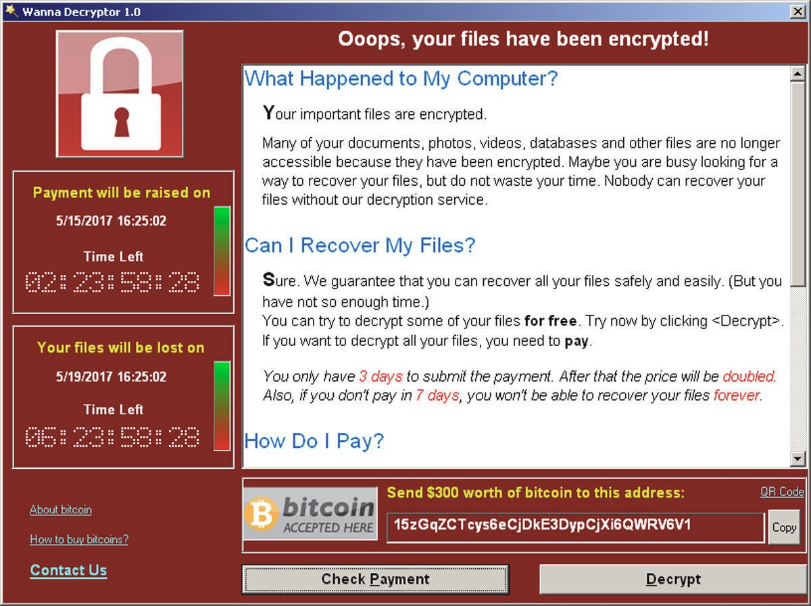
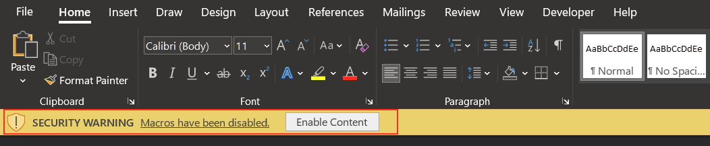

# Common Attacks

## Task 1: Introduction

Our existence in a digital world makes it imperative that
we understand and can protect against common attacks.

This room will discuss some of the most common techniques used by attackers
to target people online. It will also teach some of the best
ways to prevent the success of each technique.

Without further ado, let's begin!

***Answer the questions below***

Let's get started!

***Correct answer: No answer needed***

## Task 2

### What is Social Engineering?

Social Engineering is the term used to describe any cyberattack where a human (rather
than a computer) is the target; for this reason, it is sometimes referred to as "People
Hacking". For example, if an attacker wishes to obtain a victim's password, they could
attempt to guess or brute-force the password,
or they could [simply ask you](https://youtu.be/opRMrEfAIiI?t=42).

Whilst the example linked above
is relatively straightforward, social engineering attacks can become very complex and
often result in an attacker gaining significant control over a target's life — both
online and offline. Social engineering attacks are often multi-layered and escalate due
to the snowball effect. For example, an attacker may start off by obtaining a small
amount of publicly available information from a victim's social media presence, which
they could then use to get more information from, say, your phone or broadband provider.
The information obtained from the second stage could then be used to gain more useful
information, then escalate step-by-step to something like the victim's bank account.

The best way to understand social engineering is to see it in action! These videos from
[Defcon23](https://youtu.be/fHhNWAKw0bY?t=100)
(one of the largest hacking conferences in the world) and
[CNN](https://youtu.be/PWVN3Rq4gzw) demonstrate some
of the immense power in social engineering. They are both well worth a watch!

### Other Forms of Social Engineering

Charismatic hackers calling your phone company and taking possession of your account is
one form of social engineering; however, there are many Decorative image of a USB
driveother types. Social engineering is a vast topic, encompassing any attack that relies
on tricking humans into giving the attacker access, rather than attacking the technology
directly. Whilst direct interaction with targets is the most common style of social
engineering, other examples include dropping USB storage devices in public (e.g. in
company car parks) in the hope that someone (often a company employee) will pick one up
and plug it into a sensitive computer. In a similar vein, attackers may leave a "charging
cable" plugged into a socket in a public place. In actuality, the cable contains
malicious software such as keyloggers or tools to take control of the victim's device.

### Case Study: Stuxnet (Click to Read)

Stuxnet was the name given to a particularly nasty computer virus (allegedly developed by
the governments of the United States and Israel) that was originally used to target the
Iran nuclear programme in 2009. Due to its ability as a "worm" to self-replicate (i.e.
clone itself across networks — including the internet), the virus escaped and became much
more widespread than was intended. Multiple variants now also exist, making Stuxnet a
particularly hard-hitting and notorious weapon. You can read more about the background of
Stuxnet [here](https://web.archive.org/web/20220625202749/https://www.cyber.nj.gov/threat-center/threat-profiles/ics-malware-variants/stuxnet).

What makes Stuxnet particularly interesting for this section is the original method of
infection. The virus can clone itself across networks, but that doesn't help much when
the target network is a nuclear weapons development facility with no access to the wider
internet. The question became: how can you get a virus into a network that doesn't let
anything in or out? The answer was simple: drop malicious USB devices in places where
workers at companies that dealt with the facility would find them and hope that one of
them plugged the device into a work computer. In this case, the gamble worked, with
Stuxnet causing severe damage to the Iran nuclear programme and
effectively destroying many of the nuclear centrifuges.

In short, the limits to social engineering are at the bounds of an attacker's
imagination. A good social engineer can (and will) use a plethora of
psychological tricks under any plausible context to "hack" their targets.

### Staying Safe from Social Engineering Attacks

In many ways, it is very tricky to stay safe from social engineering as it won't always
be you who the attacker is talking to, but rather someone who can give them what they
need without your consent (e.g. calling your bank whilst pretending to be you, so as to
access your bank account). That said, there are still measures
you can take to protect yourself from Social Engineering attacks:

- Always make sure to set up multiple forms of authentication, and ensure that providers
respect these. For example, set difficult to guess — or otherwise incorrect — answers to
security questions (making sure to store the answers somewhere safe!), and make sure that
these questions are asked when you try to access accounts over the phone.
- Never plug external media (e.g. USBs/CDs/etc) into a computer that you care about or
that is connected to any other devices. Ideally, don't plug the media in at all, and
instead give it to your local police for safekeeping.
- Always insist on proof of identity when a stranger calls or messages you claiming to
work for a company whose services you use. Where possible, confirm with a known phone
number or email address that the call or message you received was legitimate (i.e. use a
trusted method to get in contact with the company to confirm). Remember that no
legitimate employee will ever ask for your password or
other information that protects your account.

***Answer the questions below***

Read the task information and watch the attached videos

***Correct answer: No answer needed***

What was the original target of Stuxnet?

***Correct answer: The Iran Nuclear Programme***

## Task 3: Social Engineering: Phishing

### Overview

Phishing is one of the most common cyber attack types employed by scammers and bad
actors, targeting individuals and businesses indiscriminately. In many cases, phishing is
the initial attack vector used to gain access to a company's infrastructure before
performing further attacks against the corporate network. Whilst there are many automated
tools now available to help combat phishing threats,
phishing is still one of the most prolific attack vectors around.

### What is Phishing?

Phishing is a sub-section of social engineering. Whereas social engineering is a very
general term used to describe any attack that takes advantage of a human rather than a
computer system, phishing specifically describes attacks whereby a scammer or other
attacker tricks a victim into opening a malicious webpage by sending them a text message,
email, or another form of online correspondence. Traditionally, "phishing" simply
referred to emails; however, in the days of instant messaging, text messages, and voice/
video calling, the term has evolved to blanket these other categories. These other forms
are sometimes referred to individually as "smishing" — phishing over SMS — and "vishing"
— phishing over voice chat — respectively. These attacks are very widespread (indeed, the
chances of you not having been on the receiving end of such an attack are slim!) and are
frequently deployed on massive scales using lists of
leaked or stolen phone numbers and email addresses.

Phishing messages usually deploy psychological trickery (for example, inducing a false
sense of urgency to make victims act rashly) and nearly always involve getting a victim
to click on a link to a web application owned by the attacker. The victim is then often
asked to enter sensitive information — for example, login details or credit card
information — at which point the malicious site stores the information and the attack is
complete. Alternatively, the victim may inadvertently install malware from the malicious
page, thus giving an attacker an entry point into their device and network.

There are three primary types of phishing attacks:

|Attack Type|Definition|
|:-:|:-|
|General Phishing|A simple, mass phishing attack which doesn't target anyone in particular, although they may aim for large groups (e.g. PayPal users, or Amazon customers). These large-scale campaigns are usually simple and are generally (but not always) fairly easy to spot as the messages and malicious sites are often not very well crafted and frequently contain many immediately visible errors.|
|Spearphishing|More targeted than general phishing, spearphishing aims for an individual or small group (e.g. employees of a specific company). Spearphishing campaigns are generally better crafted than the correspondence and malicious sites used in general phishing as they are designed to target a particular group, often as part of a more extensive campaign against the target. |
|Whaling|Even more specific than spearphishing, whaling targets high-value individuals (e.g. a C-Suite executive in a target company). The messages are generally extremely well crafted and tend to be very hard to spot.|

Be aware that you are much more likely to encounter a general phishing attack than a
spearphishing or whaling attack in your day-to-day life. This may not be the case in your
work life, however — especially if you are a high-ranking member of a company.

An example of a popular general phishing scenario (or "pretext") would be receiving an
email purportedly from "Amazon", informing you that your account has been used to buy a
very costly item (e.g. the latest iPad). You are then provided with a link to view your
purchase history. The link looks like it goes to <https://amazon.co.uk> but will actually
take you to an attacker-controlled web application (that looks identical to the Amazon
login page), asking you to enter your Amazon credentials. When you enter your
credentials, you get redirected to the real Amazon orders page, where you find that there
are no unauthorised purchases... yet. The attacker will then use your duly provided
credentials to actually order expensive items with your account.

This process is shown in the following diagram:

1. The attacker sends out a malicious phishing email campaign
2. Prospective victims receive the emails — some of them open the email and click the link
3. The victims enter their credentials into the attacker's fake web page
4. The web page stores the credentials or sends them directly to the attacker
5. The attacker uses the credentials to access the site,
thus taking over the victims' accounts

Phishing attacks work best when the malicious web page mimics an existing (usually
well-known) web page. For this reason, attackers/scammers will usually use one of many
freely available tools to simply clone an existing page,
which can then be edited at their leisure.

The end goal of a phishing attack can vary significantly depending on who is performing
the attack. For example, a low-level scammer may simply be after sensitive information
(e.g., bank details), whereas a high-powered group of malicious hackers may be targeting
a specific organisation with the intention of causing further damage.

### Identifying Phishing Attacks

Many generic phishing attacks are relatively easy to spot; they frequently have poor
grammar and often do not address their victims by name (instead leaving the greetings
generic — e.g., "Dear customer"). That said, other instances can be extremely difficult
to spot, with some attacks being thorough enough to fool cybersecurity professionals.

Regardless of the attack type, in many cases, the pretext will be plausible — for
example: the Amazon scam listed above, or a (fake) message from your "bank" telling you
that there has been unusual activity with your account and to please log in to review it.
This is especially true for spearphishing or whaling attacks where the pretext will be
very carefully tailored to the target.

Equally, the domain name for the malicious site will usually be similar (but never
identical) to the domain name used by the legitimate website. As a real-world example
from 2021, a group of scammers sent out a mass phishing campaign over SMS, mimicking the
British Royal Mail service and using the domain name <https://royalmai1.co.uk> (as opposed
to <https://royalmail.co.uk>). By exchanging the final "L" for the number one, the
scammers were able to successfully register a domain name that looked almost identical to
the domain name of their cloned website; this is a very common tactic.

Also, bear in mind that HTML emails (effectively any email that looks fancy and contains
formatting/graphics) can also be used to mask the real domain name in use. For example,
the text in the email may be "<https://amazon.co.uk>"; however, the link actually goes to
"<https://am4zon.co.uk>". You can see this by hovering your mouse over the link in a
desktop application — the real link should appear
at the bottom of the screen as in this graphic:

You can try this for yourself with the link below!

[https://tryhackme.com](https://shibes.xyz)

In a similar vein, the "From" email address in an email-based phishing campaign will
often be suspicious. Many generic mass phishing campaigns will simply use Gmail addresses
— not bothering to use a domain name associated with the company they are spoofing.
This is a dead giveaway that the email is suspicious.

The best way to identify a phishing email is simply to keep your eyes open and
look for anything suspicious — all but the best will have a mistake somewhere.

### Staying Safe from Phishing Attacks

There are a variety of things that you can (and should!)
do to keep yourself safe from phishing attacks:

- Delete unknown or untrusted emails without opening them. If you can see anything
suspicious in the email, also report it as spam to your email provider, or forward it to
your IT Security department if you received the email at work.
- Never open attachments from untrusted emails — this includes any attachments from a
legitimate contact that you were not expecting.
- Do not click on embedded links in emails or messages. Where possible, navigate to the
real website in your web browser and access the content that way. If you absolutely must
click on the link, ensure that the domain name is correct and that the link points to
where you think it does.
- Always make sure that your device and antivirus software are up-to-date.
- Avoid making your personal information (e.g. email address and phone number) public if
possible. If you must publish personal details publicly, create a "burner" email address
(a temporary address made for one purpose, then destroyed soon afterwards) for the
occasion, then destroy it as soon as it is no longer required.

It's worth noting at this point that anyone can fall for a phishing attack — especially a
complex one that has been made to look very realistic. If you accidentally fall for one,
don't panic! Make sure that you change any affected passwords immediately, and contact IT
Services if the attack happens at work.

***Answer the questions below***

Click the green "View Site" button at the top of this task if you haven't already done so.

***Correct answer: No answer needed***

The static site will display a series of emails and text messages. You will be asked to
identify which of these messages are genuine and which are phishing attempts. Once you
have successfully identified all of the messages you will be presented
with a flag to enter, here.

Good luck!

What is the flag?

*Solution:*

***Correct answer: THM{I_CAUGHT_ALL_THE_PHISH}***

## Task 4: Malware and Ransomware

### Overview

Despite the steady advance of antivirus software solutions, malware
(and ransomware in particular) is an ever-growing threat.

Malware (short for "malicious software") can be defined as any software designed to
perform malicious actions on behalf of an attacker. There are many different kinds of
malware: we will be focussing on generic malware and ransomware specifically in this task.

Once installed, attackers commonly use malware to steal information, cause damage, or
execute arbitrary commands on the infected system. Malware is often used to perform a set
of tasks referred to as "Command and Control" (or C2/C&C). C2 malware connects back to a
waiting server and allows an attacker to control the infected system remotely, often
incorporating many simple tasks such as keylogging
as built-in parts of the malicious software.

### Ransomware

A specialised class of malware: ransomware is used to infect as many systems as possible,
encrypting the data on the devices and holding it to ransom. If the victims pay the
attackers within a set timeframe (usually via a cryptocurrency such as Bitcoin),
the data is theoretically returned.

Ransomware usually spreads by exploiting known vulnerabilities in commonly installed
software (e.g. the Microsoft Windows operating system); it can be extremely
fast-spreading once an infection begins, and can demand millions in ransom money. The
goal of a ransomware attack is to infect as many systems as possible, then make as much
data inaccessible as possible by encrypting it with a key known only to the attacker.
Once the attack is complete, the malware usually displays
a window that looks something like this:

This window gives the victims the time limit and instructions on how to pay, as well as a
rundown on what exactly has happened to their data. The example above is from the infamous [Wannacry ransomware](https://www.malwarebytes.com/wannacry).

With the ransom paid, the malware may or may not decrypt the data and
self-destruct, depending entirely on how nice the attackers are.

### Delivery Methods

There are various ways that an attacker can infect a target with malware — many of these
revolve around social engineering or phishing attacks. For example, an attacker may send
a victim an email containing a Microsoft Word or Excel file that contains a malicious
macro (code that is embedded inside the document set to run when a user opens the file).
These will not run by default unless the user clicks the
"Enable Content" button at the top of the screen to enable macros:

However, there are situations in which a user may genuinely wish to execute macros,
and a good attacker will capitalise on these pretexts to
convince the victim to click the button.

Similarly, the attacker may send the file as a compiled .exe , a PDF, a .ps1 PowerShell
Script or .bat Batch script, an HTML application file ( .hta ), or even a .js JavaScript
file to be executed by the JavaScript interpreter built into Windows.

In short, there are many different ways and formats in which an attacker
can send code to a victim. Once the code is executed, the infection begins.

Alternatively, the attacker may exploit a vulnerability in public-facing infrastructure
in a corporate environment (for example, a webserver), thus giving themselves an opening
into the internal network and allowing them to start a larger attack,
facilitated by malware.

### Staying Safe

Staying safe from malware (and ransomware in particular) is best done
with a combination of awareness and keeping things up to date!

- Always accept updates and patches when offered — especially in important software like
operating systems. Updates often contain fixes to security flaws, so it is important to
get these in place as soon as possible.
- Never click on suspicious links, especially in emails. Try not to open file attachments
if possible. If a message looks suspicious, delete it, or forward it to the appropriate
team if using your work account.
- Always be on the lookout for people trying to get you to download or run files —
especially over email or instant messaging.
- Never plug unknown media devices (e.g. USB devices) into important computers.
If you find a device in public, do not plug it into your work laptop!
- Always back up important data — this will be discussed in more detail later in the room
and can be crucial in recovering from a ransomware attack.
- Make sure that your antivirus software is always up-to-date and activated.

Note: If you or your business get infected with ransomware, do not pay the ransom.
Instead, call your local authorities immediately, and try to contain the infection by
disabling your router or otherwise physically preventing the infected device from
connecting to anything else. Do not power the infected device off, as this can sometimes
destroy any potential opportunities to decrypt the data without paying.

***Answer the questions below***

[Research] What currency did the Wannacry attackers request payment in?

***Correct answer: Bitcoin***

## Task 5

### Subheading

***Answer the questions below***

***Correct answer:***

## Task 6

### Subheading

***Answer the questions below***

***Correct answer:***

## Task 7

### Subheading

***Answer the questions below***

***Correct answer:***

## Task 8

### Subheading

***Answer the questions below***

***Correct answer:***

## Task 9

### Subheading

***Answer the questions below***

***Correct answer:***

## Task 10

### Subheading

***Answer the questions below***

***Correct answer:***
