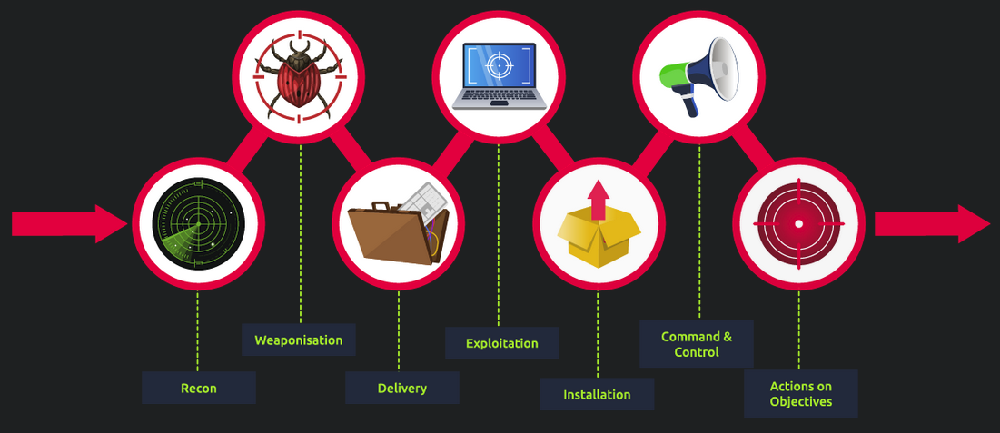
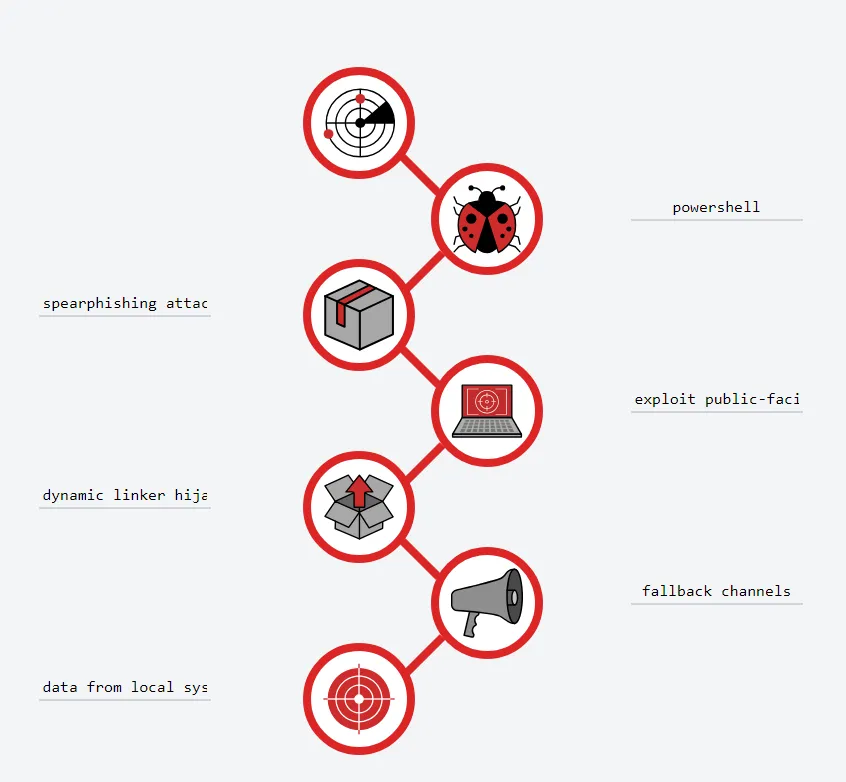

# Cyber Kill Chain

## Task 1: Introduction

The term kill chain is a military concept related to the structure of an attack.
It consists of target identification, decision and order to attack the target,
and finally the target destruction.

Thanks to Lockheed Martin, a global security and aerospace company,
that established the Cyber Kill Chain® framework for the cybersecurity
industry in 2011 based on the military concept. The framework defines
the steps used by adversaries or malicious actors in cyberspace.
To succeed, an adversary needs to go through all phases of the Kill Chain.
We will go through the attack phases and help you better understand
adversaries and their techniques used in the attack to defend yourself.

So, why is it important to understand how Cyber Kill Chain works?

The Cyber Kill Chain will help you understand and protect against ransomware attacks,
security breaches as well as Advanced Persistent Threats (APTs). You can use the Cyber
Kill Chain to assess your network and system security by identifying missing security
controls and closing certain security gaps based on your company's infrastructure.

By understanding the Kill Chain as a SOC Analyst, Security Researcher, Threat Hunter,
or Incident Responder, you will be able to recognize the intrusion attempts
and understand the intruder's goals and objectives.

We will be exploring the following attack phases in this room:

- Reconnaissance
- Weaponization
- Delivery
- Exploitation
- Installation
- Command & Control
- Actions on Objectives

**Learning Objectives:** In this room, you will learn about each phase of the Cyber Kill
Chain Framework, the advantages and disadvantages of the traditional Cyber Kill Chain.

**Outcome:** As a result, you will be ready to recognize different phases or stages of
the attack carried out by an adversary and be able to break the "kill chain."

***Answer the questions below***

***Correct answer:***

## Task 2: Reconnaisance

To learn what reconnaissance is from the attacker's perspective,
first, let's define the term reconnaissance.

Reconnaissance is discovering and collecting information on the system and the victim.
The reconnaissance phase is the planning phase for the adversaries.

OSINT (Open-Source Intelligence) also falls under reconnaissance. OSINT is the first step
an attacker needs to complete to carry out the further phases of an attack. The attacker
needs to study the victim by collecting every available piece of information on the
company and its employees, such as the company's size, email addresses, phone numbers
from publicly available resources to determine the best target for the attack.

You can also find out more about OSINT from this Varonis article,
["What is OSINT?"](https://www.varonis.com/blog/what-is-osint/)

Let's look at it from the attacker's perspective, who initially
doesn't know what company he wants to attack.

Here is the scenario: A malicious attacker who names himself "Megatron" decides to
conduct a very sophisticated attack that he has been planning out for years; he has been
studying and researching different tools and techniques that could help him get to the
last phase of the Cyber Kill Chain. But first,
he needs to start from the Reconnaissance phase.

In order to operate in this phase, the attacker would need to conduct OSINT.
Let's have a look at Email harvesting.

Email harvesting is the process of obtaining email addresses from public, paid, or free
services. An attacker can use email-address harvesting for a phishing attack (a type of
social-engineering attack used to steal sensitive data, including login credentials and
credit card numbers). The attacker will have a big arsenal of tools available for
reconnaissance purposes. Here are some of them:

- [theHarvester](https://github.com/laramies/theHarvester) -
other than gathering emails, this tool is also capable of gathering
names, subdomains, IPs, and URLs using multiple public data sources
- [Hunter.io](https://hunter.io/) - this is  an email hunting tool that will
let you obtain contact information associated with the domain
- [OSINT Framework](https://osintframework.com/) - OSINT Framework provides the
collection of OSINT tools based on various categories

An attacker would also use social media websites such as LinkedIn, Facebook, Twitter,
and Instagram to collect information on a specific victim he would want to attack
or the company. The information found on social media can be beneficial
for an attacker to conduct a phishing attack.

***Answer the questions below***

What is the name of the Intel Gathering Tool that is a web-based
interface to the common tools and resources for open-source intelligence?

***Correct answer: OSINT Framework***

What is the definition for the email gathering process during the stage of reconnaissance?

***Correct answer: email harvesting***

## Task 3: Weaponization

After a successful reconnaissance stage, "Megatron" would work on crafting a "weapon of
destruction". He would prefer not to interact with the victim directly and, instead, he
will create a "weaponizer" that, according to Lockheed Martin, combines malware and
exploit into a deliverable payload. Most attackers usually use automated tools to
generate the malware or refer to the
[DarkWeb](https://www.kaspersky.com/resource-center/threats/deep-web)
to purchase the malware. More sophisticated
actors or nation-sponsored APT (Advanced Persistent Threat Groups) would write their
custom malware to make the malware sample unique and evade detection on the target.

Let's first define some terminology before we analyze the Weaponization phase.

Malware is a program or software that is designed to damage, disrupt, or gain
unauthorized access to a computer.

An exploit is a program or a code that takes advantage of the vulnerability or flaw in
the application or system.

A payload is a malicious code that the attacker runs on the system.

Continuing with our adversary, "Megatron" chooses...

"Megatron" chooses to buy an already written payload from someone else in the DarkWeb,
so that he can spend more time on the other phases.

In the Weaponization phase, the attacker would:

- Create an infected Microsoft Office document containing a malicious macro or VBA
(Visual Basic for Applications) scripts. If you want to learn about macro and VBA,
please refer to the article
["Intro to Macros and VBA For Script Kiddies"](https://www.trustedsec.com/blog/intro-to-macros-and-vba-for-script-kiddies/) by TrustedSec.
- An attacker can create a malicious payload or a very sophisticated worm, implant it on
the USB drives, and then distribute them in public. An example of the virus.
- An attacker would choose Command and Control (C2) techniques for executing the commands
on the victim's machine or deliver more payloads.
You can read more about the C2 techniques on
[MITRE ATT&CK](https://attack.mitre.org/tactics/TA0011/).
- An attacker would select a backdoor implant (the way to access the computer system,
which includes bypassing the security mechanisms).

***Answer the questions below***

This term is referred to as a group of commands that perform a specific task.
You can think of them as subroutines or functions that contain the code that most users
use to automate routine tasks. But malicious actors tend to use them for malicious
purposes and include them in Microsoft Office documents. Can you provide the term for it?

***Correct answer: Macro***

## Task 4: Delivery

The Delivery phase is when "Megatron" decides to choose the method for transmitting the payload or the malware. He has plenty of options to choose from.

### Phishing email

After conducting the reconnaissance and determining the targets for the attack, the
malicious actor would craft a malicious email that would target either a specific person
(spearphishing attack) or multiple people in the company. The email would contain a
payload or malware. For example, "Megatron" would learn that Nancy from the Sales
department at company A would constantly like the posts on LinkedIn from Scott, a Service
Delivery Manager at company B. He would give it a second guess that they both communicate
with each other over work emails. "Megatron" would craft an email using Scott's First
Name and Last Name, making the domain look similar to the company Scott is working at. An
attacker would then send a fake "Invoice" email to Nancy, which contains the payload.

### Distribution

Distributing infected USB drives in public places like coffee shops, parking lots, or on
the street. An attacker might decide to conduct a sophisticated USB Drop Attack by
printing the company's logo on the USB drives and mailing them to the company while
pretending to be a customer sending the USB devices as a gift. You can read about one of
these similar attacks at CSO Online
["Cybercriminal group mails malicious USB dongles to targeted companies."](https://www.csoonline.com/article/3534693/cybercriminal-group-mails-malicious-usb-dongles-to-targeted-companies.html)

### Watering hole attack

A watering hole attack is a targeted attack designed to aim at a specific group of people
by compromising the website they are usually visiting and then redirecting them to the
malicious website of an attacker's choice. The attacker would look for a known
vulnerability for the website and try to exploit it. The attacker would encourage the
victims to visit the website by sending "harmless" emails pointing out the malicious URL
to make the attack work more efficiently. After visiting the website, the victim would
unintentionally download malware or a malicious application to their computer. This type
of attack is called a drive-by download. An example can be a malicious pop-up asking to
download a fake Browser extension.

***Answer the questions below***

What is the name of the attack when it is performed against a specific group of people,
and the attacker seeks to infect the website that the mentioned
group of people is constantly visiting.

***Correct answer: Watering hole attack***

## Task 5: Exploitation

To gain access to the system, an attacker needs to exploit the vulnerability.
In this phase, "Megatron" got a little bit creative - he created two phishing emails, one
that contains a phishing link to a fake Office 365 login page and another one containing
a macro attachment that would execute ransomware when the victim opens it. "Megatron"
successfully delivered his exploits and got two victims to click on the malicious link
and open the malicious file.

After gaining access to the system, the malicious actor could exploit software, system,
or server-based vulnerabilities to escalate the privileges or move laterally through the
network. According to
[CrowdStrike](https://www.crowdstrike.com/cybersecurity-101/lateral-movement/),
**lateral movement** refers to the techniques that a malicious actor uses
after gaining initial access to the victim's machine to move
deeper into a network to obtain sensitive data.

If you want to learn more about server-based or web-based vulnerabilities,
please refer to the TryHackMe room [OWASP Top 10](https://tryhackme.com/room/owasptop10).

The attacker might also apply a "Zero-day Exploit" in this stage. According to
[FireEye](https://www.fireeye.com/current-threats/what-is-a-zero-day-exploit.html),
"the zero-day exploit or a zero-day vulnerability is an unknown exploit in the wild that
exposes a vulnerability in software or hardware and can create complicated problems well
before anyone realizes something is wrong. A zero-day exploit leaves
NO opportunity for detection at the beginning."

These are examples of how an attacker carries out exploitation:

- The victim triggers the exploit by opening the email attachment or clicking on a malicious link.
- Using a zero-day exploit.
- Exploit software, hardware, or even human vulnerabilities.
- An attacker triggers the exploit for server-based vulnerabilities.

***Answer the questions below***

Can you provide the name for a cyberattack targeting a software
vulnerability that is unknown to the antivirus or software vendors?

***Correct answer: Zero-day***

## Task 6: Installation

As you have learned from the Weaponization phase, the backdoor lets an attacker bypass
security measures and hide the access. A backdoor is also known as an access point.

Once the attacker gets access to the system, he would want to reaccess the system if he
loses the connection to it or if he got detected and got the initial access removed, or
if the system is later patched. He will no longer have access to it. That is when the
attacker needs to install a
[persistent backdoor](https://www.offensive-security.com/metasploit-unleashed/persistent-backdoors/).
A persistent backdoor will let the attacker access the system he compromised in the past.
You can check out the Windows Persistence Room on TryHackMe to learn
how an attacker can achieve persistence on Windows.

The persistence can be achieved through:

- Installing a web shell on the webserver. A web shell is a malicious script written in
web development programming languages such as ASP, PHP, or JSP used by an attacker to
maintain access to the compromised system. Because of the web shell simplicity and file
formatting (.php, .asp, .aspx, .jsp, etc.) can be difficult to detect and might be
classified as benign. You may check out this great article released by
[Microsoft](https://www.microsoft.com/security/blog/2021/02/11/web-shell-attacks-continue-to-rise/)
on various web shell attacks.
- Installing a backdoor on the victim's machine. For example, the attacker can use
[Meterpreter](https://www.offensive-security.com/metasploit-unleashed/meterpreter-backdoor/)
to install a backdoor on the victim's machine. Meterpreter is a Metasploit
Framework payload that gives an interactive shell from which an attacker can interact
with the victim's machine remotely and execute the malicious code.
- Creating or modifying Windows services. This technique is known as
[T1543.003](https://attack.mitre.org/techniques/T1543/003/) on MITRE
ATT&CK (MITRE ATT&CK® is a knowledge base of adversary tactics and techniques based on
real-world scenarios). An attacker can create or modify the Windows services to execute
the malicious scripts or payloads regularly as a part of the persistence. An attacker can
use the tools like sc.exe (sc.exe lets you Create, Start, Stop, Query, or Delete any
Windows Service) and [Reg](https://attack.mitre.org/software/S0075/)
to modify service configurations. The attacker can also
[masquerade](https://attack.mitre.org/techniques/T1036/)
the malicious payload by using a service name that is known to be related to
the Operating System or legitimate software.
- Adding the entry to the "run keys" for the malicious payload in the Registry or the
Startup Folder. By doing that, the payload will execute each time the user logs in on the
computer. According to MITRE ATT&CK, there is a startup folder location for individual
user accounts and a system-wide startup folder that will be checked no matter what user
account logs in.

You can read more about the Registry Run Keys / Startup Folder persistence on one of the
[MITRE ATT&CK techniques](https://attack.mitre.org/techniques/T1547/001/).

In this phase, the attacker can also use the
[Timestomping](https://attack.mitre.org/techniques/T1070/006/)
technique to avoid detection by the forensic investigator and also to make the malware
appear as a part of a legitimate program. The Timestomping technique lets an attacker
modify the file's timestamps, including the modify, access, create and change times.

***Answer the questions below***

Can you provide the technique used to modify file time attributes
to hide new or changes to existing files?

***Correct answer: Timestomping***

Can you name the malicious script planted by an attacker on the webserver to maintain
access to the compromised system and enables the webserver to be accessed remotely?

***Correct answer: Web shell***

## Task 7: Command & Control

After getting persistence and executing the malware on the victim's machine, "Megatron"
opens up the C2 (Command and Control) channel through the malware to remotely control and
manipulate the victim. This term is also known as C&C or C2 Beaconing as a type of
malicious communication between a C&C server and malware on the infected host. The
infected host will consistently communicate with the C2 server;
that is also where the beaconing term came from.

The compromised endpoint would communicate with an external server set up by an attacker
to establish a command & control channel. After establishing the connection,  the
attacker has full control of the victim's machine. Until recently, IRC (Internet Relay
Chat) was the traditional C2 channel used by attackers. This is no longer the case,
as modern security solutions can easily detect malicious IRC traffic.

The most common C2 channels used by adversaries nowadays:

- The protocols HTTP on port 80 and HTTPS on port 443 - this type of beaconing blends the
malicious traffic with the legitimate traffic and can help the attacker evade firewalls.
- DNS (Domain Name Server). The infected machine makes constant DNS requests to the DNS
server that belongs to an attacker, this type of C2
communication is also known as DNS Tunneling.

Important to note that an adversary or another compromised host
can be the owner of the C2 infrastructure.

***Answer the questions below***

What is the C2 communication where the victim makes regular DNS requests
to a DNS server and domain which belong to an attacker.

***Correct answer: DNS tunneling***

## Task 8: Actions on Objectives (Exfiltration)

After going through six phases of the attack, "Megatron" can finally achieve his goals,
which means taking action on the original objectives. With hands-on keyboard access,
the attacker can achieve the following:

- Collect the credentials from users.
- Perform privilege escalation (gaining elevated access like domain administrator
access from a workstation by exploiting the misconfiguration).
- Internal reconnaissance (for example, an attacker gets to interact with
internal software to find its vulnerabilities).
- Lateral movement through the company's environment.
- Collect and exfiltrate sensitive data.
- Deleting the backups and shadow copies. Shadow Copy is a Microsoft technology
that can create backup copies, snapshots of computer files, or volumes.
- Overwrite or corrupt data.

***Answer the questions below***

Can you provide a technology included in Microsoft Windows that can create backup copies
or snapshots of files or volumes on the computer, even when they are in use?

***Correct answer: Shadow Copy***

## Task 9: Practice Analysis

We really hope you enjoyed this room. In order to strengthen your knowledge,
let's do a practice analysis.

Here is the real-world scenario for you to tackle:

The infamous Target cyber-attack, which led to one of the
largest data breaches in history took place on November 27, 2013.

On December 19th, 2013, Target released a
[statement](https://corporate.target.com/news-features/article/2013/12/important-notice-unauthorized-access-to-payment-ca)
confirming the breach, stating that
approximately 40 million credit and debit card accounts were impacted between Nov. 27 and
Dec. 15, 2013. Target had to pay the fine of $18.5 million under the terms of the
[multistate settlement agreement](https://www.attorneygeneral.gov/taking-action/settlement-reached-with-target-following-major-consumer-data-breach/).
This is considered to be the largest data-breach settlement in history.

How did the data breach happen? Deploy the static site attached to this task and apply
your skills to build the Cyber Kill Chain of this scenario.
Here are some tips to help you complete the practical:

1. Add each item on the list in the correct Kill Chain entry-form on the Static Site Lab:
    - exploit public-facing application
    - data from local system
    - powershell
    - dynamic linker hijacking
    - spearphishing attachment
    - fallback channels

2. Use the ‘Check answers’ button to verify whether the answers are correct
(where wrong answers will be underlined in red).

***Answer the questions below***

What is the flag after you complete the static site?

*Solution:*

Weaponization was done using Powershell

Delivery was accomplished through spearphishing

Exploitation, a gimme, exploit public-facing applications

Installation done by hijacking the DLLs

C2 achieved using fallback channels

Exfil was the data from the local system, huge amounts of credit card data

***Correct answer: THM{7HR347_1N73L_12_4w35om3}***

## Task 10: Conclusion

Cyber Kill Chain can be a great tool to improve network defence.
Is it perfect and can it be the only tool to rely on? No.

The traditional Cyber Kill Chain or Lockheed Martin Cyber Kill Chain was
last modified in 2011, which, if you remember, is the date of its establishment.
The absence of updates and modifications creates security gaps.

The traditional Cyber Kill Chain was designed to secure the network perimeter and protect
against malware threats. But the cybersecurity threats have developed drastically
nowadays, and adversaries are combining multiple TTP (tactics, techniques, and
procedures) to achieve their goal. Adversaries are capable of defeating threat
intelligence by modifying the file hashes and IP addresses. Security solutions companies
are developing technologies like AI (Artificial Intelligence) and different algorithms to
detect even slight and suspicious changes.

Since the main focus of the framework is on malware delivery and network security, the
traditional Cyber Kill Chain will not be able to identify Insider Threats. According to
[CISA](https://www.cisa.gov/defining-insider-threats),
"The Insider Threat is the potential for an insider to use their authorized access
or understanding of an organization to harm that organization."

We recommend not only relying on the traditional Cyber Kill Chain model but also
referring to [MITRE ATT&CK](https://attack.mitre.org/)
as well as [Unified Kill Chain](https://unifiedkillchain.com/)
to apply a more comprehensive approach to your defence methodologies.

***Answer the questions below***

Read the above.

***Correct answer: No answer needed***
