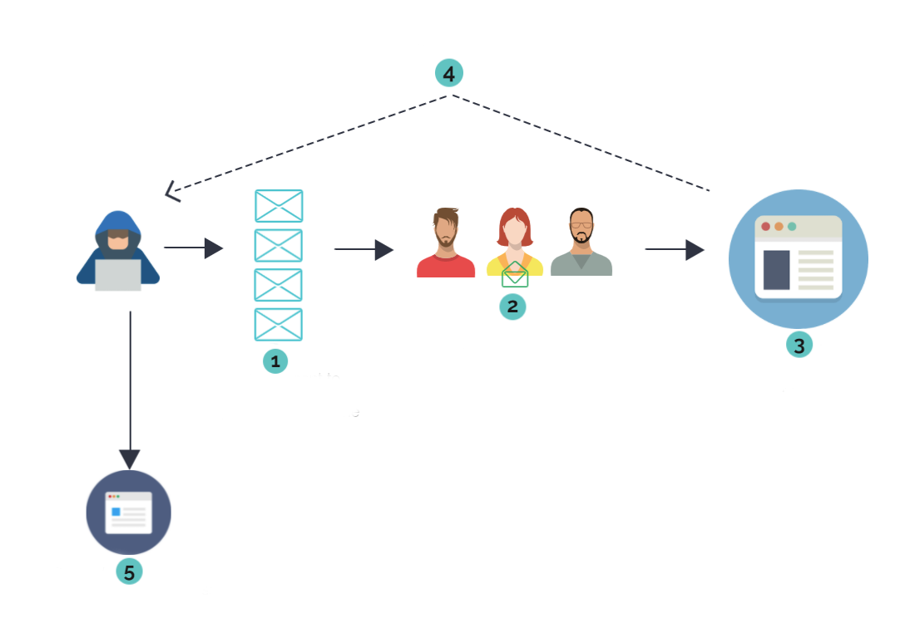
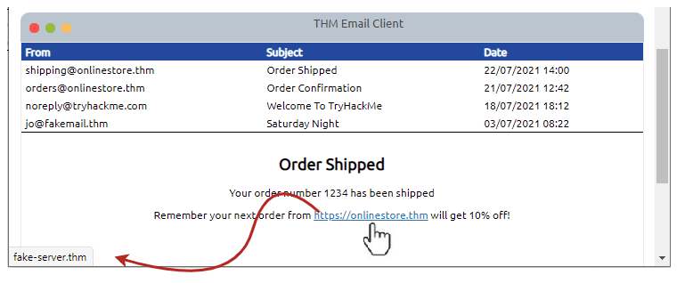
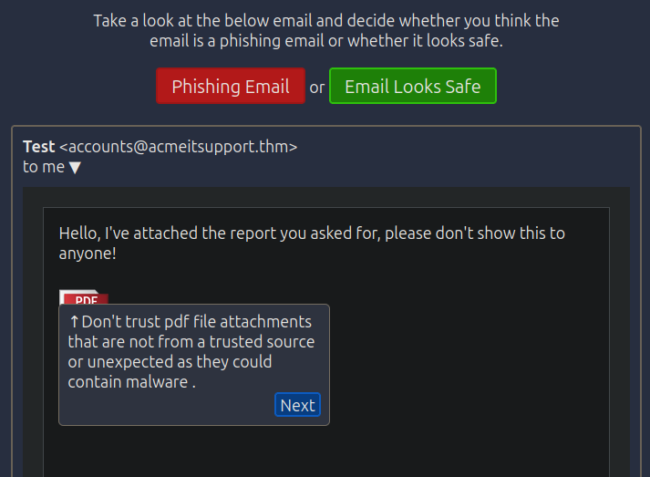
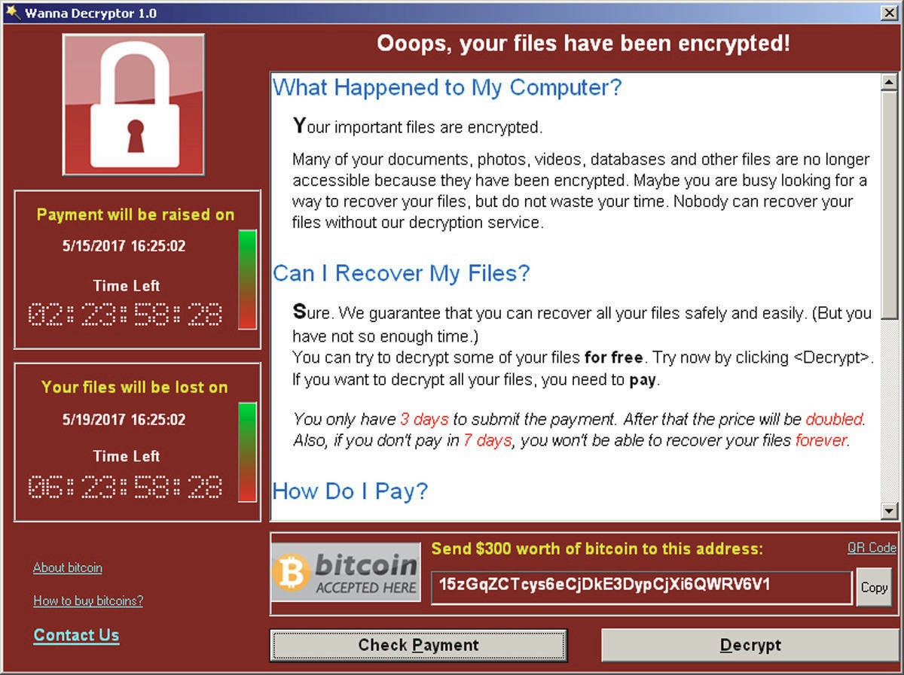
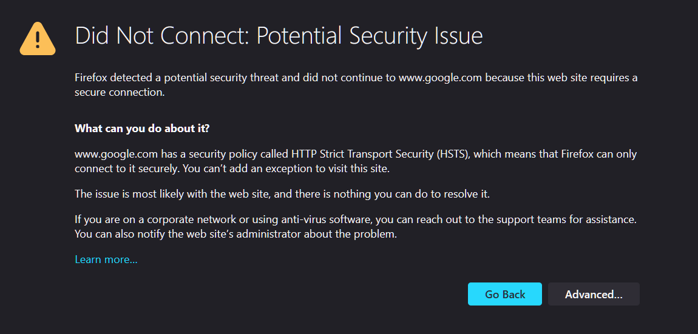
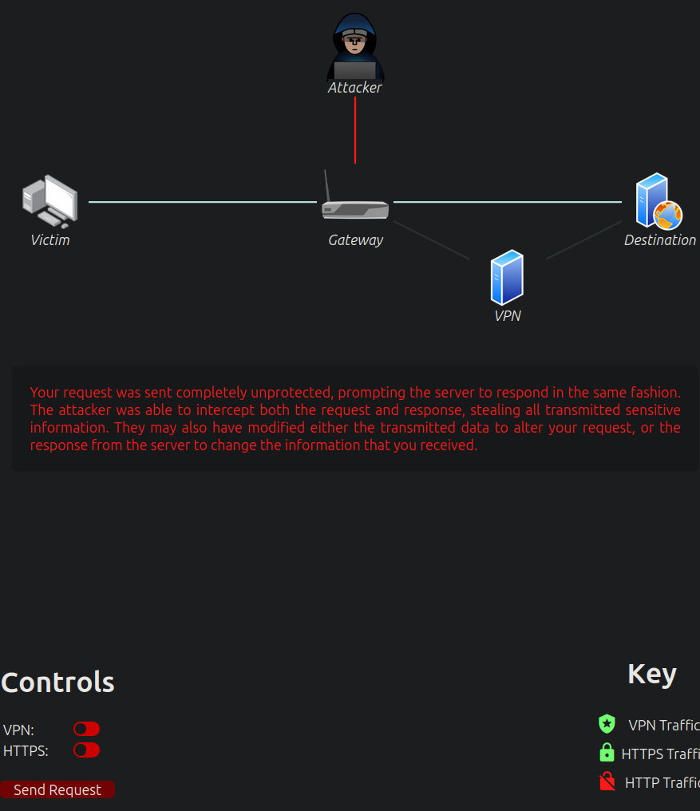
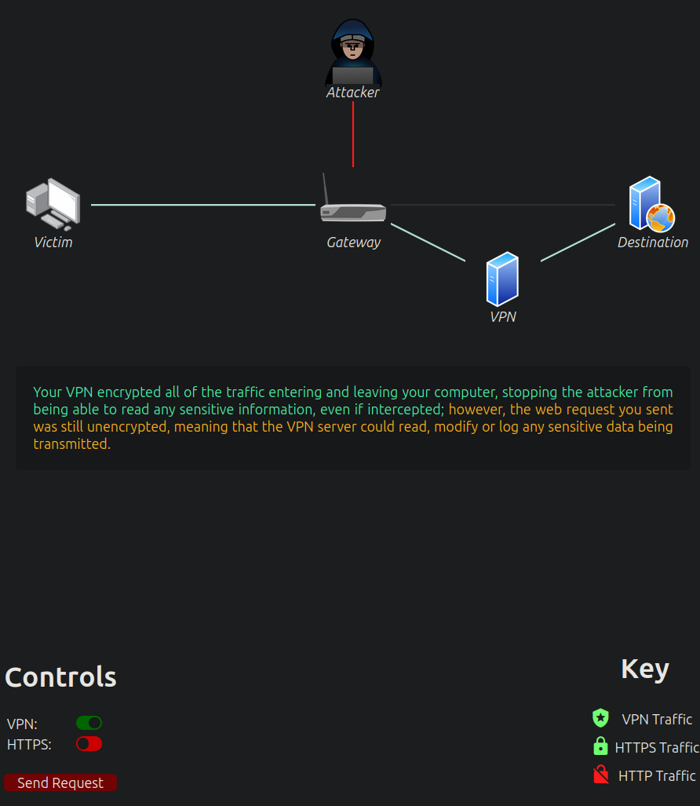
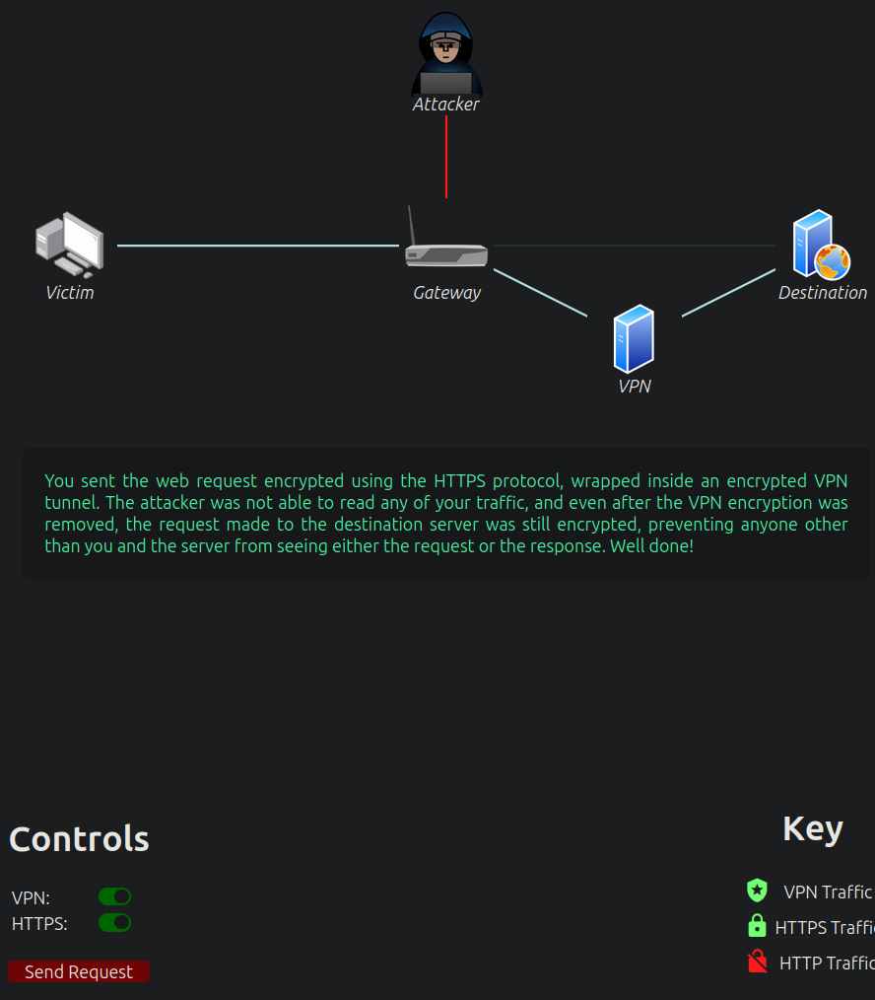

# Common Attacks

## Task 1: Introduction

Our existence in a digital world makes it imperative that
we understand and can protect against common attacks.

This room will discuss some of the most common techniques used by attackers
to target people online. It will also teach some of the best
ways to prevent the success of each technique.

Without further ado, let's begin!

***Answer the questions below***

Let's get started!

***Correct answer: No answer needed***

## Task 2

### What is Social Engineering?

Social Engineering is the term used to describe any cyberattack where a human (rather
than a computer) is the target; for this reason, it is sometimes referred to as "People
Hacking". For example, if an attacker wishes to obtain a victim's password, they could
attempt to guess or brute-force the password,
or they could [simply ask you](https://youtu.be/opRMrEfAIiI?t=42).

Whilst the example linked above
is relatively straightforward, social engineering attacks can become very complex and
often result in an attacker gaining significant control over a target's life — both
online and offline. Social engineering attacks are often multi-layered and escalate due
to the snowball effect. For example, an attacker may start off by obtaining a small
amount of publicly available information from a victim's social media presence, which
they could then use to get more information from, say, your phone or broadband provider.
The information obtained from the second stage could then be used to gain more useful
information, then escalate step-by-step to something like the victim's bank account.

The best way to understand social engineering is to see it in action! These videos from
[Defcon23](https://youtu.be/fHhNWAKw0bY?t=100)
(one of the largest hacking conferences in the world) and
[CNN](https://youtu.be/PWVN3Rq4gzw) demonstrate some
of the immense power in social engineering. They are both well worth a watch!

### Other Forms of Social Engineering

Charismatic hackers calling your phone company and taking possession of your account is
one form of social engineering; however, there are many Decorative image of a USB
driveother types. Social engineering is a vast topic, encompassing any attack that relies
on tricking humans into giving the attacker access, rather than attacking the technology
directly. Whilst direct interaction with targets is the most common style of social
engineering, other examples include dropping USB storage devices in public (e.g. in
company car parks) in the hope that someone (often a company employee) will pick one up
and plug it into a sensitive computer. In a similar vein, attackers may leave a "charging
cable" plugged into a socket in a public place. In actuality, the cable contains
malicious software such as keyloggers or tools to take control of the victim's device.

### Case Study: Stuxnet (Click to Read)

Stuxnet was the name given to a particularly nasty computer virus (allegedly developed by
the governments of the United States and Israel) that was originally used to target the
Iran nuclear programme in 2009. Due to its ability as a "worm" to self-replicate (i.e.
clone itself across networks — including the internet), the virus escaped and became much
more widespread than was intended. Multiple variants now also exist, making Stuxnet a
particularly hard-hitting and notorious weapon. You can read more about the background of
Stuxnet [here](https://web.archive.org/web/20220625202749/https://www.cyber.nj.gov/threat-center/threat-profiles/ics-malware-variants/stuxnet).

What makes Stuxnet particularly interesting for this section is the original method of
infection. The virus can clone itself across networks, but that doesn't help much when
the target network is a nuclear weapons development facility with no access to the wider
internet. The question became: how can you get a virus into a network that doesn't let
anything in or out? The answer was simple: drop malicious USB devices in places where
workers at companies that dealt with the facility would find them and hope that one of
them plugged the device into a work computer. In this case, the gamble worked, with
Stuxnet causing severe damage to the Iran nuclear programme and
effectively destroying many of the nuclear centrifuges.

In short, the limits to social engineering are at the bounds of an attacker's
imagination. A good social engineer can (and will) use a plethora of
psychological tricks under any plausible context to "hack" their targets.

### Staying Safe from Social Engineering Attacks

In many ways, it is very tricky to stay safe from social engineering as it won't always
be you who the attacker is talking to, but rather someone who can give them what they
need without your consent (e.g. calling your bank whilst pretending to be you, so as to
access your bank account). That said, there are still measures
you can take to protect yourself from Social Engineering attacks:

- Always make sure to set up multiple forms of authentication, and ensure that providers
respect these. For example, set difficult to guess — or otherwise incorrect — answers to
security questions (making sure to store the answers somewhere safe!), and make sure that
these questions are asked when you try to access accounts over the phone.
- Never plug external media (e.g. USBs/CDs/etc) into a computer that you care about or
that is connected to any other devices. Ideally, don't plug the media in at all, and
instead give it to your local police for safekeeping.
- Always insist on proof of identity when a stranger calls or messages you claiming to
work for a company whose services you use. Where possible, confirm with a known phone
number or email address that the call or message you received was legitimate (i.e. use a
trusted method to get in contact with the company to confirm). Remember that no
legitimate employee will ever ask for your password or
other information that protects your account.

***Answer the questions below***

Read the task information and watch the attached videos

***Correct answer: No answer needed***

What was the original target of Stuxnet?

***Correct answer: The Iran Nuclear Programme***

## Task 3: Social Engineering: Phishing

### Overview

Phishing is one of the most common cyber attack types employed by scammers and bad
actors, targeting individuals and businesses indiscriminately. In many cases, phishing is
the initial attack vector used to gain access to a company's infrastructure before
performing further attacks against the corporate network. Whilst there are many automated
tools now available to help combat phishing threats,
phishing is still one of the most prolific attack vectors around.

### What is Phishing?

Phishing is a sub-section of social engineering. Whereas social engineering is a very
general term used to describe any attack that takes advantage of a human rather than a
computer system, phishing specifically describes attacks whereby a scammer or other
attacker tricks a victim into opening a malicious webpage by sending them a text message,
email, or another form of online correspondence. Traditionally, "phishing" simply
referred to emails; however, in the days of instant messaging, text messages, and voice/
video calling, the term has evolved to blanket these other categories. These other forms
are sometimes referred to individually as "smishing" — phishing over SMS — and "vishing"
— phishing over voice chat — respectively. These attacks are very widespread (indeed, the
chances of you not having been on the receiving end of such an attack are slim!) and are
frequently deployed on massive scales using lists of
leaked or stolen phone numbers and email addresses.

Phishing messages usually deploy psychological trickery (for example, inducing a false
sense of urgency to make victims act rashly) and nearly always involve getting a victim
to click on a link to a web application owned by the attacker. The victim is then often
asked to enter sensitive information — for example, login details or credit card
information — at which point the malicious site stores the information and the attack is
complete. Alternatively, the victim may inadvertently install malware from the malicious
page, thus giving an attacker an entry point into their device and network.

There are three primary types of phishing attacks:

|Attack Type|Definition|
|:-:|:-|
|General Phishing|A simple, mass phishing attack which doesn't target anyone in particular, although they may aim for large groups (e.g. PayPal users, or Amazon customers). These large-scale campaigns are usually simple and are generally (but not always) fairly easy to spot as the messages and malicious sites are often not very well crafted and frequently contain many immediately visible errors.|
|Spearphishing|More targeted than general phishing, spearphishing aims for an individual or small group (e.g. employees of a specific company). Spearphishing campaigns are generally better crafted than the correspondence and malicious sites used in general phishing as they are designed to target a particular group, often as part of a more extensive campaign against the target. |
|Whaling|Even more specific than spearphishing, whaling targets high-value individuals (e.g. a C-Suite executive in a target company). The messages are generally extremely well crafted and tend to be very hard to spot.|

Be aware that you are much more likely to encounter a general phishing attack than a
spearphishing or whaling attack in your day-to-day life. This may not be the case in your
work life, however — especially if you are a high-ranking member of a company.

An example of a popular general phishing scenario (or "pretext") would be receiving an
email purportedly from "Amazon", informing you that your account has been used to buy a
very costly item (e.g. the latest iPad). You are then provided with a link to view your
purchase history. The link looks like it goes to <https://amazon.co.uk> but will actually
take you to an attacker-controlled web application (that looks identical to the Amazon
login page), asking you to enter your Amazon credentials. When you enter your
credentials, you get redirected to the real Amazon orders page, where you find that there
are no unauthorised purchases... yet. The attacker will then use your duly provided
credentials to actually order expensive items with your account.

This process is shown in the following diagram:



1. The attacker sends out a malicious phishing email campaign
2. Prospective victims receive the emails — some of them open the email and click the link
3. The victims enter their credentials into the attacker's fake web page
4. The web page stores the credentials or sends them directly to the attacker
5. The attacker uses the credentials to access the site,
thus taking over the victims' accounts

Phishing attacks work best when the malicious web page mimics an existing (usually
well-known) web page. For this reason, attackers/scammers will usually use one of many
freely available tools to simply clone an existing page,
which can then be edited at their leisure.

The end goal of a phishing attack can vary significantly depending on who is performing
the attack. For example, a low-level scammer may simply be after sensitive information
(e.g., bank details), whereas a high-powered group of malicious hackers may be targeting
a specific organisation with the intention of causing further damage.

### Identifying Phishing Attacks

Many generic phishing attacks are relatively easy to spot; they frequently have poor
grammar and often do not address their victims by name (instead leaving the greetings
generic — e.g., "Dear customer"). That said, other instances can be extremely difficult
to spot, with some attacks being thorough enough to fool cybersecurity professionals.

Regardless of the attack type, in many cases, the pretext will be plausible — for
example: the Amazon scam listed above, or a (fake) message from your "bank" telling you
that there has been unusual activity with your account and to please log in to review it.
This is especially true for spearphishing or whaling attacks where the pretext will be
very carefully tailored to the target.

Equally, the domain name for the malicious site will usually be similar (but never
identical) to the domain name used by the legitimate website. As a real-world example
from 2021, a group of scammers sent out a mass phishing campaign over SMS, mimicking the
British Royal Mail service and using the domain name <https://royalmai1.co.uk> (as opposed
to <https://royalmail.co.uk>). By exchanging the final "L" for the number one, the
scammers were able to successfully register a domain name that looked almost identical to
the domain name of their cloned website; this is a very common tactic.

Also, bear in mind that HTML emails (effectively any email that looks fancy and contains
formatting/graphics) can also be used to mask the real domain name in use. For example,
the text in the email may be "<https://amazon.co.uk>"; however, the link actually goes to
"<https://am4zon.co.uk>". You can see this by hovering your mouse over the link in a
desktop application — the real link should appear
at the bottom of the screen as in this graphic:



You can try this for yourself with the link below!

[https://tryhackme.com](https://shibes.xyz)

In a similar vein, the "From" email address in an email-based phishing campaign will
often be suspicious. Many generic mass phishing campaigns will simply use Gmail addresses
— not bothering to use a domain name associated with the company they are spoofing.
This is a dead giveaway that the email is suspicious.

The best way to identify a phishing email is simply to keep your eyes open and
look for anything suspicious — all but the best will have a mistake somewhere.

### Staying Safe from Phishing Attacks

There are a variety of things that you can (and should!)
do to keep yourself safe from phishing attacks:

- Delete unknown or untrusted emails without opening them. If you can see anything
suspicious in the email, also report it as spam to your email provider, or forward it to
your IT Security department if you received the email at work.
- Never open attachments from untrusted emails — this includes any attachments from a
legitimate contact that you were not expecting.
- Do not click on embedded links in emails or messages. Where possible, navigate to the
real website in your web browser and access the content that way. If you absolutely must
click on the link, ensure that the domain name is correct and that the link points to
where you think it does.
- Always make sure that your device and antivirus software are up-to-date.
- Avoid making your personal information (e.g. email address and phone number) public if
possible. If you must publish personal details publicly, create a "burner" email address
(a temporary address made for one purpose, then destroyed soon afterwards) for the
occasion, then destroy it as soon as it is no longer required.

It's worth noting at this point that anyone can fall for a phishing attack — especially a
complex one that has been made to look very realistic. If you accidentally fall for one,
don't panic! Make sure that you change any affected passwords immediately, and contact IT
Services if the attack happens at work.

***Answer the questions below***

Click the green "View Site" button at the top of this task if you haven't already done so.

***Correct answer: No answer needed***

The static site will display a series of emails and text messages. You will be asked to
identify which of these messages are genuine and which are phishing attempts. Once you
have successfully identified all of the messages you will be presented
with a flag to enter, here.

Good luck!

What is the flag?

*Solution:*




***Correct answer: THM{I_CAUGHT_ALL_THE_PHISH}***

## Task 4: Malware and Ransomware

### Overview

Despite the steady advance of antivirus software solutions, malware
(and ransomware in particular) is an ever-growing threat.

Malware (short for "malicious software") can be defined as any software designed to
perform malicious actions on behalf of an attacker. There are many different kinds of
malware: we will be focussing on generic malware and ransomware specifically in this task.

Once installed, attackers commonly use malware to steal information, cause damage, or
execute arbitrary commands on the infected system. Malware is often used to perform a set
of tasks referred to as "Command and Control" (or C2/C&C). C2 malware connects back to a
waiting server and allows an attacker to control the infected system remotely, often
incorporating many simple tasks such as keylogging
as built-in parts of the malicious software.

### Ransomware

A specialised class of malware: ransomware is used to infect as many systems as possible,
encrypting the data on the devices and holding it to ransom. If the victims pay the
attackers within a set timeframe (usually via a cryptocurrency such as Bitcoin),
the data is theoretically returned.

Ransomware usually spreads by exploiting known vulnerabilities in commonly installed
software (e.g. the Microsoft Windows operating system); it can be extremely
fast-spreading once an infection begins, and can demand millions in ransom money. The
goal of a ransomware attack is to infect as many systems as possible, then make as much
data inaccessible as possible by encrypting it with a key known only to the attacker.
Once the attack is complete, the malware usually displays
a window that looks something like this:



This window gives the victims the time limit and instructions on how to pay, as well as a
rundown on what exactly has happened to their data. The example above is from the infamous [Wannacry ransomware](https://www.malwarebytes.com/wannacry).

With the ransom paid, the malware may or may not decrypt the data and
self-destruct, depending entirely on how nice the attackers are.

### Delivery Methods

There are various ways that an attacker can infect a target with malware — many of these
revolve around social engineering or phishing attacks. For example, an attacker may send
a victim an email containing a Microsoft Word or Excel file that contains a malicious
macro (code that is embedded inside the document set to run when a user opens the file).
These will not run by default unless the user clicks the
"Enable Content" button at the top of the screen to enable macros:


However, there are situations in which a user may genuinely wish to execute macros,
and a good attacker will capitalise on these pretexts to
convince the victim to click the button.

Similarly, the attacker may send the file as a compiled .exe , a PDF, a .ps1 PowerShell
Script or .bat Batch script, an HTML application file ( .hta ), or even a .js JavaScript
file to be executed by the JavaScript interpreter built into Windows.

In short, there are many different ways and formats in which an attacker
can send code to a victim. Once the code is executed, the infection begins.

Alternatively, the attacker may exploit a vulnerability in public-facing infrastructure
in a corporate environment (for example, a webserver), thus giving themselves an opening
into the internal network and allowing them to start a larger attack,
facilitated by malware.

### Staying Safe

Staying safe from malware (and ransomware in particular) is best done
with a combination of awareness and keeping things up to date!

- Always accept updates and patches when offered — especially in important software like
operating systems. Updates often contain fixes to security flaws, so it is important to
get these in place as soon as possible.
- Never click on suspicious links, especially in emails. Try not to open file attachments
if possible. If a message looks suspicious, delete it, or forward it to the appropriate
team if using your work account.
- Always be on the lookout for people trying to get you to download or run files —
especially over email or instant messaging.
- Never plug unknown media devices (e.g. USB devices) into important computers.
If you find a device in public, do not plug it into your work laptop!
- Always back up important data — this will be discussed in more detail later in the room
and can be crucial in recovering from a ransomware attack.
- Make sure that your antivirus software is always up-to-date and activated.

Note: If you or your business get infected with ransomware, do not pay the ransom.
Instead, call your local authorities immediately, and try to contain the infection by
disabling your router or otherwise physically preventing the infected device from
connecting to anything else. Do not power the infected device off, as this can sometimes
destroy any potential opportunities to decrypt the data without paying.

***Answer the questions below***

[Research] What currency did the Wannacry attackers request payment in?

***Correct answer: Bitcoin***

## Task 5: Passwords and Authentication

### Overview

For better or worse, passwords are an integral part of most authentication systems. We
use passwords to protect everything, from our social media accounts to our banking
applications. Unfortunately, despite their significant importance, it is still
all-too-easy to create and use an insecure password, and even easier to take other
actions that lower the overall security of the system. For example, even the most robust
password in the world is useless if written on a whiteboard in full view of a web-camera
especially if the same password is used for more than one service.

This task will cover password security, as well as other measures
you can take to strengthen your overall authentication security.

### What Makes A Strong Password?

Advice on what constitutes a strong password has changed over time. In the past, people
were advised to choose complex passwords that were easy to remember, for example:

```bash
@Ed1nburgh#1988-2000!
```

The password above is a collection of lowercase and uppercase characters, including
symbols and numeric digits. It is over eight characters long (making it almost impossible
to attack by brute-force with our current level of technology) and is created using
knowledge that is unlikely to be held by anyone other than the owner of the password.
Importantly, it also doesn't conform to normal patterns  (using unusual symbols,
exchanging only some characters of l33t speak, and containing a date range as opposed to
a single date), making it harder to guess. For all intents and purposes, this is a
traditionally strong password. That said, the personal connection means that this
password could potentially still be made weaker through social
engineering or in-depth information gathering on a target.

Current best practices lean more towards length than complexity. For example:

```bash
Vim is _obviously_, indisputably the best text editor in existence!
```

By using a passphrase rather than a traditional password, the password is significantly
longer whilst still retaining some of the more complex elements — despite not looking
quite so obfuscated. This has the advantage of being easier to remember whilst still
being incredibly difficult to brute-force.

Ideally, however, you should use long, completely random passwords. For example:

```bash
w41=V1)S7KIJGPN,dII>cHEh>FRVQsj3M^]CB
```

These take millions of years to crack and are objectively the most secure option
available. The drawback is usability; however, this is largely mitigated by using a
password manager, which will be discussed in the next task.

### What Makes A Weak Password?

People often go for simple passwords that mean something to them, often following one of
a few "simple" patterns. For example, a commonly used pattern is a name/location,
followed by a year, followed by an exclamation mark. For example:

```bash
Gareth2012!
```

This is enough to satisfy most password complexity requirements (lowercase and uppercase
characters, over eight characters, contains numerical digits and a symbol); however, it
is trivial to guess if an attacker knows that you have a son called Gareth who was born
in 2012. This kind of password is inherently extremely insecure.

In short, any password that could easily be guessed by someone who knows you relatively
well (this includes an attacker looking at your social media) is a bad idea!

Equally, short passwords (especially those that don't contain any non-alphanumeric
characters) are weak against brute-force attacks.
We will look at this in more depth later in the task.

Of equal importance to password strength is password reuse. You can have the strongest
password in the world, but if you use it across numerous accounts and it gets leaked, an
attacker can simply use the same strong password on all affected accounts. Equally, if
you find out that your password has been exposed, you will have a lot of work to do
changing all of your account passwords!

### Exposed Passwords

Unfortunately, not every service stores passwords securely (making it doubly important
that you don't reuse passwords!).

#### Background Information: Safe Password Storage (Click to read)

When you sign up for an online account, the provider must store a copy of your password
in order to validate it the next time you sign in; but this poses a huge problem:
how can the passwords be stored securely?

- Storing the passwords as plain text (e.g. the same way you submit them) isn't an option
as every password will instantly be leaked if the database is ever hacked.
- Encrypting the passwords is an improvement, but not by much. If the passwords are
stored encrypted, then they can also be decrypted — an attacker simply has to obtain the
key, and they can turn every encrypted password back into plaintext. Encrypting passwords
was part of what made the
[2013 Adobe breach](https://nakedsecurity.sophos.com/2013/11/04/anatomy-of-a-password-disaster-adobes-giant-sized-cryptographic-blunder/)
so serious.
- The industry-standard password storage method is referred to as password hashing.
Password hashing (or simply "hashing") involves using complicated mathematical algorithms
to take any input and turn it into a unique, fixed-length output in a way that is
impossible to reverse. This means that when you sign up, your password will be hashed and
stored in the database in a way that stops everyone (including
server administrators) from being able to read it!
- When you try to sign in, the same algorithm is applied to the password that you supply:
if the stored hash matches the hash of the password you are trying to log in with
(remembering that the same input will always create the same unique output), then you are
considered to have successfully authenticated.

Ideally, every service would hash user passwords with a secure algorithm. Even if the
entire database were leaked, the attackers would still need to waste valuable time and
computational power attempting to brute-force the (otherwise useless) hashes to find the
plaintext passwords. This is why it is so important that passwords are long and
preferably of a decent level of complexity: the longer the password and the larger the
number of potential characters involved, the more power it takes to effectively guess the
password input used to generate a hash.

(end of Background)

So, what happens if a service gets hacked and their database containing user account
information gets leaked? As a best-case scenario, the service has used a secure hashing
algorithm, and you have a strong password — in this case, your password is safe, but your
email address or username may still be leaked publicly (so expect some spam emails).

As a worst-case scenario, your plaintext password is either immediately available, or is
easy for an attacker to find. If this happens then both your username and password are
known to the attacker, allowing them to take over your account or perform "credential
stuffing" attacks — using your stolen username and password pair against other services
to see if you reused them elsewhere. These leaked databases containing credentials
frequently appear on the dark web, which leads us to our final point in this section:
data exposure notification services.

The largest and most well-known data exposure checker is called
["Have I Been Pwned?"](https://haveibeenpwned.com/).
It exists as a free online service that scours data dumps and catalogues all of the
information found, allowing users to enter their email addresses to see if they have been
included in any breaches. Have I Been Pwned also allows you to add yourself to a
notification list, meaning that you will receive an email notifying you if your email
address appears in any data breaches.

Whilst not a perfect defence, notification services give you a vital early
warning to change your passwords (hopefully) before you get hacked.

### Password Attacks

An attacker has a few options when it comes to attacking passwords and authentication
systems. Some attacks are entirely local (i.e. working entirely on a device owned by the
attacker without interacting with the target service at all),
others are remote attacks involving the original server.

Local attacks require a stolen copy of the credentials in question. The attacker will
take a file full of stolen usernames/emails and hashed passwords, then use software to
effectively try to guess the input that created the hash either using randomly generated
sequences of characters (slower but more thorough) or by using a pre-generated wordlist
of possible passwords (faster but much more likely to miss things). Hybrid types are also
very widely used; these are when an attacker takes an existing wordlist and mutates it to
add new characters, symbols, or random elements. Local password attacks will be
demonstrated in the interactive element for this task.

Remote attacks tend to be one of two categories; they either involve attempting to
brute-force known usernames by sending requests to the server and seeing what it responds
with, or they use known username and password pairs from previous breaches to see if they
are valid on the target site — this is the aforementioned credential stuffing.

***Answer the questions below***

Put yourself in the shoes of a malicious hacker. You have managed to dump the password
database for an online service, but you still have to crack those hashes!

Click the green button at the start of the task to
deploy the interactive hash brute-forcer!

***Correct answer: No answer needed***

Based on the content of the website, you have generated a list of
likely passwords, which is as follows:

```bash
TryH@ckMe
TryHackMe123
THM123456
qwertyuiop123
TryHackMe2021
TryHackMe123!
TryHackMe345
TryHackM3!
```

Copy the list of passwords into the "Password List" field of the hash cracker,
then click "Go"!

***Correct answer: No answer needed***

Look at the "Current Word / Hash" section of the hash cracker.

Notice that for each word in the list you entered, the cracker is creating an MD5 hash of
the word then comparing it to the Target Hash.
If the two hashes match then the password has been found!

The hash cracker should find the password that matches the target hash very quickly.

What is the password?

***Correct answer: TryHackMe123!***

This is a very simple, browser-based example; however, in reality local hash cracking
with a wordlist isn't any more complex from a high-level perspective — it's the same
technique, but with a lot more potential passwords!

Hopefully this example illustrates why it is so important to choose a
strong password, even if the passwords are hashed appropriately.

In the next task we will look at some of the common account protection measures,
as well as how to generate secure passwords.

***Correct answer: No answer needed***

## Task 6: Multi-Factor Authentication and Password Managers

### Overview

In the previous task, we looked at some of the common attacks made against passwords and
authentication systems. We also looked at what makes a password weak or strong. This task
will cover some of the extra steps that you can take to enhance your password security
through the use of password managers and multi-factor authentication.

### Multi-Factor Authentication

Multi-Factor Authentication (or MFA) is a term used to describe any authentication
process where you need more than one thing to log in. The most common example of this is
when you enter the password for an account, then get asked for a six-digit code that is
sent to your phone and usually expires after fifteen minutes or so. This particular
second authentication factor is referred to as a Time-based One Time Password (or TOTP)
and is one of the most common second factors currently in use.

#### Background Information: Three Factors of Authentication (Click to Read)

There are three main factors that can be considered when
implementing multi-factor authentication; these are:

- Something you have (e.g. a smart card, a TOTP, or a hardware authenticator such as a
"YubiKey". You may also have experienced your bank asking you to insert your card into a
card reader and enter your PIN code before allowing access to
online banking services — this is the same principle)
- Something you know (e.g. a password)
- Something you are (i.e. biometric data such as a fingerprint or iris scan)

An ideal authentication uses all three of these — for example; it may require a password,
a smart card, and a fingerprint before allowing the user access to the system.

Unfortunately, most individuals do not have access to a smart card reader, an expensive
hardware authenticator (e.g. the aforementioned YubiKey) or a fingerprint scanner. They
do have access to a smartphone which can be used to receive or access time-based one time
passwords. As such, mobile-based MFA is amongst the most common multi-factor
authentication methods implemented for personal use.
Whilst not ideal, two factors are better than one.

(end of Background)

You should always activate multi-factor authentication where available. Doing so means
that an attacker must obtain more than one factor if they wish to compromise any of your
accounts — for example, they must have both the password and your phone (or the ability
to intercept your text messages). Many people see it as an "unnecessary hassle"; however,
it is well worth it for the added security!

Unfortunately, SMS (text message) based TOTP authentication — despite being the most
commonly used — is far from the most secure as there have been documented cases of
attackers managing to reroute a victim's texts without undue
[difficulty](https://krebsonsecurity.com/2021/03/can-we-stop-pretending-sms-is-secure-now).

So, if not SMS then what? Time-based one-time passwords are still the most accessible
form of second-factor authentication for most users;
fortunately, it's possible to generate them yourself!

Most services will provide you with an option to use an "Authenticator App" for MFA. When
you select this option, you will be presented with a QR code as well as a "secret key" —
either of which can be scanned or imported into an app such as
[Authy](https://authy.com/) or Google Authenticator (Android | IOS).
Once you have added your secret key for the application,
these apps can generate TOTP codes entirely on your device without
requiring any network connectivity or interceptable SMS.

### Password Managers and Generating Strong Passwords

As mentioned previously, the most secure passwords are simply long,
completely random strings of characters, digits, and symbols. Unfortunately, these random
passwords are very difficult to memorise — indeed, memorising a different 60-digit,
randomly generated password for every online account
is simply not feasible for most people.

Enter: Password Managers.

At the most basic level, password managers provide a safe space to store your passwords.
They store passwords in "vaults": encrypted storage either locally on your own device, or
as an online service (which also usually allows you to access your passwords from any
device). These vaults are accessed using a master password — the only password you need
to remember —  or (more commonly in recent years) biometric data such as a fingerprint.
Some password managers are free, whilst others require a paid subscription. That said,
the features and usability provided by paid offerings
often make them well worth the expense!

The more fully-featured password managers usually also include a range of additional
capabilities, such as storing other types of data (e.g. images, files, etc.),
auto-filling passwords automatically for other services, and secure password generation.
Having these features available means that you can quickly and easily generate very
strong passwords and store them automatically, then seamlessly have the password entered
for you when you attempt to log into an app, all within the same application.

Password managers are the recommended way to handle authentication for your many
accounts; however, it is worth remembering that the security of the whole structure can
revolve around a single master password, so make sure that it's solid!

Some common password managers include:

- [1Password](https://1password.com/)
- [LastPass](https://www.lastpass.com/)
- [KeePass](https://keepass.info/)
- [Bitwarden](https://bitwarden.com/)

There are many others available! Each password manager has its own advantages and
disadvantages, so it is well worth doing some research to
find the one that suits you best.

***Answer the questions below***

Where you have the option, which should you use as a second authentication
factor between SMS based TOTPs or Authenticator App based TOTPs (SMS or App)?

***Correct answer: App***

## Task 7: Public Network Safety

### The Problem

The internet plays a gargantuan role in modern life, with most people being connected in
some way virtually constantly. As such, most public spaces (e.g. cafés, restaurants,
public transport) are fully equipped with public WiFI to let people catch up on email
(or, equally likely, play the latest hit mobile game). What many people don't realise is
that expecting public WiFi to be available can prove to be very dangerous indeed.

Public WiFi, whilst incredibly handy, also gives an attacker ideal opportunities to
attack other users' devices or simply intercept and record traffic to steal sensitive
information. This latter technique can be as simple as exploiting the fact that most
people expect to see public networks available. The attacker can quickly set up a network
of their own and monitor the traffic of everyone who connects; this is referred to as a
"man-in-the-middle" attack and is very easy to carry out. For example, if you were to
connect to a network belonging to an attacker then logged into an account for a website
that doesn't use an encrypted (HTTPS) connection, the attacker could simply pluck your
credentials out of the network traffic and use them to log into your account for
themselves. This scenario will be explored in more detail in the interactive element to
this task; however, it is fortunately significantly less likely to occur with modern
websites which implement T ransport L ayer S ecurity (TLS) to encrypt traffic between
their servers and users as standard.

Equally, being connected to any network (regardless of whether you trust it or not) makes
your device visible to others on the network. You never know who else is
on a public network or what their intentions might be!

### The Solutions

The ideal solution to this problem is simply not connecting to untrusted networks.
Beneficial though public wireless connections are, it will always be safer to use a
mobile hotspot or private network. Unfortunately, the ideal solution is not always
feasible; when this is the case, we must rely on other methods of staying safe.

V irtual P rivate N etworks (VPNs) encrypt all traffic leaving and re-entering your
machine, rendering any interception techniques useless as the intercepted data will
simply look like gibberish. Whilst it is possible to host your own VPN server for free,
most people prefer to use one of the many online solutions. Some of these commercial
solutions are free, but be warned: free VPNs tend not to provide the best security and
often harvest your data themselves to make a profit. That said, the price of a good VPN
is more than worth it for the increased safety when operating on untrusted networks.
There are many good options around, including [ProtonVPN](https://protonvpn.com/)
and [Mullvad VPN](https://mullvad.net/en/), to name two.

### Website Connection Security

In addition to the actions that you take to protect yourself , it is also
important to be aware of the measures that online services take to protect you.

All websites should now only serve information in the safety of an encrypted connection.
As with using a VPN, this prevents an attacker from reading, or modifying your web
traffic if they intercept it. The encrypted connection used to create HTTPS ( H yper T
ext T ransfer P rotocol S ecure) is referred to as TLS ( T ransport L ayer S ecurity),
and in most browsers is represented by a padlock to the left of the search bar, which
indicates that the connection is secure:


With this in place, your traffic can only be decrypted in very select circumstances:
namely, if it is a work or school managed device and you are
connected to a work/school network.

*Note: The presence of the padlock indicates that the connection is secure; it does not
guarantee that the website itself is safe . In other words, a malicious website can still
easily have a TLS cert (meaning that your traffic with the server is encrypted), but that
doesn't stop the site from having a malicious purpose.*

If you are accessing a website without the padlock symbol, never enter any credentials
or sensitive information — especially if you are using an untrusted network.

In some instances, you may also see a padlock with a cross through it or an exclamation
mark over it; this indicates that the connection is theoretically secure but that there
is something wrong with the certificate in use by the server. The presence of this
altered padlock icon can mean anything from the server administrator simply letting the
certificate go out of date to an attacker actively meddling with the security of your
connection. In other words: if the icon is anything other than a regular padlock,
do not trust that connection is secure.

You may also encounter full-page errors related to certificate security
when trying to access web pages; these can look something like this:



As a general rule, if you see an error like this, you should click the "Go Back" button
(or equivalent in other browsers); it usually means that there is something wrong with
the encrypted connection, potentially leaving your traffic open to being stolen.

***Answer the questions below***

Deploy the interactive content by clicking the green button at the top of the task.

***Correct answer: No answer needed***

The interactive content for this task demonstrates what can happen if information is sent
over a potentially unsafe network with various types of encryption (or lack thereof).
There is no flag for this task, but you are encouraged to try each of
the different scenarios, mixing and matching the options provided in
the control box at the bottom right of the screen.

*Solution:*







***Correct answer: No answer needed***

## Task 8: Backups

### Overview

Backups are arguably the single most important defensive measure you can take to protect
your data. No matter what happens, if you have taken appropriate steps to
back your information up, you will always be able to recover
almost regardless of the severity of the damage.

Whether the data in question is all-important business-critical data at work or the
family photos at home, backups are a simple insurance measure that pays
for itself many times over should the worst come to pass.

Depending on the data in question, taking and restoring from backups could be as simple
as dragging and dropping folders into Google Drive. That said, there are also many
software solutions available to help automate backups
and take the pain out of restoration.

### The Golden 3,2,1 Rule

The golden standard for taking backups is relatively simple
and is often called the "3,2,1 rule".

The 3,2,1 rule specifies that:

You should always keep at least three up-to-date copies of your data;
this can include the original copy, but all copies must be maintained.

Backups should be stored on at least two different storage mediums; for example:
a cloud backup and a USB device. This can include a hard drive on your PC.

One (or more) backups should be stored "off-site".
Cloud services such as Google Drive are ideal for personal use in this regard.

Your backups should be safe if all three conditions of the 3,2,1 rule have been met; but
of equal importance is the frequency at which you take backups. There's no point in
keeping your backups stored securely if they are all a year old!

How frequently you backup your data is up to you and usually depends on the sensitivity
of the data, compared to the risk of compromise and the amount of backup space available.
For example, a multi-billion pound corporation handling sensitive data is at high risk of
a ransomware attack and may wish to take full backups two or three times a day. By
comparison, a home user may only feel the need to take backups once or twice a week.

***Answer the questions below***

What is the minimum number of up-to-date backups you should make?

***Correct answer: 3***

Of these, how many (at minimum) should be stored in another location?

***Correct answer: 1***

## Task 9: Updates and Patches

### Software Updates

Updates are an essential part of the software development lifecycle; they allow
developers to add new features, fix bugs and otherwise simply alter aspects of the
product. When vulnerabilities are discovered in software, the developers usually release
special updates called patches that contain a fix for the
vulnerability or otherwise "patch" the security issue.

For this reason, it is imperative that you update software whenever possible — especially
for things like operating systems (e.g. Windows or macOS) where vulnerabilities
can be particularly dangerous, as seen in the case study below.

#### Case Study: Eternal Blue (Click to read)

Eternal Blue is believed to have been discovered by the United States National Security
Agency (the NSA) and was leaked to the general public in April 2017. The vulnerability
affects an integral part of the Windows operating system and gives a remote attacker
complete control over the target at the highest level of privileges. You can see this for
yourself in the ["Blue"](https://tryhackme.com/room/blue) room on TryHackMe.

Microsoft quickly released a patch (the infamous
[MS17-010](https://docs.microsoft.com/en-us/security-updates/SecurityBulletins/2017/ms17-010))
which was designed to remove
the vulnerable component in the software; however, many administrators simply chose not
to download it for one reason or another.

Why is this important? Eternal Blue was the transmission vector that the Wannacry
ransomware (discussed in task 4) used to spread and infect new devices! Eternal Blue gave
full access to a target remotely, making it a perfect vulnerability to exploit with a
self-replicating virus. Despite a patch having been made available months before the
appearance of Wannacry, the ransomware was still able to attack millions of unpatched
systems, with devastating effects.

You can read more about Eternal Blue
[here](https://www.sentinelone.com/blog/eternalblue-nsa-developed-exploit-just-wont-die/).

### Antivirus Updates

Most antivirus software packages receive very frequent updates;
this is because they largely work using a local database of
known exploit signatures, which must be kept up-to-date.

In other words: when new malware is discovered, it gets sent around antivirus vendors who
generate a "signature" that identifies this particular piece of malicious software. These
signatures are then distributed to every device on the planet that uses the antivirus
software, ensuring that your installed antivirus solution is
kept up-to-date on all the latest (known) malware.

If antivirus software is not allowed to update it will still be able to catch some
malware through other methods. However, the local signature database will quickly become
outdated, resulting in malicious software potentially falling through the gaps.
In short: if the antivirus wants to update, let it!

***Answer the questions below***

(Optional) Complete the [Blue room](https://tryhackme.com/room/blue)
on TryHackMe to see the brutal effects of the Eternal Blue
exploit in action against an unpatched machine for yourself!

***Correct answer: No answer needed***

## Task 10

To conclude: there are many different options for a malicious attacker to target both
individuals and sweeping groups; however, there are remediations for every attack.

Having completed this room, you should hopefully understand a little more about these
common attacks and the defences against them. You don't need to be an expert in computers
or cybersecurity to stay safe online: the solutions are simple and
well-worth adopting in your personal and professional online interactions.

***Answer the questions below***

I have completed the Common Attacks room!

***Correct answer: No answer needed***
